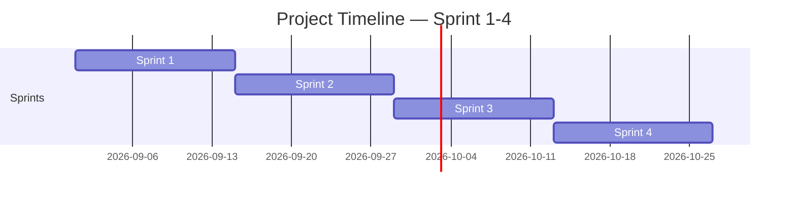

<!-- Template เต็มไฟล์สำหรับสร้าง docs/agile/02-sprint-backlog.md -->
<!-- ภาพรวมว่า Story ไหนไปอยู่ Sprint ไหนตลอด 4 Sprint — ไม่ต้องระบุคนรับผิดชอบ/Status ที่นี่ ส่วนนั้นอยู่ใน sprint-plan-[NN].md ของ Sprint ที่กำลังทำ -->

# Sprint Backlog

**Version:** 1.0 | **Last Updated:** 2026-09-01

> ภาพรวมว่า User Story ไหนจาก `01-product-backlog.md` จะไปอยู่ Sprint ไหน — Sprint ที่ยังไม่ถึงคือ draft คร่าวๆ ปรับได้เสมอเมื่อเข้าใจงานมากขึ้น

## Timeline (4 Sprint, Sprint ละ 2 สัปดาห์)

| Sprint   | เริ่ม      | สิ้นสุด    |     |
| -------- | ---------- | ---------- | --- |
| Sprint 1 | 2026-09-01 | 2026-09-14 |     |
| Sprint 2 | 2026-09-15 | 2026-09-28 |     |
| Sprint 3 | 2026-09-29 | 2026-10-12 |     |
| Sprint 4 | 2026-10-13 | 2026-10-26 |     |

> ปรับวันที่ให้ตรงกับวันที่ทีมเริ่มลงมือทำจริง (ถ้าไม่ใช่วันแลปนี้)

## Sprint 1 (กำลังทำ)

| #   | User Story                                       | MoSCoW    | Estimate (SP) |
| --- | ------------------------------------------------ | --------- | ------------- |
| 1   | As a player, I want to click                     | Must Have | 4             |
| 2   | As a player, I want to press button to play qte. | Must Have | 5             |
| 3   | As a player, I want to see attacked system       | Must Have | 4             |
| 4   | As a player, I want to see pet behavior.         | Must Have | 6             |

## Sprint 2 (Draft)

| #   | User Story                                     | MoSCoW      | Estimate (SP) |
| --- | ---------------------------------------------- | ----------- | ------------- |
| 1   | As a player, I want to see my remaining lives  | Should Have | 2             |
| 2   | As a player, I want to see how many pet type.  | Should Have | 5             |
| 3   | As player, I want to see how many qte. type.   | Should Have | 5             |
| 4   | As a player, I want to see pet behavior status | Should Have | 3             |

## Sprint 3 (Draft)

| #   | User Story                                                 | MoSCoW      | Estimate (SP) |
| --- | ---------------------------------------------------------- | ----------- | ------------- |
| 1   | [User Story ที่วางแผนไว้ล่วงหน้าจาก 01-product-backlog.md] | Should Have | [SP]          |

## Sprint 4 (Draft)

| #   | User Story                                                                                         | MoSCoW                                                               | Estimate (SP) |
| --- | -------------------------------------------------------------------------------------------------- | -------------------------------------------------------------------- | ------------- |
| 1   | As a designer, I want to have other status. so player can feel more challanges.                    | Nice to Have                                                         | 3             |
| 2   | As a designer, I want to have a tutorial page so player can see how to play or interact with game. | อยากให้มีภาพแสดงวิธีการเล่น ผู้เล่นจะได้รู้ว่าเล่นเกมยังไง           | 2             |
| 3   | As a Artist, I want animation when got attack or pet behavior when qte.                            | อยากให้มีอนิเมชัน เมื่อมีปฏิสัมพันธ์กับสัตว์เลี้ยง หรือเมื่อโดนโจมตี | 5             |
| 4   | As a programmer, I want debug mode                                                                 | debug mode                                                           | 5             |

> **Sprint 2-4 คือ draft ระดับ release plan** — เป้าหมายคือฝึกกะจำนวน SP ต่อ Sprint ให้ใกล้เคียง capacity ของทีม ไม่ใช่ล็อก scope ตายตัว ปรับได้ทุกครั้งที่ทำ Sprint Planning ของ Sprint ถัดไป
>
> เมื่อ Sprint ไหนเริ่มทำงานจริง ให้คัดลอก template `sprint-plan-template.md` (ไฟล์แนบใน LMS) ไปสร้าง `docs/agile/sprint-plan-[NN].md` แล้วดึง Story ของ Sprint นั้นจากตารางด้านบนมาใส่คนรับผิดชอบ แตก Task และปรับ Estimate ให้ละเอียดขึ้น

## Links
- [[docs/agile/01-product-backlog|Product Backlog]]
- [[docs/agile/sprint-plan-01|Sprint 1 Plan]]
