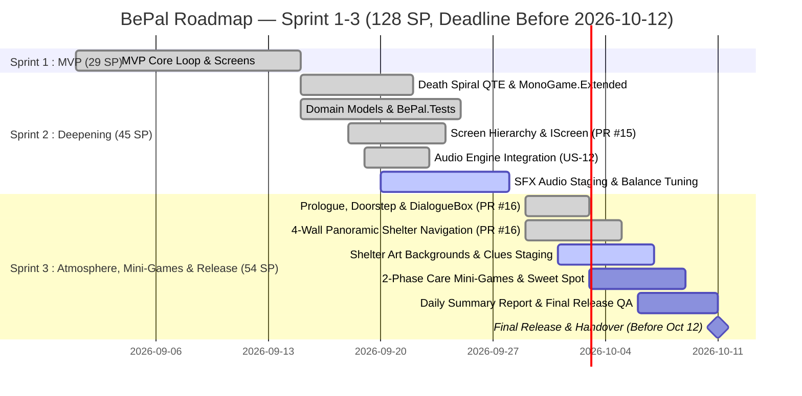

# Sprint Backlog — BePal (Sprint 1–3 Release Plan)

> ภาพรวมการกระจาย User Stories และ Technical Enablers ทั้งหมด 31 รายการจาก `01-product-backlog.md` ลงสู่ **3 Sprints (รวม 128 SP, สิ้นสุดก่อน 12 ตุลาคม 2026)** โดยตัวเลข Story Points ทั้งหมดผ่านการตรวจสอบความถูกต้องทางคณิตศาสตร์ตรงกันสมบูรณ์ทุกแกน:
> - **โชว์ (Show):** Lead Programmer (60 SP)
> - **ซุง (Zunk):** Game Designer (28 SP)
> - **ภูมิ (Pooh):** Flex (leans towards Design) / Audio Support (21 SP)
> - **เดียร์ (Dear):** 2D Art & UI Lead (19 SP)

---

## 1. Timeline & Velocity Overview

| Sprint | ระยะเวลา | เป้าหมายหลัก (Sprint Goal) | Velocity (SP) | สถานะ |
| --- | --- | --- | --- | --- |
| **Sprint 1** | 2026-09-01 — 2026-09-14 | **MVP Core Loop:** ระบบวงล้อ Care QTE, สัตว์โจมตี Dodge QTE, เลือด 3 หน่วย, และ Survival Log | **29 SP** | ✅ **Done** (29/29 SP) |
| **Sprint 2** | 2026-09-15 — 2026-09-28 | **Deepening & Systems Polish:** วงล้อ Death Spiral QTE, เสียง SFX, แยก Domain Models, และ Unit Test | **45 SP** | 🔄 **Active** (35/45 SP Done, Tech & Audio 100%) |
| **Sprint 3** | 2026-09-29 — 2026-10-11 | **Shelter Atmosphere, 2-Phase Care Mini-Games & Final Release:** ห้อง 4 ทิศ, บทนำ, มินิเกม 4 แบบ, Sweet Spot, Daily Report และปล่อยเกมสมบูรณ์ก่อน 12 ต.ค. | **54 SP** | 🔲 **Planned / Final Sprint** (13/54 SP Done ล่วงหน้าใน PR #16) |
| **Total** | **6 สัปดาห์ (เสร็จก่อน 12 ต.ค. 2026)** | **BePal Full Prototype & Game Release** | **128 SP** | **77/128 SP Completed (60%)** |

---

## 2. Sprint 1: MVP Core Gameplay (เสร็จสมบูรณ์ ✅)
**ระยะเวลา:** 2026-09-01 — 2026-09-14 | **Actual Velocity:** 29 SP | **Status:** ✅ Done (29/29 SP)

| ID | User Story / Task | ผู้รับผิดชอบหลัก | MoSCoW | SP | Status | คำอธิบายความรับผิดชอบ |
| --- | --- | --- | --- | --- | --- | --- |
| **US-01** | Mouse Navigation & Core UI Screens | โชว์ (Lead Prog) | Must Have | 4 | ✅ Done | โชว์วางโครงสร้างจอ 6 จอและการคลิกเมาส์ |
| **US-02** | Wheel-Based Care QTE Engine | โชว์ (Lead Prog) | Must Have | 5 | ✅ Done | โชว์เขียนระบบหมุนเข็ม $\omega = 2.2 \text{ rad/s}$ |
| **US-03** | Pet Behavior & Favor Rules Design | ซุง (Game Designer) | Must Have | 6 | ✅ Done | ซุงออกแบบกฎและ Action Pattern สัตว์ 3 ตัว |
| **US-04** | Attack Reaction & Dodge QTE System | โชว์ (Lead Prog) | Must Have | 5 | ✅ Done | โชว์สร้างระบบหลบการโจมตีใน Dodge Zone |
| **US-05** | Health, Damage & Forced Retreat Rules | ซุง (Game Designer) | Must Have | 4 | ✅ Done | ซุงกำหนดกฎเสียเลือด 1 HP และถอยร่นฉุกเฉิน |
| **US-06** | Survival Log Discovery Rules & Display | ซุง (Game Designer) | Must Have | 5 | ✅ Done | ซุงเขียนข้อความ โชว์ต่อเข้าระบบบันทึก |
| **รวม** | **Sprint 1 Velocity** | - | - | **29** | - | โชว์: 14 SP, ซุง: 15 SP, ภูมิ: 0 SP, เดียร์: 0 SP |

---

## 3. Sprint 2: Deepening, Death Spiral QTE & Systems (กำลังดำเนินการ 🔄)
**ระยะเวลา:** 2026-09-15 — 2026-09-28 | **Estimated Velocity:** 45 SP | **Status:** 🔄 In Progress (35 SP Done, Technical Enablers & Audio Engine 100% Completed)

| ID          | User Story / Task                        | ผู้รับผิดชอบหลัก     | MoSCoW      | SP     | Status         | คำอธิบายความรับผิดชอบ                               |
| ----------- | ---------------------------------------- | -------------------- | ----------- | ------ | -------------- | --------------------------------------------------- |
| **US-07**   | Dynamic Pet Emotional Sprites (Mossling) | เดียร์ (2D Art Lead) | Should Have | 4      | ✅ Done         | เดียร์วาดภาพอารมณ์ โชว์ต่อเข้า Reaction Timer       |
| **US-08**   | Death Spiral Circular Track & Needle     | โชว์ (Lead Prog)     | Should Have | 5      | ✅ Done         | โชว์เขียนวงล้อคู่ MonoGame.Extended, Screen Shake, Floating Tags |
| **US-09**   | Hazard Level & Harm Type System Design   | ซุง (Game Designer)  | Should Have | 3      | ✅ Done         | ซุงออกแบบสเกลความอันตราย โชว์ต่อขึ้น HUD            |
| **US-10**   | Playtest Screenshot & Capture Pipeline   | โชว์ (Lead Prog)     | Should Have | 3      | ✅ Done         | โชว์สร้างคำสั่ง `--screenshot` (27 เฟรม) และปุ่ม `F12` |
| **US-11**   | Sound Effects Production (8 SFX)         | ภูมิ (Pooh / Audio)  | Should Have | 4      | 🔄 In Progress | ภูมิจัดหาและตัดต่อเสียง 8 เสียงลง Staging           |
| **US-12**   | Audio Engine Integration into MonoGame   | โชว์ (Lead Prog)     | Should Have | 3      | ✅ Done         | โชว์เขียนระบบ `IAudioService` / `AudioManager` และ Procedural Fallback |
| **ART-01**  | Death Spiral UI Scrap Badges (6 Badges)  | เดียร์ (2D Art Lead) | Should Have | 3      | 🔄 In Progress | เดียร์วาดป้าย FEED, PLAY, PET, OBSERVE, DODGE       |
| **DES-01**  | QTE Balance Matrix & Timing Calculations | ซุง (Game Designer)  | Should Have | 3      | 🔄 In Progress | ซุงคำนวณขนาดมุม $60^\circ$ Dead Zone และแต้ม Favor  |
| **QA-01**   | Lead QA Playtesting & Feel Feedback      | ภูมิ (Pooh / Design) | Should Have | 3      | 🔄 In Progress | ภูมิทดสอบฟีลลิ่งจังหวะกด Spacebar ส่งให้ซุง/โชว์    |
| **TECH-01** | Pure C# Domain Models Extraction         | โชว์ (Lead Prog)     | Should Have | 3      | ✅ Done         | โชว์แยกคลาส Pure C# Domain Models ออกจาก `Game1.cs` |
| **TECH-02** | Automated Unit Testing (`BePal.Tests`)   | โชว์ (Lead Prog)     | Should Have | 4      | ✅ Done         | โชว์สร้างโปรเจกต์ xUnit และเขียนเทสต์ครอบคลุม State (51/51 tests ผ่าน) |
| **TECH-03** | Modular Screen Hierarchy (`IScreen`)     | โชว์ (Lead Prog)     | Should Have | 5      | ✅ Done         | โชว์แยก Screen Classes ออกจาก `Game1.cs` เป็น `IScreen` (PR #15) |
| **TECH-04** | Content Pipeline Warning Cleanups        | โชว์ (Lead Prog)     | Should Have | 2      | ✅ Done         | โชว์คลีนอัพการอ้างอิง DLL ใน `Content.mgcb` บิลด์ 0 warnings 0 errors |
| **รวม**     | **Sprint 2 Velocity**                    | -                    | -           | **45** | -              | โชว์: 25 SP (25 SP Done - 100%), ซุง: 6 SP (3 SP Done), ภูมิ: 7 SP, เดียร์: 7 SP (4 SP Done) |

---

## 4. Sprint 3: Shelter Atmosphere, 2-Phase Care Mini-Games & Final Release (Milestone ปล่อยเกมสมบูรณ์ 🔲)
**ระยะเวลา:** 2026-09-29 — 2026-10-11 (สิ้นสุดก่อน 12 ต.ค. 2026) | **Estimated Velocity:** 54 SP | **Status:** 🔲 Planned / Final Milestone (13 SP Done ล่วงหน้าใน PR #16, คงเหลือรอพัฒนา 41 SP)

> **การปรับ Scope สู่ 3 Sprints:** รวมงานระบบบรรยากาศห้อง 4 ทิศ, บทนำ, 2-Phase Care Mini-Games, Sweet Spots, และ Daily Summary Report ไว้ใน Sprint เดียวกัน เพื่อให้กระบวนการพัฒนาและทดสอบ QA เสร็จสิ้นก่อนวันที่ 12 ตุลาคม 2026

| ID | User Story / Task | ผู้รับผิดชอบหลัก | MoSCoW | SP | Status | คำอธิบายความรับผิดชอบ |
| --- | --- | --- | --- | --- | --- | --- |
| **US-15** | Prologue & Daily Doorstep Narrative Scripts | ภูมิ (Pooh / Design) | Must Have | 4 | ✅ Done | ภูมิเขียนบทนำ Day 1 และบทพัสดุมาส่ง Day 2–5 ภาษาอังกฤษ โชว์ต่อเข้าระบบใน `NarrativeScripts.cs`, `PrologueScreen`, `DoorstepScreen` (เสร็จแล้วใน PR #16) |
| **TECH-05** | Unified DialogueBox Subsystem | โชว์ (Lead Prog) | Must Have | 4 | ✅ Done | โชว์สร้างระบบข้อความพิมพ์ดีด typewriter, fast-reveal, dynamic word wrap, และ prompt `[YES]/[NO]` ผ่าน unit tests 8/8 (เสร็จแล้วใน PR #16) |
| **ART-02** | 4-Wall Panoramic Shelter Backgrounds & Porch | เดียร์ (2D Art Lead) | Must Have | 5 | 🔄 In Progress | เดียร์วาดภาพห้อง 4 ทิศ (Wall 1–4) และชานเรือนหน้าบ้าน (ปัจจุบันใช้ Procedural Layout Rendered รองรับใน `PanoramicRoomScreen`) |
| **US-20** | 4-Wall Panoramic Shelter Navigation Engine | โชว์ (Lead Prog) | Must Have | 5 | ✅ Done | โชว์พัฒนา `PanoramicRoomScreen` หมุน 360 องศา 4 ทิศ (A/D, ลูกศร), Hitbox สำรวจสิ่งของ 4 ผนัง, และคลิกยืนยันเริ่มแคร์ (เสร็จแล้วใน PR #16) |
| **US-13** | Distinct Pet Species Sprites (Nibbleclaw & Blinkbun) | เดียร์ (2D Art Lead) | Should Have | 4 | 🔲 Backlog | เดียร์วาด Nibbleclaw และ Blinkbun ครบ 4 ท่าหลัก (Idle, Happy, Angry, Attack/Teleport) |
| **DES-02** | Behavior Cues & Inspectable Clues Design | ซุง (Game Designer) | Should Have | 3 | 🔄 In Progress | ซุงออกแบบภาษากายสัตว์ (Ambient Cues) เชื่อมเข้ากับ Wall 1 และคำบอกใบ้บนชั้น Pantry Wall 2 |
| **US-14** | Atmospheric Cozy & Tension BGM | ภูมิ (Pooh / Audio) | Should Have | 3 | 🔲 Backlog | ภูมิจัดหาและตั้งค่า Loop เพลง 2 เพลง (Cozy Shelter & Care Tension) ลง Staging |
| **US-21** | Dynamic Wheel with Sweet Spots & Cue Integration | โชว์ & ซุง | Must Have | 6 | 🔲 Backlog | โชว์ (4 SP) & ซุง (2 SP): ระบบเข็ม Sweet Spot $\pm 15^\circ$ (+2 Satisfaction), ความเร่งเข็มตามสายพันธุ์ และเชื่อม Behavior Cues |
| **US-22** | Tactile Care Mini-Games Subsystem (4 Actions) | โชว์ & เดียร์ | Must Have | 8 | 🔲 Backlog | โชว์ (5 SP) & เดียร์ (3 SP): มินิเกม Feed (Hold to Pour), Pet (Mouse Stroke), Play (Reflex Catch), Observe (Focus Lens) พร้อม Props |
| **US-23** | Daily Summary Report Card & Night Rest | โชว์ & ซุง | Must Have | 5 | 🔲 Backlog | โชว์ (3 SP) & ซุง (2 SP): ใบรายงานประจำวันสไตล์ Papers, Please และ Fade to Black Night Rest ฟื้นฟู 3 HP ก่อนข้ามวัน |
| **US-16** | Narrative Lore Secret Origin & Ending | ภูมิ (Pooh / Design) | Should Have | 4 | 🔲 Backlog | ภูมิเขียนบทสรุปเนื้อเรื่องตอนจบของศูนย์วิจัยใน Run Summary เมื่อผ่านครบ 5 วัน |
| **QA-02** | End-to-End Playtesting & Final Balance QA | ภูมิ (Pooh / Design) | Should Have | 3 | 🔲 Backlog | ภูมิทดสอบลูปเต็ม 5 วัน ตรวจสอบความสมดุลรอบสุดท้ายและ Regression QA ก่อนปล่อยตัวเต็ม |
| **รวม** | **Sprint 3 Velocity** | - | - | **54** | - | โชว์: 21 SP (9 SP Done, 12 SP Remaining), ซุง: 7 SP, ภูมิ: 14 SP (4 SP Done, 10 SP Remaining), เดียร์: 12 SP |

---

## 5. Sprint Capacity & Velocity Matrix (การันตีความถูกต้องทางคณิตศาสตร์)

ตารางสรุป Story Points แยกตามสมาชิกและ Sprint โดยตัวเลขรวมทั้งแนวตั้งและแนวนอนเท่ากับ **128 SP** ทุกประการ:

| สมาชิก | บทบาท (Role) | Sprint 1 (Done) | Sprint 2 (Active) | Sprint 3 (Planned) | รวมทั้งโปรเจกต์ (SP) | สถานะความคืบหน้าปัจจุบัน |
| --- | --- | --- | --- | --- | --- | --- |
| **วศิน (โชว์)** | **Lead Programmer** | 14 SP | 25 SP | 21 SP | **60 SP** | 48 SP Done (80%) |
| **ปีย์ตะวัน (ซุง)** | **Game Designer** | 15 SP | 6 SP | 7 SP | **28 SP** | 18 SP Done (64%) |
| **ภูมิพัฒน์ (ภูมิ / Pooh)** | **Flex (Design & Audio)** | 0 SP | 7 SP | 14 SP | **21 SP** | 4 SP Done (19%) |
| **ธัญญรัตน์ (เดียร์)** | **2D Art & UI Lead** | 0 SP | 7 SP | 12 SP | **19 SP** | 4 SP Done (21%) |
| **รวม Story Points ต่อ Sprint** | - | **29 SP** | **45 SP** | **54 SP** | **128 SP** | **77 SP Done (60% Total)** |

---

## 6. Integrated Pull Requests & Delivery Traceability (สรุปการส่งมอบตาม Gitflow)

ตารางบันทึกการผสานโค้ดผ่าน Pull Requests เข้าสู่กิ่ง `Develop` ตามมาตรฐาน Atlassian Gitflow ที่บันทึกไว้ใน `docs/handoff.md`:

| Pull Request | Branch | Subsystems / Stories Implemented | Automated QA & Verification | สถานะบน `Develop` |
| --- | --- | --- | --- | --- |
| **PR #15** | `feature/modular-screens` | **TECH-03:** แยกสถาปัตยกรรมจอเป็น `IScreen`, `ScreenManager`, `ScreenContext` ครบ 6 จอพื้นฐาน | ผ่านการทดสอบบิลด์ 0 warnings, 0 errors | ✅ Merged (`--no-ff`) |
| **PR #16** | `feature/sprint-3-narrative-shelter` | **TECH-05:** `DialogueBox` typewriter & prompts **US-20:** `PanoramicRoomScreen` 4 ผนัง 360° **US-15:** `PrologueScreen`, `DoorstepScreen`, `NarrativeScripts` | Unit tests 28/28 ผ่าน, ภาพ 22 เฟรม (01–08 PNG captures) | ✅ Merged (`--no-ff`) |
| **PR #17** | `feature/prototype-run-day-cycle-fix` | **Bugfix & Logic Polish:** แก้ข้ามวันเบิ้ล [End Day], จัดการ Forced Retreat routing ให้แม่นยำ, ป้องกัน ActivePet Day 6+ Out of bounds | Unit tests 32/32 ผ่าน 100%, ทดสอบครบ 5 วันบริบูรณ์ | ✅ Merged (`--no-ff`) |
| **PR #18** | `feature/stripe-wipe-transition` | **StripeWipeTransition:** ระบบสลับฉาก Venetian-blinds ทแยงมุม 2 เฟส | Unit tests 45/45 ผ่าน, แคปภาพ 09_transition.png ใน playtest harness | ✅ Merged (`--no-ff`) |
| **PR #19** | `feature/configurable-transition-duration` | **TransitionDuration:** ปรับแต่งระยะเวลาสลับฉากได้ โดยตั้งค่า Default เป็น 0.85s | Unit tests 45/45 ผ่าน, Playtest harness 27 เฟรม | ✅ Merged (`--no-ff`) |
| **PR #20** | `feature/update-bepal-docs` | **Documentation Polish:** อัปเดต AGENTS.md, Class Diagram, Kanban, และ Session Handoff | ตรวจสอบความสอดคล้องกับโค้ดและการออกแบบ | ✅ Merged (`--no-ff`) |

---

## 7. Links
- [[BEPAL/Docs/Agile/01-product-backlog|Product Backlog]]
- [[BEPAL/Docs/Agile/03-kanban-board|Kanban Board]]
- [[BEPAL/Docs/Agile/04-Kanban-for-Obsidian|Obsidian Interactive Kanban]]
- [[BEPAL/Docs/Agile/sprint-plan-01|Sprint 1 Plan]]
- [[BEPAL/Docs/Agile/sprint-plan-02|Sprint 2 Plan]]
- [[BEPAL/Docs/Agile/sprint-plan-03|Sprint 3 Plan]]
- [[BEPAL/Docs/GDD/00-concept|GDD Concept]]
- [[BEPAL/Docs/GDD/01-core-loop|GDD Core Loop]]
- [[BEPAL/Docs/GDD/02-scope-features|GDD Scope & Features]]
- [[BEPAL/Docs/GDD/03-mechanics|GDD Mechanics]]
- [[BEPAL/Docs/GDD/04-class-diagram|GDD Architecture]]
- [[BEPAL/Docs/GDD/05-asset-list|GDD Asset List]]
