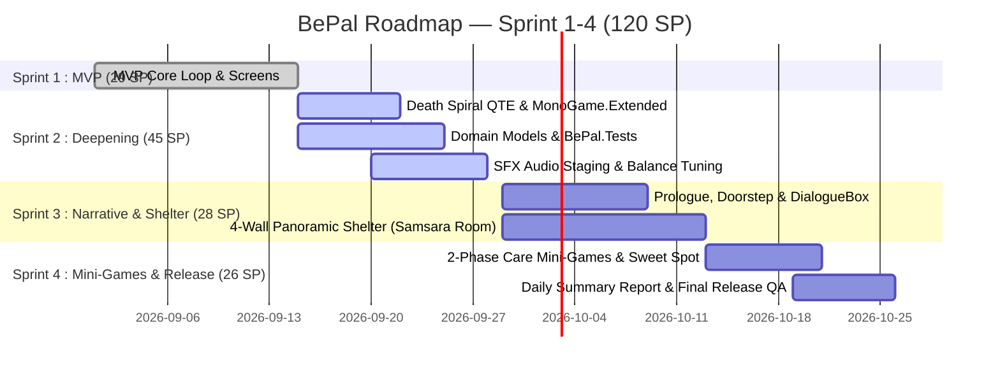

# Sprint Backlog — BePal (Sprint 1–4 Release Plan)

> ภาพรวมการกระจาย User Stories และ Technical Enablers ทั้งหมด 31 รายการจาก `01-product-backlog.md` ลงสู่ **4 Sprints (รวม 120 SP)** โดยตัวเลข Story Points ทั้งหมดผ่านการตรวจสอบความถูกต้องทางคณิตศาสตร์ตรงกันสมบูรณ์ทุกแกน:
> - **โชว์ (Show):** Lead Programmer (50 SP)
> - **ซุง (Zunk):** Game Designer (28 SP)
> - **ภูมิ (Pooh):** Flex (leans towards Design) / Audio Support (22 SP)
> - **เดียร์ (Dear):** 2D Art & UI Lead (20 SP)

---

## 1. Timeline & Velocity Overview

| Sprint | ระยะเวลา | เป้าหมายหลัก (Sprint Goal) | Velocity (SP) | สถานะ |
| --- | --- | --- | --- | --- |
| **Sprint 1** | 2026-09-01 — 2026-09-14 | **MVP Core Loop:** ระบบวงล้อ Care QTE, สัตว์โจมตี Dodge QTE, เลือด 3 หน่วย, และ Survival Log | **29 SP** | ✅ **Done** |
| **Sprint 2** | 2026-09-15 — 2026-09-28 | **Deepening & Systems Polish:** วงล้อ Death Spiral QTE, เสียง SFX, แยก Domain Models, และ Unit Test | **45 SP** | 🔄 **Active** |
| **Sprint 3** | 2026-09-29 — 2026-10-12 | **Atmosphere, Narrative & 4-Wall Shelter:** บทนำ Prologue, ระบบห้อง 4 ทิศ (Samsara Room), และ DialogueBox | **28 SP** | 🔲 **Draft** |
| **Sprint 4** | 2026-10-13 — 2026-10-26 | **2-Phase Care Mini-Games & Release:** Dynamic Wheel Sweet Spot, มินิเกม 4 แบบ, Daily Report และบทสรุป | **26 SP** | 🔲 **Draft** |
| **Total** | **8 สัปดาห์ (ตลอดเทอม)** | **BePal Full Prototype & Game Release** | **128 SP** | - |

---

## 2. Sprint 1: MVP Core Gameplay (เสร็จสมบูรณ์ ✅)
**ระยะเวลา:** 2026-09-01 — 2026-09-14 | **Actual Velocity:** 29 SP | **Status:** ✅ Done

| ID | User Story / Task | ผู้รับผิดชอบหลัก | MoSCoW | SP | Status | คำอธิบายความรับผิดชอบ |
| --- | --- | --- | --- | --- | --- | --- |
| **US-01** | Mouse Navigation & Core UI Screens | โชว์ (Lead Prog) | Must Have | 4 | ✅ Done | โชว์วางโครงสร้างจอ 6 จอและการคลิกเมาส์ |
| **US-02** | Wheel-Based Care QTE Engine | โชว์ (Lead Prog) | Must Have | 5 | ✅ Done | โชว์เขียนระบบหมุนเข็ม $\omega = 2.2 \text{ rad/s}$ |
| **US-03** | Pet Behavior & Favor Rules Design | ซุง (Game Designer) | Must Have | 6 | ✅ Done | ซุงออกแบบกฎและ Action Pattern สัตว์ 3 ตัว |
| **US-04** | Attack Reaction & Dodge QTE System | โชว์ (Lead Prog) | Must Have | 5 | ✅ Done | โชว์สร้างระบบหลบการโจมตีใน Dodge Zone |
| **US-05** | Health, Damage & Forced Retreat Rules | ซุง (Game Designer) | Must Have | 4 | ✅ Done | ซุงกำหนดกฎเสียเลือด 1 HP และถอยร่นฉุกเฉิน |
| **US-06** | Survival Log Discovery Rules & Display | ซุง (Game Designer) | Must Have | 5 | ✅ Done | ซุงเขียนข้อความ โชว์ต่อเข้าระบบบันทึก |
| **รวม** | **Sprint 1 Velocity** | - | - | **29** | - | โชว์: 14 SP, ซุง: 15 SP, ภูมิ: 0 SP, เดียร์: 0 SP |

---

## 3. Sprint 2: Deepening, Death Spiral QTE & Systems (กำลังดำเนินการ 🔄)
**ระยะเวลา:** 2026-09-15 — 2026-09-28 | **Estimated Velocity:** 45 SP | **Status:** 🔄 In Progress

| ID          | User Story / Task                        | ผู้รับผิดชอบหลัก     | MoSCoW      | SP     | Status         | คำอธิบายความรับผิดชอบ                               |
| ----------- | ---------------------------------------- | -------------------- | ----------- | ------ | -------------- | --------------------------------------------------- |
| **US-07**   | Dynamic Pet Emotional Sprites (Mossling) | เดียร์ (2D Art Lead) | Should Have | 4      | ✅ Done         | เดียร์วาดภาพอารมณ์ โชว์ต่อเข้า Reaction Timer       |
| **US-08**   | Death Spiral Circular Track & Needle     | โชว์ (Lead Prog)     | Should Have | 5      | 🔍 Review      | โชว์เขียนวงล้อคู่ด้วย MonoGame.Extended             |
| **US-09**   | Hazard Level & Harm Type System Design   | ซุง (Game Designer)  | Should Have | 3      | 🔍 Review      | ซุงออกแบบสเกลความอันตราย โชว์ต่อขึ้น HUD            |
| **US-10**   | Playtest Screenshot & Capture Pipeline   | โชว์ (Lead Prog)     | Should Have | 3      | 🔍 Review      | โชว์สร้างคำสั่ง `--screenshot` และปุ่ม `F12`        |
| **US-11**   | Sound Effects Production (8 SFX)         | ภูมิ (Pooh / Audio)  | Should Have | 4      | 🔄 In Progress | ภูมิจัดหาและตัดต่อเสียง 8 เสียงลง Staging           |
| **US-12**   | Audio Engine Integration into MonoGame   | โชว์ (Lead Prog)     | Should Have | 3      | 📋 Ready       | โชว์เขียนระบบเล่นเสียง SFX เมื่อกดยืนยัน            |
| **ART-01**  | Death Spiral UI Scrap Badges (6 Badges)  | เดียร์ (2D Art Lead) | Should Have | 3      | 🔄 In Progress | เดียร์วาดป้าย FEED, PLAY, PET, OBSERVE, DODGE       |
| **DES-01**  | QTE Balance Matrix & Timing Calculations | ซุง (Game Designer)  | Should Have | 3      | 🔄 In Progress | ซุงคำนวณขนาดมุม $60^\circ$ Dead Zone และแต้ม Favor  |
| **QA-01**   | Lead QA Playtesting & Feel Feedback      | ภูมิ (Pooh / Design) | Should Have | 3      | 🔄 In Progress | ภูมิทดสอบฟีลลิ่งจังหวะกด Spacebar ส่งให้ซุง/โชว์    |
| **TECH-01** | Pure C# Domain Models Extraction         | โชว์ (Lead Prog)     | Should Have | 3      | 🔄 In Progress | โชว์แยกคลาสตามสเปกของซุงเพื่อความสะอาดของโค้ด       |
| **TECH-02** | Automated Unit Testing (`BePal.Tests`)   | โชว์ (Lead Prog)     | Should Have | 4      | 📋 Ready       | โชว์สร้างโปรเจกต์ xUnit และเขียนเทสต์ครอบคลุม State |
| **TECH-03** | Modular Screen Hierarchy (`IScreen`)     | โชว์ (Lead Prog)     | Should Have | 5      | 📋 Ready       | โชว์แยก Screen Classes ออกจาก `Game1.cs`            |
| **TECH-04** | Content Pipeline Warning Cleanups        | โชว์ (Lead Prog)     | Should Have | 2      | 📋 Ready       | โชว์คลีนอัพการอ้างอิง DLL ใน `Content.mgcb`         |
| **รวม**     | **Sprint 2 Velocity**                    | -                    | -           | **45** | -              | โชว์: 25 SP, ซุง: 6 SP, ภูมิ: 7 SP, เดียร์: 7 SP    |

---

## 4. Sprint 3: Atmosphere, Narrative & 4-Wall Shelter (เตรียมความพร้อม 🔲)
**ระยะเวลา:** 2026-09-29 — 2026-10-12 | **Estimated Velocity:** 28 SP | **Status:** 🔲 Planned

| ID | User Story / Task | ผู้รับผิดชอบหลัก | MoSCoW | SP | Status | คำอธิบายความรับผิดชอบ |
| --- | --- | --- | --- | --- | --- | --- |
| **US-15** | Prologue & Daily Doorstep Narrative Scripts | ภูมิ (Pooh / Design) | Must Have | 4 | 🔲 Backlog | ภูมิเขียนบทนำ Day 1 และบทพัสดุมาส่ง Day 2–5 ภาษาอังกฤษ |
| **TECH-05** | Unified DialogueBox Subsystem | โชว์ (Lead Prog) | Must Have | 4 | 🔲 Backlog | โชว์สร้างระบบข้อความพิมพ์ดีด, fast-reveal, prompt `[YES]/[NO]` |
| **ART-02** | 4-Wall Panoramic Shelter Backgrounds & Porch | เดียร์ (2D Art Lead) | Must Have | 5 | 🔲 Backlog | เดียร์วาดภาพห้อง 4 ทิศ (Wall 1–4) และชานเรือนหน้าบ้าน |
| **US-20** | 4-Wall Panoramic Shelter Navigation Engine | โชว์ (Lead Prog) | Must Have | 5 | 🔲 Backlog | โชว์พัฒนา `PanoramicRoomScreen` หมุนซ้าย-ขวา 4 ทิศและคลิกสำรวจของ |
| **US-13** | Distinct Pet Species Sprites (Nibbleclaw & Blinkbun) | เดียร์ (2D Art Lead) | Should Have | 4 | 🔲 Backlog | เดียร์วาด Nibbleclaw และ Blinkbun ครบ 4 ท่าหลัก |
| **DES-02** | Behavior Cues & Inspectable Clues Design | ซุง (Game Designer) | Should Have | 3 | 🔲 Backlog | ซุงออกแบบภาษากายสัตว์ (Cues) และ Clues คำบอกใบ้ในห้อง |
| **US-14** | Atmospheric Cozy & Tension BGM | ภูมิ (Pooh / Audio) | Should Have | 3 | 🔲 Backlog | ภูมิจัดหาและตั้งค่า Loop เพลง 2 เพลงลง Staging |
| **รวม** | **Sprint 3 Velocity** | - | - | **28** | - | โชว์: 9 SP, ซุง: 3 SP, ภูมิ: 7 SP, เดียร์: 9 SP |

---

## 5. Sprint 4: 2-Phase Care Mini-Games & Release (เตรียมความพร้อม 🔲)
**ระยะเวลา:** 2026-10-13 — 2026-10-26 | **Estimated Velocity:** 26 SP | **Status:** 🔲 Planned

| ID | User Story / Task | ผู้รับผิดชอบหลัก | MoSCoW | SP | Status | คำอธิบายความรับผิดชอบ |
| --- | --- | --- | --- | --- | --- | --- |
| **US-21** | Dynamic Wheel with Sweet Spots & Cue Integration | โชว์ & ซุง | Must Have | 6 | 🔲 Backlog | โชว์ (4 SP) & ซุง (2 SP): ระบบเข็ม Sweet Spot +2 และเชื่อม Cues |
| **US-22** | Tactile Care Mini-Games Subsystem (4 Actions) | โชว์ & เดียร์ | Must Have | 8 | 🔲 Backlog | โชว์ (5 SP) & เดียร์ (3 SP): มินิเกม Feed, Pet, Play, Observe พร้อม Props |
| **US-23** | Daily Summary Report Card & Night Rest | โชว์ & ซุง | Must Have | 5 | 🔲 Backlog | โชว์ (3 SP) & ซุง (2 SP): ใบรายงานประจำวันสไตล์ Papers, Please และฉากมืด |
| **US-16** | Narrative Lore Secret Origin & Ending | ภูมิ (Pooh / Design) | Should Have | 4 | 🔲 Backlog | ภูมิเขียนบทสรุปเนื้อเรื่องตอนจบของศูนย์วิจัยใน Run Summary |
| **QA-02** | End-to-End Playtesting & Final Balance QA | ภูมิ (Pooh / Design) | Should Have | 3 | 🔲 Backlog | ภูมิทดสอบลูปเต็ม 5 วัน ตรวจสอบความสมดุลรอบสุดท้าย |
| **รวม** | **Sprint 4 Velocity** | - | - | **26** | - | โชว์: 12 SP, ซุง: 4 SP, ภูมิ: 7 SP, เดียร์: 3 SP |

---

## 6. Sprint Capacity & Velocity Matrix (การันตีความถูกต้องทางคณิตศาสตร์)

ตารางสรุป Story Points แยกตามสมาชิกและ Sprint โดยตัวเลขรวมทั้งแนวตั้งและแนวนอนเท่ากับ **120 SP** ทุกประการ:

| สมาชิก | บทบาท (Role) | Sprint 1 (Done) | Sprint 2 (Active) | Sprint 3 (Draft) | Sprint 4 (Draft) | รวมทั้งโปรเจกต์ (SP) |
| --- | --- | --- | --- | --- | --- | --- |
| **วศิน (โชว์)** | **Lead Programmer** | 14 SP | 25 SP | 9 SP | 12 SP | **60 SP** |
| **ปีย์ตะวัน (ซุง)** | **Game Designer** | 15 SP | 6 SP | 3 SP | 4 SP | **28 SP** |
| **ภูมิพัฒน์ (ภูมิ / Pooh)** | **Flex (Design & Audio)** | 0 SP | 7 SP | 7 SP | 7 SP | **21 SP** |
| **ธัญญรัตน์ (เดียร์)** | **2D Art & UI Lead** | 0 SP | 7 SP | 9 SP | 3 SP | **19 SP** |
| **รวม Story Points ต่อ Sprint** | - | **29 SP** | **45 SP** | **28 SP** | **26 SP** | **128 SP** |

---

## 7. Links
- [[BEPAL/Docs/Agile/01-product-backlog|Product Backlog]]
- [[BEPAL/Docs/Agile/03-kanban-board|Kanban Board]]
- [[BEPAL/Docs/Agile/04-Kanban-for-Obsidian|Obsidian Interactive Kanban]]
- [[BEPAL/Docs/Agile/sprint-plan-01|Sprint 1 Plan]]
- [[BEPAL/Docs/Agile/sprint-plan-02|Sprint 2 Plan]]
- [[BEPAL/Docs/GDD/00-concept|GDD Concept]]
- [[BEPAL/Docs/GDD/01-core-loop|GDD Core Loop]]
- [[BEPAL/Docs/GDD/02-scope-features|GDD Scope & Features]]
- [[BEPAL/Docs/GDD/03-mechanics|GDD Mechanics]]
- [[BEPAL/Docs/GDD/04-class-diagram|GDD Architecture]]
- [[BEPAL/Docs/GDD/05-asset-list|GDD Asset List]]
