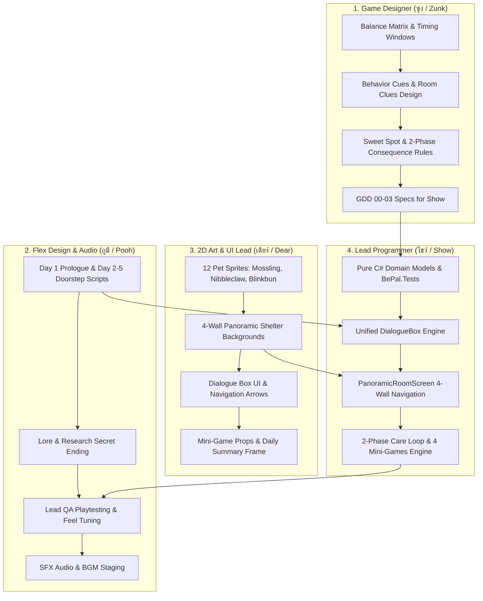
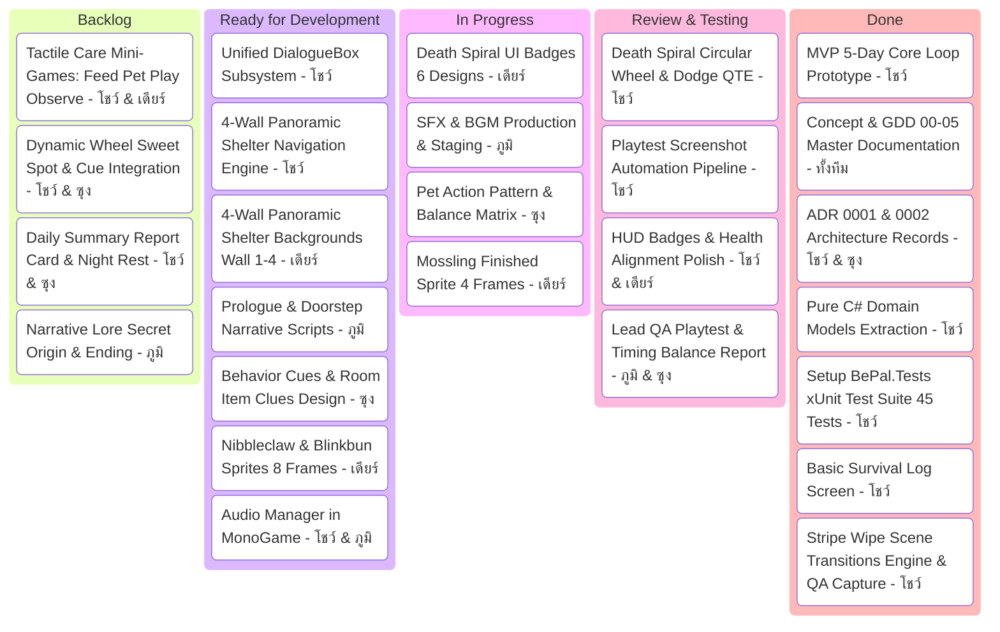

# BePal — Workload Breakdown & Kanban Board

เอกสารแจกแจงภาระงาน (Workload Breakdown) และกระดาน **Kanban Board** ที่ปรับจูนให้เหมาะสมกับบทบาทของสมาชิกแต่ละคน:
- **โชว์ (Show):** Lead Programmer (สถาปัตยกรรม, ระบบเกมเพลย์, ห้อง 4 ทิศ, และมินิเกม)
- **ซุง (Zunk):** Game Designer (ระบบกลไก, ตัวเลข Balance, กฎพฤติกรรมสัตว์, Cues, และ Progression)
- **ภูมิ (Pooh):** Flex (leans towards Design) / Audio Support (เนื้อเรื่อง/บทสนทนา, Playtesting QA, และเสียง SFX/BGM)
- **เดียร์ (Dear):** 2D Art & UI Lead (วาดภาพ Sprite สัตว์, ภาพห้อง 4 ทิศ, ป้าย UI, และ Mini-game Props)

---

## 1. Role-Based Workload Methodologies (ระเบียบวิธีและขอบเขตงาน)

---

## 2. Interactive Kanban Board

---

## 3. Kanban Task Tracking Table (ตารางแจกแจงงานอย่างละเอียด)

| คอลัมน์ | Task ID | ชื่องาน (Task Name) | ผู้รับผิดชอบ | SP | ความสอดคล้องกับบทบาท |
| --- | --- | --- | --- | --- | --- |
| **Done** | T-01 | MVP Core 5-Day Loop | โชว์ | 5 | โชว์สร้างแก่นเกมเพลย์ 5 วัน รันได้จริง |
| **Done** | T-02 | GDD 00–05 Master Docs | ทั้งทีม | 4 | อัปเดตเอกสาร GDD, Backlogs, และ CONTEXT.md |
| **Done** | T-03 | ADR Architecture Records (0001 & 0002) | โชว์ & ซุง | 3 | บันทึกสถาปัตยกรรม IScreen และ 4-Wall / 2-Phase Care |
| **Done** | T-04 | Basic Survival Log Screen | โชว์ | 3 | ปลดล็อกและแสดงผลพฤติกรรมสัตว์เมื่อผ่าน 3 รอบ |
| **Done** | T-14 | Domain Models Extraction | โชว์ | 3 | โชว์แยก `CareAction`, `PetDefinition`, `ActionPattern` เป็น Pure C# |
| **Done** | T-17 | Setup `BePal.Tests` Project | โชว์ | 4 | โชว์สร้างโปรเจกต์ xUnit และเขียนเทสต์ครอบคลุม 45 กรณีทดสอบ |
| **Done** | T-32 | Stripe Wipe Scene Transitions | โชว์ | 3 | โชว์พัฒนาระบบสลับฉาก Venetian Blinds ทแยงมุม พร้อม xUnit 45 Tests และภาพ 09_transition.png (PR #18, #19) |
| **Review / Testing** | T-05 | Death Spiral QTE System | โชว์ | 5 | วงล้อ 4 Sectors, เข็มหมุน, Dodge Zone, Floating Tags |
| **Review / Testing** | T-06 | Playtest Screenshot Pipeline | โชว์ | 3 | คำสั่ง `--screenshot` และปุ่ม `F12` บันทึกภาพ PNG ทันที |
| **Review / Testing** | T-07 | HUD Badges & Health Alignment | โชว์ & เดียร์ | 2 | แสดง HEALTH 3.0, DAY, และข้อมูลสัตว์ไม่ทับขอบกล่อง |
| **Review / Testing** | T-08 | QA Playtest & Balance Review | ภูมิ & ซุง | 3 | ภูมิทดสอบฟีลลิ่งเข็มหมุน ซุงตรวจสอบค่าตัวเลข Balance |
| **In Progress** | T-09 | Pet Rules & Balance Matrix | ซุง | 4 | ซุงกำหนด Action Patterns และตารางตัวเลขสัตว์ 3 ตัว |
| **In Progress** | T-11 | SFX & BGM Production & Staging | ภูมิ | 4 | ภูมิตัดต่อเสียง SFX และ BGM ลงใน Staging |
| **In Progress** | T-12 | Mossling Finished Sprite (4 ท่า) | เดียร์ | 4 | เดียร์วาด Mossling ครบ Idle, Happy, Angry, Attack |
| **In Progress** | T-13 | Death Spiral Scrap Badges (6 แบบ) | เดียร์ | 3 | เดียร์วาดป้าย FEED, PLAY, PET, OBSERVE, DODGE, ATTACK |
| **Ready for Dev** | T-23 | Unified DialogueBox Subsystem | โชว์ | 4 | โชว์สร้างระบบข้อความพิมพ์ดีด, fast reveal, prompt `[YES]/[NO]` |
| **Ready for Dev** | T-24 | 4-Wall Panoramic Navigation Engine | โชว์ | 5 | โชว์พัฒนา `PanoramicRoomScreen` หมุนซ้าย-ขวา 4 ทิศและคลิกสำรวจของ |
| **Ready for Dev** | T-25 | 4-Wall Backgrounds (Wall 1–4) & Porch | เดียร์ | 5 | เดียร์วาดฉาก 1280×720 สำหรับ Wall 1–4 และชานเรือนหน้าบ้าน |
| **Ready for Dev** | T-10 | Prologue & Doorstep Narrative Scripts | ภูมิ | 4 | ภูมิเขียนบทนำ Day 1 และบทพัสดุมาส่ง Day 2–5 เป็นภาษาอังกฤษ |
| **Ready for Dev** | T-26 | Behavior Cues & Room Item Clues Design | ซุง | 3 | ซุงออกแบบภาษากายสัตว์ และคำบอกใบ้บนชั้นอาหาร |
| **Ready for Dev** | T-15 | Nibbleclaw & Blinkbun (8 ท่า) | เดียร์ | 4 | เดียร์วาดภาพสัตว์สายพันธุ์ที่ 2 และ 3 ครบ 4 อารมณ์ |
| **Ready for Dev** | T-18 | Audio Engine in MonoGame | โชว์ & ภูมิ | 3 | โชว์นำไฟล์เสียงของภูมิไปเล่นในจังหวะ Spacebar QTE |
| **Backlog** | T-27 | Dynamic Wheel Sweet Spot & Cue Integration | โชว์ & ซุง | 6 | โชว์และซุงสร้างเข็ม Sweet Spot +2 แต้ม และเชื่อม Cues |
| **Backlog** | T-28 | Tactile Care Mini-Games (4 Actions) | โชว์ & เดียร์ | 8 | โชว์และเดียร์พัฒนามินิเกม Feed, Pet, Play, Observe พร้อม Props |
| **Backlog** | T-29 | Daily Summary Report Card & Night Rest | โชว์ & ซุง | 5 | ใบรายงานผลประจำวันสไตล์ Papers, Please และฉากพักผ่อน |
| **Backlog** | T-30 | Narrative Lore Secret Origin & Ending | ภูมิ | 4 | ภูมิเขียนบทสรุปเนื้อเรื่องตอนจบของศูนย์วิจัย |
| **Backlog** | T-31 | Final Release Balance QA & Polish | ภูมิ | 3 | ภูมิทดสอบลูปเต็ม 5 วัน ตรวจสอบความสมดุลรอบสุดท้าย |

---

## 4. Definition of Done (DoD)

1. **Code & Build:** โค้ดคอมไพล์ผ่านบน `Develop` โดยไม่มี Error (`dotnet build` $\rightarrow$ 0 Errors)
2. **Visual & Asset Verification:** Asset ภาพของเดียร์และเสียงของภูมิต้องผ่านการ Staging และตรวจสอบในตัวเกมจริง
3. **Design Alignment:** ตัวเลขในโค้ดต้องตรงตาม Balance Matrix ของซุง และบทต้องตรงตามที่ภูมิวางไว้
4. **Automated Verification:** โค้ดใหม่ต้องมี Unit Test หรือผ่าน Playtest Screenshot ไม่ทำลายระบบเดิม
