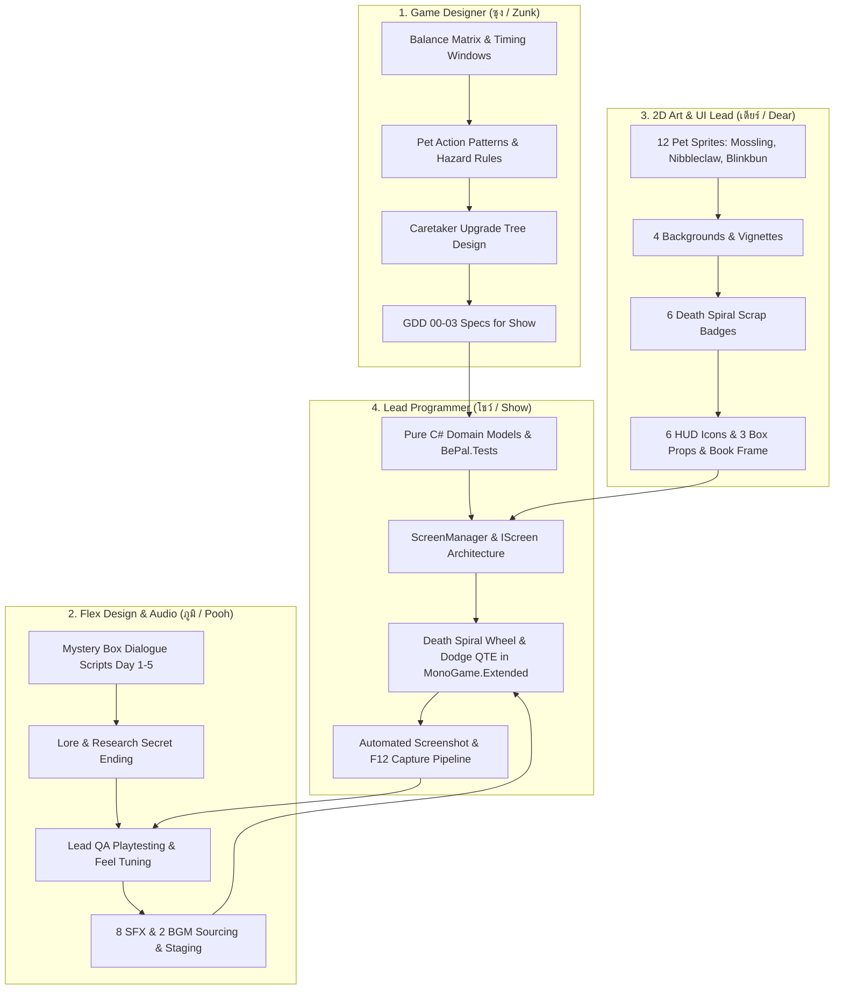
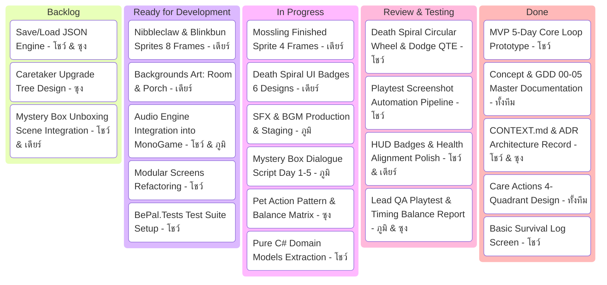

# BePal — Workload Breakdown & Kanban Board

เอกสารแจกแจงภาระงาน (Workload Breakdown) และกระดาน **Kanban Board** ที่ปรับจูนให้เหมาะสมกับบทบาทของสมาชิกแต่ละคน:
- **โชว์ (Show):** Lead Programmer (สถาปัตยกรรม, ระบบเกมเพลย์, และเครื่องมือทดสอบ)
- **ซุง (Zunk):** Game Designer (ระบบกลไก, ตัวเลข Balance, กฎพฤติกรรมสัตว์, และ Progression)
- **ภูมิ (Pooh):** Flex (leans towards Design) / Audio Support (เนื้อเรื่อง/บทสนทนา, Playtesting QA, และเสียง SFX/BGM)
- **เดียร์ (Dear):** 2D Art & UI Lead (วาดภาพ Sprite สัตว์, ฉากหลัง, ป้าย UI Scrap Badges, และ Props)

---

## 1. Role-Based Workload Methodologies (ระเบียบวิธีและขอบเขตงาน)

---

### 1.1 ปีย์ตะวัน แห่งหาญ (ซุง / Zunk) — Game Designer
- **Methodology:** **Systemic Design, Mathematical Balance & Rule Specification**
- **ขอบเขตงาน (Focus):** เน้นการออกแบบระบบ ตัวเลข และกฎเกณฑ์เชิงทฤษฎี โดยไม่ต้องเขียนโค้ด C# (โชว์เป็นผู้รับไป Implement)
  1. **Balance Matrix:** กำหนดความเร็วเข็มหมุน ($\omega = 2.2 \text{ rad/s}$), ขนาดองศา Action Sectors ($60^\circ$), ขนาด Dead Zones ($30^\circ$), และช่วงเวลา Dodge Zone
  2. **Pet Action Patterns:** กำหนดลำดับความชอบของสัตว์แต่ละตัว (Mossling, Nibbleclaw, Blinkbun), อัตราแต้ม Pet Favor ($+2, +1, +0, \text{Attack}$), และเงื่อนไขการโจมตี
  3. **Hazard & Harm Classification:** กำหนดระดับอันตราย Hazard Levels (1–3) และประเภท Harm (Physical vs. Mental)
  4. **Caretaker Progression Upgrades:** ออกแบบตารางอัปเกรดตัวละครตอนจบวัน (บัฟขนาด Hitbox, ความทนทานต่อดาเมจ)
  5. **Font Selection & Text Specs:** คัดเลือกฟอนต์และกำหนดข้อกำหนดการแสดงผลตัวอักษร
- **WIP Limit:** ไม่เกิน **2 Tasks** พร้อมกัน
- **Estimated Workload:** **15 Story Points (SP)**

---

### 1.2 ภูมิพัฒน์ ตามวงค์ (ภูมิ / Pooh) — Flex (leans towards Design) / Audio Support
- **Methodology:** **Narrative Scripting, Playtest QA Balancing & Audio Pipeline**
- **ขอบเขตงาน (Focus):** แบ่งงานออกเป็น 2 ด้านหลัก (เน้น Design เป็นหลัก และสนับสนุนงานเสียง):
  - **ด้าน Game Design & Narrative (70%):**
    1. **Mystery Box Dialogues:** เขียนบทสนทนาและคำบรรยายฉากเปิดกล่องพัสดุปริศนาหน้าบ้านในแต่ละวัน (Day 1–5) ด้วยสไตล์ Typewriter
    2. **Lore & Secret Ending:** เขียนปมเบื้องหลังของศูนย์วิจัย, ประวัติยาทดลอง, และบทสรุปเนื้อเรื่องตอนจบ
    3. **Lead QA Playtester:** เล่นทดสอบเกมในแต่ละรอบอย่างละเอียด บันทึกจังหวะความรู้สึก (Feel/Pacing) จุดที่ยากหรือง่ายเกินไป เพื่อส่ง Feedback ให้ซุงและโชว์ปรับแก้
  - **ด้าน Audio Support (30%):**
    4. **SFX Production:** จัดหา, ตัดต่อ และ Normalize เสียงเอฟเฟกต์ 8 เสียง (Confirm, Success, Fail, Teleport, Dodge Warning, Evade, Chime, Knock)
    5. **BGM Staging:** คัดเลือกและตั้งค่า Loop เพลงประกอบ 2 เพลง (Cozy Shelter BGM และ QTE Suspense BGM)
- **WIP Limit:** ไม่เกิน **2 Tasks** พร้อมกัน
- **Estimated Workload:** **14 Story Points (SP)**

---

### 1.3 ธัญญรัตน์ ติ๊บหน่อ (เดียร์ / Dear) — 2D Art & UI Lead
- **Methodology:** **Visual Identity, Atomic Sprite Production & Asset Staging**
- **ขอบเขตงาน (Focus):** รับผิดชอบงานวาดภาพ 2D ทั้งหมดตาม **Master Asset List ใน GDD-05 (รวม 35 ภาพ)**:
  1. **12 สไปรต์สัตว์เลี้ยง (280×360):**
     - Mossling: Idle, Happy, Angry, Attack
     - Nibbleclaw: Idle, Happy, Angry, Attack
     - Blinkbun: Idle, Happy, Angry, Teleport
  2. **4 ภาพฉากหลัง & บรรยากาศ (1280×720):**
     - `bg_main_pet_room.png` (ห้อง Daycare อบอุ่น)
     - `bg_doorstep_morning.png` (ชานเรือนหน้าบ้านตอนเช้า)
     - `bg_qte_vignette.png` (ขอบมืดโฟกัสวงล้อ)
     - `bg_danger_vignette.png` (ขอบแดงเตือนภัยตอน Attack)
  3. **6 ป้ายแอ็กชันวงล้อสไตล์ Death Spiral (Scrap Badges):**
     - ป้ายกระดาษฉีก: FEED, PLAY, PET, OBSERVE, DODGE ZONE, ATTACK!
  4. **6 ไอคอนสถานะและ HUD (36×36, 28×28, 280×72):**
     - หัวใจเต็ม/กลวง (Health), สัญลักษณ์ Energy, เม็ดความพอใจ On/Off, กรอบการ์ด HUD
  5. **3 วัตถุประกอบฉาก (Props):**
     - กล่องพัสดุปริศนา: ปิดเทป, กำลังสั่น/แง้ม, เปิดออกแล้ว
  6. **4 ชิ้นส่วน UI สมุดและปุ่มกด:**
     - กรอบสมุดบันทึก Survival Log, ปุ่มมาตรฐาน Normal/Hover, ปุ่มปิด (X)
- **WIP Limit:** ไม่เกิน **2 Tasks** พร้อมกัน
- **Estimated Workload:** **17 Story Points (SP)**

---

### 1.4 วศิน ศรีวรกุล (โชว์ / Show) — Lead Programmer
- **Methodology:** **Vertical-Slice Architecture & Interactive Playtesting**
- **ขอบเขตงาน (Focus):** ดูแลงานด้านเทคนิคและสถาปัตยกรรมโค้ดทั้งหมดของ BePal:
  1. **สถาปัตยกรรมโค้ด:** แยกคลาสตาม `AGENTS.md` (`ScreenManager`, `IScreen`, `Pure C# Domain Models`)
  2. **Death Spiral QTE Engine:** คำนวณองศาเรขาคณิต, วาดวงล้อด้วย `MonoGame.Extended`, ตรวจจับ Hit/Miss, Screen Shake, และ Floating Tags
  3. **Automated Playtest Tools:** ระบบแคปเจอร์ภาพ `--screenshot` และปุ่ม `F12` บันทึกภาพทันที
  4. **Test Suite:** ติดตั้งโปรเจกต์ `BePal.Tests` (xUnit) รองรับ Regression Testing
- **WIP Limit:** ไม่เกิน **2 Tasks** พร้อมกัน
- **Estimated Workload:** **18 Story Points (SP)**

---

## 2. Interactive Kanban Board

---

## 3. Kanban Task Tracking Table (ตารางแจกแจงงานอย่างละเอียด)

| คอลัมน์ | Task ID | ชื่องาน (Task Name) | ผู้รับผิดชอบ | SP | ความสอดคล้องกับบทบาท |
| --- | --- | --- | --- | --- | --- |
| **Done** | T-01 | MVP Core 5-Day Loop | โชว์ | 5 | โชว์สร้างแก่นเกมเพลย์ 5 วัน รันได้จริง |
| **Done** | T-02 | GDD 00–05 Master Docs | ทั้งทีม | 4 | อัปเดตเอกสาร GDD, Backlogs, และ CONTEXT.md |
| **Done** | T-03 | ADR Architecture Record | โชว์ | 2 | บันทึกสถาปัตยกรรม `docs/adr/0001-screen-and-care-qte.md` |
| **Done** | T-04 | Basic Survival Log Screen | โชว์ | 3 | ปลดล็อกและแสดงผลพฤติกรรมสัตว์เมื่อผ่าน 3 รอบ |
| **Review / Testing** | T-05 | Death Spiral QTE System | โชว์ | 5 | วงล้อ 4 Sectors, เข็มหมุน, Dodge Zone, Floating Tags |
| **Review / Testing** | T-06 | Playtest Screenshot Pipeline | โชว์ | 3 | คำสั่ง `--screenshot` และปุ่ม `F12` บันทึกภาพ PNG ทันที |
| **Review / Testing** | T-07 | HUD Badges & Health Alignment | โชว์ & เดียร์ | 2 | แสดง HEALTH 3.0, DAY, และข้อมูลสัตว์ไม่ทับขอบกล่อง |
| **Review / Testing** | T-08 | QA Playtest & Balance Review | ภูมิ & ซุง | 3 | ภูมิทดสอบฟีลลิ่งเข็มหมุน ซุงตรวจสอบค่าตัวเลข Balance |
| **In Progress** | T-09 | Pet Rules & Balance Matrix | ซุง | 4 | ซุงกำหนด Action Patterns และตารางตัวเลขสัตว์ 3 ตัว |
| **In Progress** | T-10 | Mystery Box Dialogue Script | ภูมิ | 3 | ภูมิเขียนบทบรรยายเปิดกล่องพัสดุ Day 1–5 และ Lore |
| **In Progress** | T-11 | SFX & BGM Production & Staging | ภูมิ | 4 | ภูมิตัดต่อเสียง 8 SFX และ 2 BGM ลงใน Staging |
| **In Progress** | T-12 | Mossling Finished Sprite (4 ท่า) | เดียร์ | 4 | เดียร์วาด Mossling ครบ Idle, Happy, Angry, Attack |
| **In Progress** | T-13 | Death Spiral Scrap Badges (6 แบบ) | เดียร์ | 3 | เดียร์วาดป้าย FEED, PLAY, PET, OBSERVE, DODGE, ATTACK |
| **In Progress** | T-14 | Domain Models Extraction | โชว์ | 3 | โชว์แยก `CareAction`, `PetDefinition`, `ActionPattern` |
| **Ready for Dev** | T-15 | Nibbleclaw & Blinkbun (8 ท่า) | เดียร์ | 6 | เดียร์วาดภาพสัตว์สายพันธุ์ที่ 2 และ 3 ครบ 4 อารมณ์ |
| **Ready for Dev** | T-16 | Background Art: Room & Porch | เดียร์ | 4 | เดียร์วาดห้อง Daycare อบอุ่น และชานเรือนหน้าบ้าน |
| **Ready for Dev** | T-17 | Setup `BePal.Tests` Project | โชว์ | 4 | โชว์สร้างโปรเจกต์ xUnit และเขียนเทสต์ครอบคลุม State |
| **Ready for Dev** | T-18 | Audio Engine in MonoGame | โชว์ & ภูมิ | 4 | โชว์นำไฟล์เสียงของภูมิไปเล่นในจังหวะ Spacebar QTE |
| **Ready for Dev** | T-19 | Modular Screens (`IScreen`) | โชว์ | 5 | โชว์แตก Screen Classes ออกจาก `Game1.cs` |
| **Backlog** | T-20 | Mystery Box Scene Integration | โชว์ & เดียร์ | 4 | นำภาพกล่องของเดียร์และบทของภูมิมาแสดงผลในเกม |
| **Backlog** | T-21 | Caretaker Upgrade Design | ซุง | 4 | ซุงออกแบบระบบบัฟตัวละครเมื่อจบวัน |
| **Backlog** | T-22 | Save / Load JSON Engine | โชว์ & ซุง | 4 | ซุงสเปกข้อมูล โชว์เขียนโค้ดเซฟลงไฟล์ JSON |

---

## 4. Definition of Done (DoD)

1. **Code & Build:** โค้ดคอมไพล์ผ่านบน `main` โดยไม่มี Error (`dotnet build` $\rightarrow$ 0 Errors)
2. **Visual & Asset Verification:** Asset ภาพของเดียร์และเสียงของภูมิต้องผ่านการ Staging และตรวจสอบในตัวเกมจริง
3. **Design Alignment:** ตัวเลขในโค้ดต้องตรงตาม Balance Matrix ของซุง และบทต้องตรงตามที่ภูมิวางไว้
4. **Automated Verification:** โค้ดใหม่ต้องมี Unit Test หรือผ่าน Playtest Screenshot ไม่ทำลายระบบเดิม
