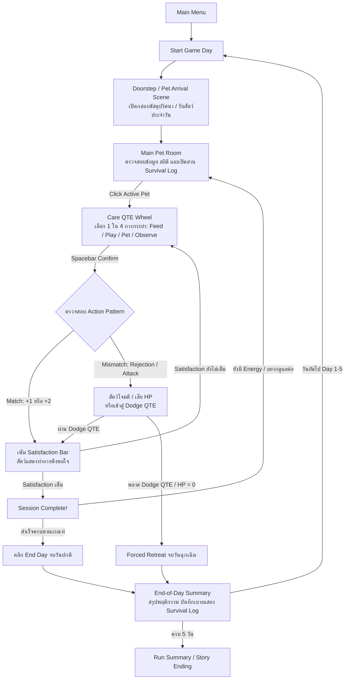

# BePal — Core Loop & Gameplay Flow

## Core Daily Loop

## Scene Breakdown

1. **Front Door / Arrival Scene (ฉากเปิดกล่องปริศนา):**
   ทุกเช้า (หรือวันใหม่) จะมีกล่องพัสดุปริศนาส่งมาหน้าบ้าน ผู้เล่นคลิกเปิดกล่องเพื่อพบกับสัตว์เลี้ยงแปลกหน้าประจำวัน พร้อมบทสนทนาสั้นๆ เล่าเรื่อง
2. **Main Pet Room (ห้องรับเลี้ยงหลัก):**
   - สังเกตสัตว์เลี้ยง ดูค่าสถานะ: ห้อง (Room #), ชื่อสัตว์, Hazard Level (ระดับความอันตราย 1–3), Harm Type (กายภาพ/จิตใจ), และ Care Progress Requirement (เช่น 0/3)
   - ตรวจสอบ Energy คงเหลือของวัน และ Health (HP)
   - เปิดอ่าน **Survival Log** เพื่อทบทวนกฎที่ค้นพบแล้ว
   - คลิกที่ตัวสัตว์เลี้ยงเพื่อเริ่ม **Pet-Care Session**
3. **Care QTE Scene (วงล้อการดูแล):**
   - วงล้อแบ่ง 4 ส่วน: **Feed (Appetite)**, **Play (Recreation)**, **Pet (Intimacy)**, **Observe (Observation)**
   - เข็ม Wheel Marker หมุนวน ผู้เล่นกด Spacebar เมื่อเข็มชี้ไปยังการกระทำที่ต้องการ
   - บางตัวอาจมีลูกเล่น เช่น **Teleporting Marker** (เข็มวาร์ปสุ่มตำแหน่ง)
4. **Attack & Dodge QTE Scene (การหลบการโจมตี):**
   - เมื่อสัตว์เลี้ยงไม่พอใจหรือโจมตีตามแพทเทิร์น วงล้อจะเปลี่ยนเป็น **Dodge QTE** ที่มีแถบสีทอง (Dodge Zone)
   - กด Spacebar ให้ทันในแถบสีทองเพื่อหลบหลีกการบาดเจ็บ
5. **End-of-Day Summary & Survival Log Update:**
   - รวบรวมข้อมูลว่าการกระทำใดส่งผลดี (+2/+1) หรือส่งผลเสีย (+0/Attack)
   - ปลดล็อกข้อมูล Action Pattern ลงใน Survival Log ถาวรเมื่อเล่นกับสัตว์ตัวนั้นครบ 3 Sessions

## Controls

| Input | Context | Action |
| --- | --- | --- |
| **Left Click** | ทั่วไป / UI | คลิกเลือกเมนู, เปิดกล่อง, คลิกสัตว์เลี้ยงเพื่อเริ่มดูแล, กดปุ่ม End Day / Survival Log |
| **Spacebar** | Care QTE / Dodge QTE | **QTE Confirmation** ยืนยันการกระทำเมื่อเข็มหมุนถึงช่องเป้าหมาย |
| **Escape** | ทุกหน้าจอ | ปิดหน้าต่าง Popup (เช่น Survival Log, Help) หรือกลับสู่เมนูหลัก |

## Win / Lose Conditions

- **Victory Condition (ชนะ):** อยู่รอดปลอดภัยจนจบ **Game Day 5** โดยรักษาระดับ Health ไม่ให้หมดสิ้น พร้อมปลดล็อกข้อมูลสัตว์เลี้ยงและเข้าสู่บทสรุปเนื้อเรื่อง
- **Defeat / Forced Retreat (ถอยร่น):** หากทำพลาดจน Health เหลือ $0$ จะเกิด **Forced Retreat** วันนั้นจะจบลงทันทีและผู้เล่นต้องพักรักษาตัวเพื่อเริ่มวันใหม่

