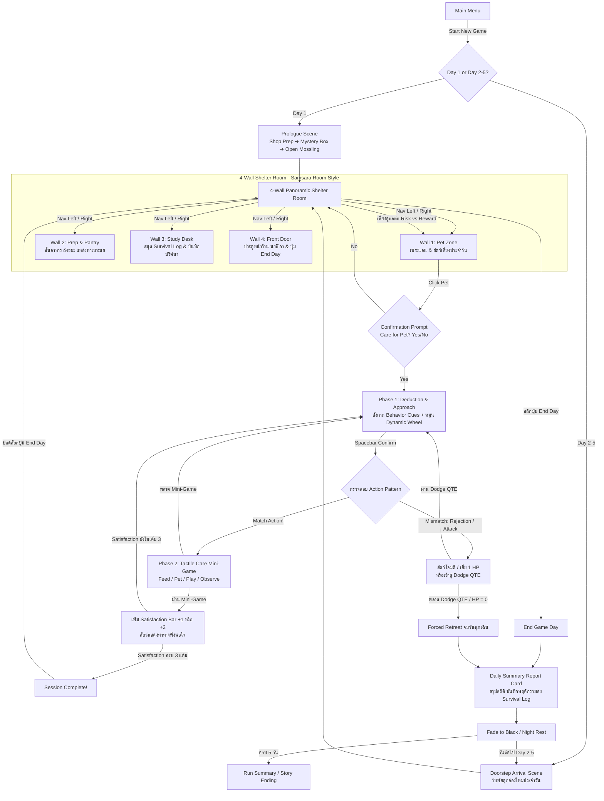

# BePal — Core Loop & Gameplay Flow

## Core Daily Loop

## Scene Breakdown

1. **Prologue Scene (Day 1 เท่านั้น):**
   - แนะนำตัวละครหลักและความฝันในการเปิดร้านรับดูแลสัตว์เลี้ยง (Pet Daycare)
   - การจัดเตรียมร้านและอุปกรณ์จนพร้อมเปิดบริการ
   - มีกล่องพัสดุปริศนามาส่งหน้าบ้าน -> เปิดกล่องพบสัตว์ประหลาดตัวแรก (**Mossling**)
   - ควบคุมผ่าน **Unified Dialogue Box** (มีเอฟเฟกต์พิมพ์ดีด, คลิกกล่องเพื่อแสดงข้อความทั้งหมด, กด `NEXT =>`)

2. **Doorstep Arrival Scene (Day 2–5):**
   - ทุกเช้าจะมีกล่องพัสดุใหม่มาวางไว้หน้าประตู
   - คลิกเปิดกล่องเพื่อรับสัตว์ประหลาดประจำวัน (Nibbleclaw, Blinkbun) พร้อมข้อความบรรยายสั้นๆ

3. **4-Wall Panoramic Shelter Room (ห้องรับเลี้ยง 4 ทิศ):**
   - ผู้เล่นสามารถกดลูกศร **[◄ Left]** และ **[Right ►]** เพื่อหมุนมุมมอง $360^\circ$ รอบห้อง 4 ทิศ (สไตล์ *Samsara Room*):
     - **Wall 1 (Pet Zone):** เบาะนอน คอนโดแมว และตัวสัตว์เลี้ยง มีภาษากายบอกเหตุ (Ambient Cues) คลิกแล้วขึ้นข้อความถาม `[YES] / [NO]` เพื่อเริ่มการดูแล
     - **Wall 2 (Prep & Pantry):** ชั้นวางอาหารสัตว์ อ่างน้ำ ถังขยะ คลิกสำรวจเพื่ออ่านเบาะแสว่าสัตว์ชอบอะไร
     - **Wall 3 (Study Desk):** โต๊ะทำงาน คลิกที่สมุดเพื่อเปิด **Survival Log** อ่านประวัติและข้อมูลสัตว์ที่ปลดล็อกแล้ว
     - **Wall 4 (Front Door & Entrance):** ประตูหน้าร้าน หน้าต่างมองข้างนอก และนาฬิกา/ปุ่ม **End Day** (จะปรากฏขึ้นหลังผ่าน Session แรก)

4. **2-Phase Care Loop:**
   - **Phase 1 (Deduction & Dynamic Wheel):**
     - สังเกต **Dynamic Behavior Cues** ของสัตว์แบบเรียลไทม์ (หางสั่น, ท้องร้อง, ขนพอง)
     - กะจังหวะ Wheel Marker บนวงล้อที่หมุนอย่างมีลูกเล่น (เข็มเร่ง/ช้า, มี Sweet Spot สีทองตรงกลางช่อง)
     - กด Spacebar เพื่อเลือก 1 ใน 4 หมวดการดูแล: **Feed, Play, Pet, Observe**
     - หากเลือกผิด: สัตว์ปฏิเสธและโจมตีทันที (-1 HP หรือเข้าสู่ Dodge QTE)
   - **Phase 2 (Tactile Care Mini-Game):**
     - เมื่อเลือกถูกหมวด วงล้อจะตัดเข้าสู่มินิเกมสัมผัสจริง 2–3 วินาที:
       - **Feed:** กด Spacebar ค้างเพื่อเทอาหารให้ตรงขีด Safe Line
       - **Pet:** ใช้เมาส์ลากลูบตัวสัตว์อย่างนุ่มนวลตามความเร็วที่เหมาะสม
       - **Play:** เลื่อนเคอร์เซอร์คลิกจับจังหวะของเล่นที่แกว่งไปมา
       - **Observe:** เลื่อนเลนส์แว่นขยายส่องหาจุดผิดปกติบนตัวสัตว์
     - *ผลลัพธ์:* เล่นสำเร็จได้ **+1 Satisfaction** (หรือ **+2** หากกดโดน Sweet Spot ใน Phase 1) หากพลาดจะได้ **+0 Satisfaction** โดยไม่เสีย HP

5. **Attack & Dodge QTE Scene:**
   - เมื่อสัตว์เลี้ยงเข้าสู่จังหวะโจมตีตาม Action Pattern วงล้อจะเปลี่ยนเป็น **Dodge QTE** สีเข้มพร้อมแถบ **Dodge Zone** สีทอง
   - กด Spacebar ให้ทันในโซนเพื่อหลบหลีก หากพลาดจะเสีย 1 Health

6. **Daily Summary Report & Night Transition:**
   - เมื่อกด **End Day** หรือเกิด **Forced Retreat (HP = 0)**:
   - แสดง **Daily Summary Report Card** (ใบรายงานประจำวันสไตล์ Papers, Please) สรุปจำนวน Session สำเร็จ, ข้อมูลใหม่ที่บันทึกลง Survival Log, และสถานะสุขภาพ
   - ตัดเข้าสู่ **Fade to Black (Night Rest)** สู่ความมืดและเสียงยามค่ำคืน ก่อนเข้าสู่วันถัดไป

## Controls

| Input | Context | Action |
| --- | --- | --- |
| **Left Click** | ทั่วไป / UI | หมุนห้อง (ซ้าย/ขวา), คลิกสำรวจสิ่งของ, คลิกสัตว์เลี้ยง, กด Next บทสนทนา, เล่นมินิเกม Play/Observe |
| **Spacebar** | Care Phase 1 / Dodge / Feed | **QTE Confirmation** ยืนยันจังหวะเข็ม, กดหลบ Dodge, กดค้างเทอาหารในมินิเกม Feed |
| **Mouse Drag** | Care Phase 2 (Pet) | ลากเมาส์ลูบตัวสัตว์เลี้ยงอย่างนุ่มนวล |
| **Escape** | ทุกหน้าจอ | ปิดหน้าต่าง Overlay (Survival Log), เมนู Pause หรือกดยกเลิกการสำรวจ |

## Win / Lose Conditions

- **Victory Condition (ชนะ):** อยู่รอดปลอดภัยจนครบ **Game Day 5** รักษาระดับ Health ไม่ให้หมดสิ้น พร้อมปลดล็อกข้อมูลสัตว์เลี้ยงและเข้าสู่บทสรุปเนื้อเรื่อง
- **Defeat / Forced Retreat (ถอยร่น):** หาก Health เหลือ $0$ จะเกิด **Forced Retreat** วันนั้นจะจบลงทันที ได้รับการปฐมพยาบาล และฟื้นฟู Health เป็น 3 ในเช้าวันใหม่
