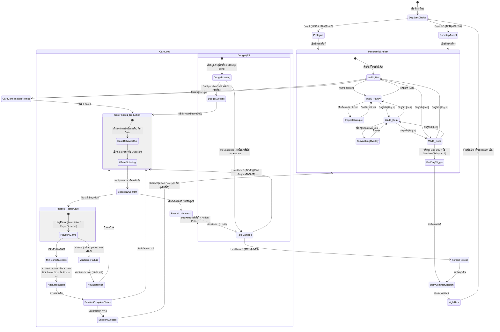

# Mechanic Design — Pet Care, 4-Wall Navigation & 2-Phase Care Loop

## State Machine Diagram

## 1. 4-Wall Panoramic Shelter Navigation

ระบบห้องพักสัตว์แบบ $360^\circ$ แบ่งออกเป็น 4 ผนังตามแกนทิศ โดยควบคุมผ่านปุ่มลูกศร **[◄ Left]** และ **[Right ►]** ที่ขอบจอ:

| ผนัง | ชื่อโซน | วัตถุประสงค์ & สิ่งที่คลิกสำรวจได้ |
| --- | --- | --- |
| **Wall 1** | **Pet Zone** | - ตัวสัตว์เลี้ยงประจำวัน: แสดงท่าทางและภาษากาย (Ambient Cue) - คลิกที่สัตว์เลี้ยง: เปิด Prompt ถาม *"Care for [Name]? [YES] / [NO]"* - คอนโดสัตว์และเบาะนอน |
| **Wall 2** | **Prep & Pantry** | - ชั้นอาหาร (Pantry Shelf): อ่านคำอธิบายวัตถุดิบและกลิ่นอาหาร (Clues) - อ่างล้างและที่ให้น้ำ: ตรวจสอบความสะอาด - ถังขยะ: ดูเศษซากของที่สัตว์ไม่กิน |
| **Wall 3** | **Study Desk** | - สมุด **Survival Log**: คลิกเปิดหน้าต่างอ่านข้อมูลพฤติกรรมสัตว์ที่ค้นพบ - กระดานข้อความ/บันทึก: อ่านจดหมายปริศนาจากผู้ส่งกล่อง |
| **Wall 4** | **Front Door** | - ประตูหน้าร้าน: จุดที่กล่องพัสดุมาส่งในยามเช้า - หน้าต่าง: บรรยากาศภายนอก (กลางวัน/ฝนตก) - นาฬิกา / ปฏิทิน: ปุ่ม **[End Day]** (จะปรากฏขึ้นหลังผ่านอย่างน้อย 1 Session) |

## 2. The 2-Phase Care Loop

### Phase 1: Deduction & Dynamic Wheel (การวิเคราะห์ & จังหวะเข็ม)
1. **Behavior Cues (ภาษากายสัตว์):**
   - ในแต่ละรอบ สัตว์จะแสดงอาการที่สอดคล้องกับความต้องการ เช่น:
     - ท้องร้อง / น้ำลายสอ $\rightarrow$ ต้องการ **Feed**
     - ดวงตากระตุก / ร่างกายคันยุบยิบ $\rightarrow$ ต้องการ **Pet**
     - สายตาวอกแวก / ส่ายหัวไปมา $\rightarrow$ ต้องการ **Play**
     - ขนพอง / หวาดระแวง / ตัวเกร็ง $\rightarrow$ ต้องการ **Observe** (ห้ามเข้าใกล้)
2. **Dynamic Wheel Mechanics:**
   - วงล้อแบ่ง 4 ส่วน ($90^\circ$ ต่อช่อง): Feed ($45^\circ$), Play ($135^\circ$), Pet ($225^\circ$), Observe ($315^\circ$)
   - ความเร็วเข็มหมุนปรับตาม Hazard Level ของสัตว์ (เช่น Mossling 2.0 rad/s, Nibbleclaw เร่งความเร็ว, Blinkbun วาร์ปเข็ม)
   - **Golden Sweet Spot:** กึ่งกลางของแต่ละช่องจะมีแถบสีทองกว้าง $\pm 15^\circ$ หากกดโดนเป๊ะ จะได้รับโบนัส **+2 Satisfaction** ใน Phase 2
3. **การตัดสินผล Phase 1:**
   - **เลือกตรงตามที่สัตว์ต้องการ:** ผ่านเข้าสู่ **Phase 2 (Tactile Mini-Game)**
   - **เลือกผิดหมวด:** สัตว์ปฏิเสธทันที เสีย 1 Health หรือบังคับเข้าสู่ **Dodge QTE**

---

### Phase 2: Tactile Care Mini-Games (การลงมือดูแลจริง 4 รูปแบบ)
เมื่อผ่าน Phase 1 วงล้อจะเปลี่ยนเป็นมินิเกมสัมผัสจริงระยะสั้น (2–3 วินาที):

1. **Feed (ให้อาหาร — Hold & Release):**
   - ผู้เล่นกด Spacebar ค้างเพื่อเทอาหารเหลว/สารอาหารลงในชาม
   - แถบระดับอาหารจะเพิ่มขึ้น ผู้เล่นต้องปล่อย Spacebar เมื่อระดับอาหารอยู่ในแถบ **Safe Line (สีเขียว)**
   - หากเทน้อยไปหรือเทล้นชาม = พลาด
2. **Pet (ลูบตัว — Mouse Stroking):**
   - เคอร์เซอร์เมาส์เปลี่ยนเป็นรูปมือ
   - ผู้เล่นต้องคลิกลากเมาส์ลูบไปบนตัวสัตว์ 2–3 ครั้งด้วยความเร็วปานกลางที่สม่ำเสมอ
   - หากลากเมาส์เร็วเกินไป (Flick) สัตว์จะตกใจขู่ฟ่อ = พลาด
3. **Play (เล่นของเล่น — Reflex Catch):**
   - ของเล่น (เช่น กิ่งไม้เรืองแสง หรือลูกบอลหญ้า) จะแกว่งหรือกระดอนไปมาบนจอ
   - ผู้เล่นต้องคลิกเมาส์จับของเล่นในจังหวะที่มันวิ่งผ่านจุดที่สัตว์กระโจน = ผ่าน
4. **Observe (ส่องสังเกต — Focus Lens):**
   - หน้าจอจะซูมเข้าใกล้จุดสำคัญของสัตว์ มีวงเลนส์แว่นขยายให้ผู้เล่นเลื่อนเมาส์
   - ผู้เล่นต้องเลื่อนเลนส์ไปส่องตรวจหา "จุดผิดปกติ" (เช่น ลายเส้นเรืองแสง หรือรอยแตกลาย) ให้เลนส์โฟกัสชัดเจน 1.5 วินาที = ผ่าน

---

### กฎการให้คะแนนและบทลงโทษใน Phase 2 (Consequence System)
- **มินิเกมสำเร็จ:** ได้รับ **+1 Satisfaction** (หรือ **+2** หากกดโดน Sweet Spot ใน Phase 1)
- **มินิเกมล้มเหลว:** ได้รับ **+0 Satisfaction** (ไม่เสีย HP ผู้เล่นเพียงเสียโอกาสและต้องเริ่มรอบใหม่)
- **สะสมครบ 3 Satisfaction:** จบ Session อย่างสมบูรณ์ สัตว์เข้าสู่สถานะ Happy

## 3. Dodge QTE System

- เมื่อสัตว์เลี้ยงเข้าสู่จังหวะโจมตี วงล้อจะเปลี่ยนสภาพเป็นพื้นหลังสีเข้มพร้อมคำเตือน **"WARNING: ATTACK INCOMING!"**
- **Dodge Zone (โซนสีทอง):** กว้าง $\pm 36^\circ$ ที่มุมด้านบน ($270^\circ$)
- ผู้เล่นต้องกด Spacebar ขณะเข็มวิ่งผ่านโซนสีทอง
  - *หลบพ้น:* ไม่เสียเลือด และกลับสู่การดูแลรอบถัดไป
  - *พลาด:* โดนโจมตี เสีย 1 Health ทันที

## 4. Health, Risk vs. Reward & Progression

- **Health (HP):** เริ่มต้นวันด้วย 3 Health
- **Risk vs. Reward (สิทธิ์ในการ End Day):**
  - เมื่อดูแลสัตว์สำเร็จ **1 Session**: ปุ่ม **[End Day]** จะเปิดใช้งานที่ Wall 4
  - ผู้เล่นมีสิทธิ์เลือกระหว่าง:
    1. **Play Safe:** กด [End Day] เพื่อจบวันอย่างปลอดภัย ไม่เสี่ยงเสียชีวิต
    2. **High Risk, High Reward:** คลิกดูแลสัตว์ต่ออีกรอบเพื่อสะสมสถิติสำหรับปลดล็อก **Survival Log** (ต้องสะสมครบ 3 Sessions ต่อสายพันธุ์)
- **Forced Retreat:** หาก Health เหลือ 0 ระหว่างการดูแล วันนั้นจะจบลงฉุกเฉินทันที

## 5. Daily Summary Report & Night Transition

เมื่อวันสิ้นสุดลง (ทั้งจบปกติและ Forced Retreat) เกมจะนำเสนอ:
1. **Daily Summary Report Card:**
   - สรุป Session ที่ดูแลสำเร็จในวันนี้
   - บันทึกการค้นพบใหม่ (Action Pattern หรือความชอบที่ถูกจดลง Survival Log)
   - สภาพร่างกายและแต้ม Forced Retreat
2. **Night Rest:**
   - หน้าจอ Fade to Black พร้อมเสียงบรรยากาศยามค่ำคืน
   - เช้าวันใหม่เริ่มต้นด้วย Health เต็ม 3 และตัดเข้าสู่ Doorstep Scene ของวันถัดไป
