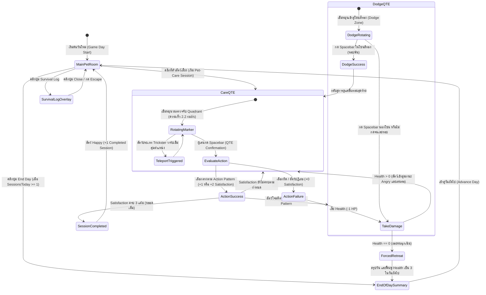

# Mechanic Design — Pet Care, QTE Wheel & Hazard System

## State Machine Diagram

## 1. The Four Care Actions (การกระทำ 4 รูปแบบ)

| Care Action | ด้านความต้องการ | การแสดงผลในเกม | คำอธิบายและวัตถุประสงค์ |
| --- | --- | --- | --- |
| **Feed** | Appetite (ความอยากอาหาร) | สีเขียว (Quadrant 0, $45^\circ$) | ให้อาหารและสารอาหาร พร้อมสังเกตการตอบสนองของระบบย่อยและสรีระ |
| **Play** | Recreation (การสันทนาการ) | สีฟ้า (Quadrant 1, $135^\circ$) | ใช้อุปกรณ์ ของเล่น หรือกิจกรรมกระตุ้นพลังงานเพื่อลดความตึงเครียด |
| **Pet** | Intimacy (ความใกล้ชิด) | สีชมพู (Quadrant 2, $225^\circ$) | ค่อยๆ เข้าหาและลูบสัมผัสเพื่อสร้างความคุ้นเคยและความไว้ใจ |
| **Observe** | Observation (การเฝ้าสังเกต) | สีม่วง (Quadrant 3, $315^\circ$) | ยืนเฝ้ามองจากระยะปลอดภัย ไม่สัมผัสตัว เพื่อวิเคราะห์พฤติกรรมผิดปกติ |

## 2. Pet Favor & Satisfaction (ความพึงพอใจและแต้ม)

การกระทำแต่ละอย่างจะได้รับผลตอบรับจากสัตว์เลี้ยงตาม **Action Pattern**:
- **Very Effective (+2):** สัตว์ชื่นชอบมาก ได้รับ Satisfaction 2 แต้มทันที
- **Effective (+1):** สัตว์ยอมรับ ได้รับ Satisfaction 1 แต้ม
- **Neutral (+0):** สัตว์ไม่สนใจ ไม่ได้ Satisfaction แต่ไม่ทำร้าย
- **Rejection / Attack:** สัตว์ไม่พอใจอย่างรุนแรง โจมตีผู้เล่นทำให้เสีย Health หรือบังคับเข้าสู่ **Dodge QTE**

เป้าหมายในแต่ละ Session คือสะสม Satisfaction ให้เต็ม **3 แต้ม** เพื่อจบ Session อย่างสมบูรณ์

## 3. QTE Wheel Mechanics (กลไกวงล้อ Care QTE)

- **องศาและการคำนวณตำแหน่ง:**
  - มุมหมุน $\theta = (\theta + \omega \cdot \Delta t) \pmod{2\pi}$ โดย $\omega = 2.2 \text{ rad/s}$
  - ส่วนของวงกลมแบ่ง 4 ช่องเท่ากัน ช่องละ $90^\circ$ ($\frac{\pi}{2} \text{ rad}$)
  - การคำนวณเลือก Segment: $\text{Segment} = \lfloor \frac{\theta}{\pi / 2} \rfloor \pmod 4$
- **Teleporting Marker Modifier:**
  - สำหรับสัตว์ที่มีลักษณะ Trickster เข็มหมุนจะสุ่มเวลา $t_{\text{teleport}} \in [0.45, 1.3] \text{ วินาที}$
  - เมื่อถึงเวลา เข็มจะวาร์ปไปยังมุมสุ่ม $\theta_{\text{new}} \in [0, 2\pi)$ ทันที 1 ครั้งต่อรอบเพื่อทดสอบสมาธิ

## 4. Dodge QTE Mechanics (กลไกการหลบหลีก)

- เมื่อสัตว์โจมตี วงล้อจะเปลี่ยนสภาพเป็นพื้นหลังสีเข้ม และมีข้อความ **"ATTACK!"** ตรงกลาง
- **Dodge Zone (โซนสีทอง):** ปรากฏที่มุมด้านบน $\theta_{\text{zone}} = \frac{3\pi}{2}$ ($270^\circ$) รัศมีกว้าง $\Delta \theta = \pm \frac{\pi}{5}$ ($36^\circ$)
- ผู้เล่นต้องกด Spacebar ขณะที่ Wheel Marker วิ่งผ่านโซนสีทอง
- **ผลลัพธ์:**
  - *สำเร็จ:* หลบการโจมตีได้ ไม่เสีย Health และดำเนินการดูแลขั้นตอนถัดไป
  - *ล้มเหลว:* โดนโจมตี เสีย 1 Health ทันที

## 5. Health, Hazard & Harm System

- **Health (HP):** เริ่มต้นวันใหม่ด้วย $3$ Health เสมอ (แทนค่าด้วยไอคอนหัวใจ 3 ดวง)
- **Hazard Level (ระดับอันตราย):**
  - **Level 1 (Low):** พฤติกรรมมั่นคง เข็มหมุนปกติ การโจมตีเบา
  - **Level 2 (Medium):** มีจังหวะโจมตีสวนกลับ บังคับเล่น Dodge QTE
  - **Level 3 (High):** พฤติกรรมหลอกล่อ เข็มวาร์ปสุ่มตำแหน่ง (Teleporting Marker)
- **Harm Type (ประเภทความเสียหาย):**
  - **Physical:** ความเสียหายทางกายภาพ กรงเล็บ การกัด หรือการชน
  - **Mental:** การจ้องมองที่ผิดปกติ เสียงคลื่นความถี่สูง หรือแรงกดดันทางจิตใจ
- **Forced Retreat (การถอยร่นฉุกเฉิน):**
  - เมื่อ Health ลดเหลือ $0$ ผู้เล่นจะถูกบังคับถอยกลับห้องพักทันที
  - วันนั้นจะสิ้นสุดลงทันที (นับแต้ม Forced Retreats +1) และ Health จะได้รับการฟื้นฟูเต็ม $3$ ในวันถัดไป

## 6. Survival Log Progression

- ในแต่ละวันที่ดูแลสัตว์สำเร็จ ข้อมูลพฤติกรรมจะถูกสะสม
- เมื่อผู้เล่นดูแลสัตว์ชนิดใดชนิดหนึ่งสำเร็จครบ **3 Sessions** (ไม่จำเป็นต้องในวันเดียวกัน):
  - Survival Log จะปลดล็อกข้อมูลสมบูรณ์ของสัตว์ตัวนั้น
  - เปิดเผย Action Pattern, Care Action ที่ชอบ, จังหวะการโจมตี, และลูกเล่นของเข็มอย่างละเอียด

