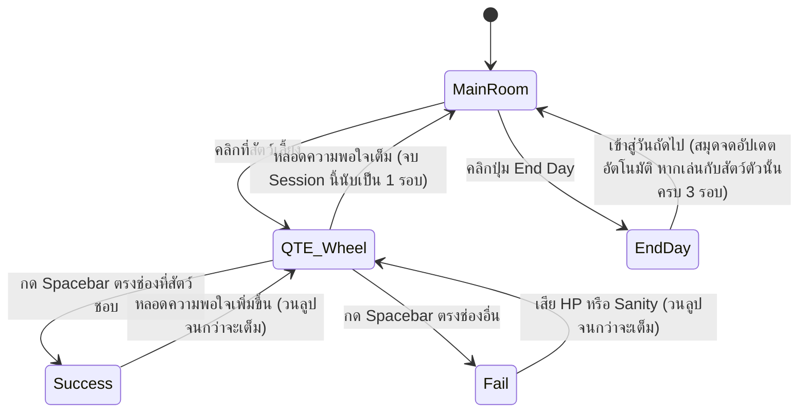

# Mechanic Design — [Pet Care & QTE Mechanic]

## State Diagram

## Rules

| State     | เข้าเงื่อนไข                                             | ออกเงื่อนไข                                   | Note                                             |
| --------- | -------------------------------------------------------- | --------------------------------------------- | ------------------------------------------------ |
| Main Room | เริ่มวันใหม่ / จบ Session (หลอดความพอใจเต็ม)             | คลิกที่ตัวสัตว์เลี้ยง / คลิกปุ่ม End Day      | ห้องหลักสำหรับเดินสำรวจและเปิดดูสมุดบันทึก       |
| QTE Wheel | คลิกที่ตัวสัตว์เลี้ยง / วนลูปกลับมาจาก Success หรือ Fail | กด Spacebar / หลอดความพอใจเต็ม (จบ Session)   | เข็มหมุนวนบน 4 ตัวเลือกด้วยความเร็วคงที่ตลอดเวลา |
| Success   | กด Spacebar ตรงช่องการกระทำที่สัตว์ **"ชอบ"**            | อนิเมชั่นสัตว์พอใจจบลง ➔ กลับไป QTE Wheel     | หลอดความพอใจ (Object bar) เพิ่มขึ้น              |
| Fail      | กด Spacebar ตรงช่องที่สัตว์ **"ไม่ชอบ"**                 | อนิเมชั่นโจมตีหรือหลอนจบลง ➔ กลับไป QTE Wheel | ผู้เล่นเสียค่า HP หรือ Sanity                    |
| End Day   | ผู้เล่นเสียค่า HP หรือ Sanity                            | เปลี่ยนฉากเพื่อเข้าสู่วันถัดไป                | -                                                |

