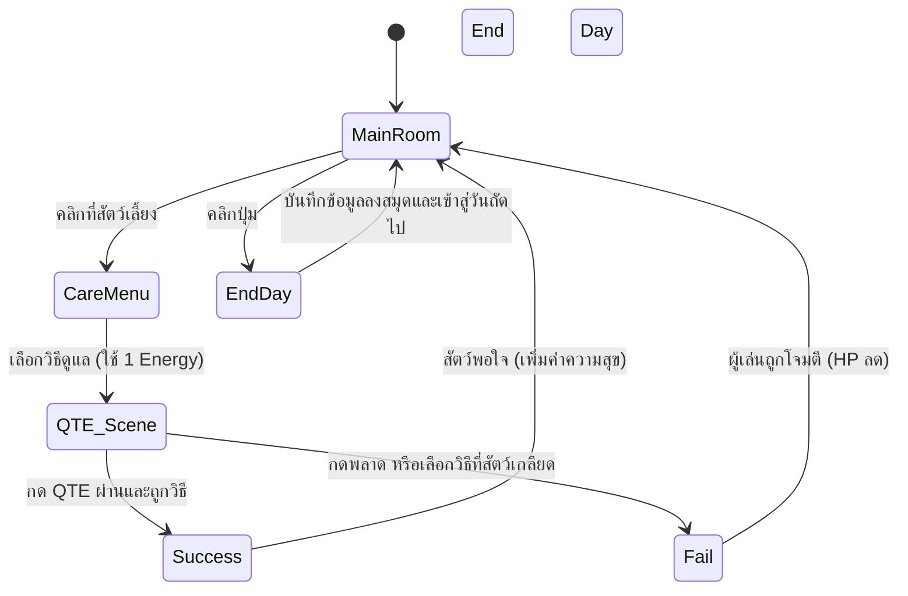

# Mechanic Design — [Pet Care & QTE Mechanic]

## State Diagram

## Rules

| State         | เข้าเงื่อนไข                                  | ออกเงื่อนไข                              | Note                                    |
| ------------- | --------------------------------------------- | ---------------------------------------- | --------------------------------------- |
| Main Room     | เริ่มวันใหม่ / จบแอคชั่นดูแลสัตว์             | คลิกที่ตัวสัตว์เลี้ยง / คลิกปุ่ม End Day | ห้องหลักสำหรับสำรวจ                     |
| Care Menu     | คลิกที่สัตว์เลี้ยง                            | เลือกวิธีการดูแล 1 อย่าง                 | หัก Energy 1 หน่วยเมื่อเลือก            |
| QTE Scene     | เลือกวิธีการดูแลเสร็จสิ้น                     | กดปุ่มสำเร็จ / กดพลาด / หมดเวลา          | ความยากอาจแปรผันตามสัตว์                |
| Success       | กด QTE ผ่านและเลือกถูกวิธี                    | อนิเมชั่นสัตว์พอใจจบลง                   | สัตว์ได้รับค่าความสุข (+2, +1)          |
| Fail (Attack) | กด QTE พลาด หรือ เลือกวิธีที่สัตว์ไม่ชอบ (+0) | อนิเมชั่นสัตว์โจมตีจบลง                  | ผู้เล่นเสีย HP (-10, -5, -20)           |
| End Day       | คลิกปุ่ม End Day ใน Main Room                 | ผู้เล่นกดยืนยันเพื่อเริ่มวันถัดไป        | บันทึกข้อมูลลงสมุด / ฟื้นฟู HP 25 หน่วย |
