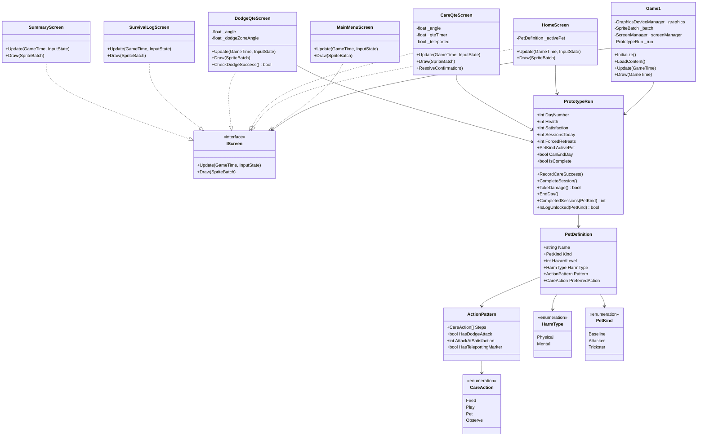

# Class Diagram — BePal Architecture

## Architecture Overview

โครงสร้างคลาสของ BePal ออกแบบตามหลักการแยกหน้าที่ (Separation of Concerns) สอดคล้องกับแนวทางใน `AGENTS.md` และ `CONTEXT.md` โดยแยกชั้นการจัดการหน้าจอ (Screens) ออกจากตรรกะการบริหารและการเล่น (Gameplay & Domain Models)

