# Class Diagram — BePal Architecture

## Architecture Overview

โครงสร้างคลาสของ BePal ออกแบบตามหลักการแยกหน้าที่ (Separation of Concerns) สอดคล้องกับแนวทางใน `AGENTS.md` และ `CONTEXT.md` โดยแยกชั้นการจัดการหน้าจอ (Screens), ระบบกล่องข้อความ (Dialogue), มินิเกมสัมผัส (Mini-Games) ออกจากตรรกะและสถานะของเกม (Gameplay & Domain Models)

```mermaid
classDiagram
    class Game1 {
        -GraphicsDeviceManager _graphics
        -SpriteBatch _batch
        -ScreenManager _screenManager
        -PrototypeRun _run
        +Initialize()
        +LoadContent()
        +Update(GameTime)
        +Draw(GameTime)
    }

    class ScreenManager {
        -Stack~IScreen~ _screens
        +ScreenContext Context
        +PushScreen(IScreen)
        +PopScreen()
        +SetScreen(IScreen)
        +ShowPrologue()
        +ShowDoorstep()
        +ShowRoom()
        +BeginCare()
        +BeginDodge()
        +ShowDailySummary()
    }

    class IScreen {
        <<interface>>
        +Update(GameTime)
        +Draw(GameTime, SpriteBatch)
    }

    class DialogueBox {
        -Queue~string~ _dialogueLines
        -string _currentLine
        -float _charTimer
        -int _revealedChars
        -bool _isFullTextRevealed
        -bool _showPrompt
        +bool IsFinished
        +Update(GameTime, MouseState)
        +Draw(SpriteBatch)
        +SetDialogue(IEnumerable~string~)
        +SetPrompt(string question, Action onYes, Action onNo)
        +SkipTypewriter()
    }

    class PrologueScreen {
        -DialogueBox _dialogueBox
        -int _sceneIndex
        +Update(GameTime)
        +Draw(GameTime, SpriteBatch)
    }

    class DoorstepScreen {
        -DialogueBox _dialogueBox
        -bool _boxOpened
        +Update(GameTime)
        +Draw(GameTime, SpriteBatch)
    }

    class PanoramicRoomScreen {
        -int _currentWallIndex
        -DialogueBox _dialogueBox
        -List~InspectableItem~ _wallItems
        +Update(GameTime)
        +Draw(GameTime, SpriteBatch)
        +RotateLeft()
        +RotateRight()
        +OnPetClicked()
        +OnEndDayClicked()
    }

    class CareQteScreen {
        -float _angle
        -float _needleSpeed
        -BehaviorCue _activeCue
        -bool _isPhase2Active
        -ICareMiniGame _activeMiniGame
        +Update(GameTime)
        +Draw(GameTime, SpriteBatch)
        +ResolvePhase1(CareAction chosen)
        +StartPhase2(CareAction action)
    }

    class ICareMiniGame {
        <<interface>>
        +bool IsFinished
        +bool IsSuccess
        +Update(GameTime, KeyboardState, MouseState)
        +Draw(SpriteBatch)
        +Reset()
    }

    class FeedMiniGame {
        -float _fillLevel
        -float _targetMin
        -float _targetMax
        +Update(GameTime, KeyboardState, MouseState)
        +Draw(SpriteBatch)
    }

    class PetMiniGame {
        -Vector2 _lastMousePos
        -float _strokeProgress
        -float _maxSafeSpeed
        +Update(GameTime, KeyboardState, MouseState)
        +Draw(SpriteBatch)
    }

    class PlayMiniGame {
        -Vector2 _toyPos
        -Vector2 _velocity
        +Update(GameTime, KeyboardState, MouseState)
        +Draw(SpriteBatch)
    }

    class ObserveMiniGame {
        -Vector2 _lensPos
        -Vector2 _targetAnomalyPos
        -float _focusTime
        +Update(GameTime, KeyboardState, MouseState)
        +Draw(SpriteBatch)
    }

    class DodgeQteScreen {
        -float _angle
        -float _dodgeCenter
        +Update(GameTime)
        +Draw(GameTime, SpriteBatch)
        +ResolveDodge()
    }

    class DailySummaryScreen {
        -PrototypeRun _run
        +Update(GameTime)
        +Draw(GameTime, SpriteBatch)
    }

    class SurvivalLogScreen {
        +Update(GameTime)
        +Draw(GameTime, SpriteBatch)
    }

    class PrototypeRun {
        +int DayNumber
        +int Health
        +int Satisfaction
        +int SessionsToday
        +int ForcedRetreats
        +PetKind ActivePet
        +bool CanEndDay
        +bool IsComplete
        +RecordCareSuccess(int amount)
        +CompleteSession()
        +TakeDamage() bool
        +EndDay()
        +CompletedSessions(PetKind) int
        +IsLogUnlocked(PetKind) bool
    }

    class PetDefinition {
        +string Name
        +PetKind Kind
        +int HazardLevel
        +HarmType HarmType
        +ActionPattern Pattern
        +CareAction PreferredAction
        +BehaviorCue[] AvailableCues
    }

    class BehaviorCue {
        +CareAction TargetAction
        +string RoomDescription
        +string RealTimeVisualCue
    }

    Game1 --> ScreenManager
    ScreenManager --> IScreen
    PrologueScreen ..|> IScreen
    DoorstepScreen ..|> IScreen
    PanoramicRoomScreen ..|> IScreen
    CareQteScreen ..|> IScreen
    DodgeQteScreen ..|> IScreen
    DailySummaryScreen ..|> IScreen
    SurvivalLogScreen ..|> IScreen

    PrologueScreen --> DialogueBox
    DoorstepScreen --> DialogueBox
    PanoramicRoomScreen --> DialogueBox
    CareQteScreen --> ICareMiniGame
    FeedMiniGame ..|> ICareMiniGame
    PetMiniGame ..|> ICareMiniGame
    PlayMiniGame ..|> ICareMiniGame
    ObserveMiniGame ..|> ICareMiniGame

    PanoramicRoomScreen --> PrototypeRun
    CareQteScreen --> PrototypeRun
    PrototypeRun --> PetDefinition
    PetDefinition --> BehaviorCue
```

