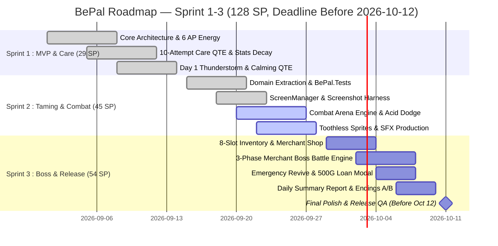

# Sprint Backlog — BePal (Sprint 1–3 Release Plan v2.0)

> ภาพรวมการกระจาย User Stories และ Technical Tasks ทั้งหมดจาก `01-product-backlog.md` ลงสู่ **3 Sprints (รวม 128 SP, สิ้นสุดก่อน 12 ตุลาคม 2026)** โดยตัวเลข Story Points ทั้งหมดผ่านการตรวจสอบความถูกต้องทางคณิตศาสตร์ตรงกันสมบูรณ์ทุกแกน:
> - **โชว์ (Show):** Lead Programmer (60 SP)
> - **ซุง (Zunk):** Game Designer (28 SP)
> - **ภูมิ (Pooh):** Flex (leans towards Design) / Audio Support (21 SP)
> - **เดียร์ (Dear):** 2D Art & UI Lead (19 SP)

---

## 1. Timeline & Velocity Overview

| Sprint | ระยะเวลา | เป้าหมายหลัก (Sprint Goal) | Velocity (SP) | สถานะ |
| --- | --- | --- | --- | --- |
| **Sprint 1** | 2026-09-01 — 2026-09-14 | **MVP Core & Care Foundations:** สถาปัตยกรรมหลัก, ระบบเวลา 4 เฟส, โควตาพลังงาน 6 AP, วงล้อ Care QTE 10 ครั้ง, สเตตัส 4 มิติ และพายุ Thunderstorm | **29 SP** | ✅ **Done** (29/29 SP) |
| **Sprint 2** | 2026-09-15 — 2026-09-28 | **Toothless Taming, Combat Arena & Systems Polish:** เหตุการณ์ "Knock Knock !!", สัตว์ร้าย Toothless, ระบบ Combat Taming Arena, หลบกรดและสวนกลับ, ระบบเสียง SFX 9 เสียง | **45 SP** | 🔄 **Active** (35/45 SP Done) |
| **Sprint 3** | 2026-09-29 — 2026-10-11 | **Merchant Shop, 3-Phase Boss Battle & Final Release:** พ่อค้าเร่ The Traveling Collector, ร้านค้า 5 ชนิด, กระเป๋า 8 ช่อง, ทางแยกขายสัตว์ 5,000G vs สู้บอส 3 เฟส, ฉากจบ Ending A & B และปล่อยเกม | **54 SP** | 🔲 **Planned / Final Sprint** |
| **Total** | **6 สัปดาห์ (เสร็จก่อน 12 ต.ค. 2026)** | **BePal Full Prototype & Game Release (v2.0)** | **128 SP** | **77/128 SP Completed (60%)** |

---

## 2. Sprint 1: MVP Core & Care Foundations (เสร็จสมบูรณ์ ✅)
**ระยะเวลา:** 2026-09-01 — 2026-09-14 | **Actual Velocity:** 29 SP | **Status:** ✅ Done (29/29 SP)

| ID | User Story / Task | ผู้รับผิดชอบหลัก | MoSCoW | SP | Status | คำอธิบายความรับผิดชอบ |
| --- | --- | --- | --- | --- | --- | --- |
| **US-01** | Starter Pet Selection & Base Habitat Room | โชว์ (Lead Prog) | Must | 4 | ✅ Done | โชว์สร้างหน้าต่างเลือกสัตว์ 3 ชนิด และ HUD ห้องพัก |
| **US-02** | 10-Attempt Care QTE Engine | โชว์ (Lead Prog) | Must | 5 | ✅ Done | โชว์พัฒนาเข็มหมุน 2.4 rad/s พร้อมคำนวณ Perfect/Good |
| **US-03** | Pet Stats Model & Mathematical Decay Rules | ซุง (Game Designer) | Must | 6 | ✅ Done | ซุงคำนวณสูตร Natural Decay และ Per-Action Burn |
| **US-04** | Discrete Energy Budget (6 AP) System | โชว์ (Lead Prog) | Must | 5 | ✅ Done | โชว์พัฒนาระบบโควตา 6 AP และการตัดเข้าสู่ Phase 3 |
| **US-05** | Sickness & Health Status Effects Design | ซุง (Game Designer) | Must | 5 | ✅ Done | ซุงออกแบบบทลงโทษ Starving, Grimy และ Infected |
| **US-06** | Day 1 Thunderstorm Disaster & Calming QTE | ซุง (Game Designer) | Must | 4 | ✅ Done | ซุงออกแบบมินิเกมปลอบประโลมพายุ 3 จังหวะ |
| **รวม** | **Sprint 1 Velocity** | - | - | **29** | - | โชว์: 14 SP, ซุง: 15 SP, ภูมิ: 0 SP, เดียร์: 0 SP |

---

## 3. Sprint 2: Toothless Taming, Combat Arena & Systems Polish (กำลังดำเนินการ 🔄)
**ระยะเวลา:** 2026-09-15 — 2026-09-28 | **Planned Velocity:** 45 SP | **Status:** 🔄 Active (35/45 SP Done)

| ID | User Story / Task | ผู้รับผิดชอบหลัก | MoSCoW | SP | Status | คำอธิบายความรับผิดชอบ |
| --- | --- | --- | --- | --- | --- | --- |
| **US-07** | Dynamic Pet Emotional Sprites (Coco 4 ท่า) | เดียร์ (2D Art Lead) | Should | 4 | 🔄 Active | เดียร์วาดสไปรต์ Coco ครบ 4 อารมณ์ (280×360 px) |
| **US-08** | Day 2 "Knock Knock !!" Narrative Script | ภูมิ (Flex / Audio) | Must | 4 | ✅ Done | ภูมิเขียนบทสนทนาเสียงเคาะประตูและรอยกรด |
| **US-09** | Toothless Combat Taming Arena & QTE | โชว์ (Lead Prog) | Must | 5 | 🔄 Active | โชว์พัฒนา `CombatArenaScreen` และหลอด Tame Gauge |
| **US-10** | Acid Spit Dodge Zone & Counter-Attack | โชว์ (Lead Prog) | Must | 5 | 🔄 Active | โชว์สร้างระบบหลบกรดและสวนกลับแบบ Shrinking Ring |
| **US-11** | Core Sound Effects Production (9 SFX) | ภูมิ (Flex / Audio) | Should | 3 | 🔄 Active | ภูมิจัดหาและ Normalize ไฟล์เสียง SFX 9 ไฟล์ |
| **US-12** | MonoGame Audio Engine Integration | โชว์ (Lead Prog) | Should | 3 | ✅ Done | โชว์เชื่อมต่อระบบเล่นเสียงใน MonoGame |
| **ART-01** | Toothless Sprite Sheet (4 ท่า) | เดียร์ (2D Art Lead) | Must | 3 | 🔄 Active | เดียร์วาด Toothless ครบ 4 ท่า (Idle, Angry, Attack, Tamed) |
| **DES-01** | Combat & Taming Balance Matrix | ซุง (Game Designer) | Should | 3 | ✅ Done | ซุงคำนวณตัวเลขความเร็วเข็มและดาเมจกรด |
| **QA-01** | Lead QA Playtesting & QTE Timing Calibration | ภูมิ (Flex / Audio) | Should | 3 | 🔄 Active | ภูมิทดสอบฟีลลิ่งการหลบและสวนกลับ |
| **TECH-01** | Pure C# Domain Models Extraction | โชว์ (Lead Prog) | Should | 3 | ✅ Done | โชว์แยกโมเดลโดเมนออกจาก Engine |
| **TECH-02** | Automated Unit Testing (`BePal.Tests`) | โชว์ (Lead Prog) | Should | 4 | ✅ Done | โชว์สร้างชุดทดสอบครอบคลุมสเตตัสและการคำนวณ |
| **TECH-03** | Screen Hierarchy & State Transitions | โชว์ (Lead Prog) | Should | 3 | ✅ Done | โชว์สร้าง `IScreen` และ `ScreenManager` |
| **TECH-04** | Content Pipeline & Automated Screenshot Harness | โชว์ (Lead Prog) | Should | 2 | ✅ Done | โชว์พัฒนาระบบ `--screenshot` รันผ่าน 27 เฟรม |
| **รวม** | **Sprint 2 Velocity** | - | - | **45** | - | โชว์: 25 SP, ซุง: 6 SP, ภูมิ: 7 SP, เดียร์: 7 SP |

---

## 4. Sprint 3: Merchant Shop, 3-Phase Boss Battle & Release (วางแผนไว้ 🔲)
**ระยะเวลา:** 2026-09-29 — 2026-10-11 | **Planned Velocity:** 54 SP | **Status:** 🔲 Planned

| ID | User Story / Task | ผู้รับผิดชอบหลัก | MoSCoW | SP | Status | คำอธิบายความรับผิดชอบ |
| --- | --- | --- | --- | --- | --- | --- |
| **US-20** | 8-Slot Inventory & Item Consumption Subsystem | โชว์ (Lead Prog) | Must | 5 | 🔲 Planned | โชว์พัฒนา `InventoryOverlayScreen` รองรับไอเทม 8 ช่อง |
| **US-21** | Merchant 3-Phase Boss Battle Engine | โชว์ (Lead Prog) | Must | 5 | 🔲 Planned | โชว์พัฒนาบอสไฟต์ 3 เฟส (Acid, Gatling, Cane) |
| **US-22** | Emergency Revive & 500G Loan Subsystem | โชว์ (Lead Prog) | Must | 4 | 🔲 Planned | โชว์พัฒนาระบบกู้ชีพฉุกเฉินและสัญญาเงินกู้ 20% |
| **US-23** | Daily Summary Report Card & JSON Save System | โชว์ (Lead Prog) | Must | 4 | 🔲 Planned | โชว์พัฒนาหน้าสรุปผลรายวันและการเซฟโหลด JSON |
| **TECH-05** | Final Release Build & Integration Polish | โชว์ (Lead Prog) | Must | 3 | 🔲 Planned | โชว์เชื่อมต่อระบบทั้งหมดและเตรียมบิลด์เกมปล่อย |
| **DES-02** | 5-Item Shop Catalog & 3 Equipment Balance | ซุง (Game Designer) | Should | 4 | 🔲 Planned | ซุงกำหนดราคาสินค้า 5 ชนิด และบัฟอุปกรณ์ 3 ชิ้น |
| **DES-03** | Boss Combat 3 Phases Math & Ending Conditions | ซุง (Game Designer) | Must | 3 | 🔲 Planned | ซุงคำนวณบอส HP 1,000 และดาเมจแต่ละเฟส |
| **US-14** | Day 3 Traveling Merchant Lore & Buyout Script | ภูมิ (Flex / Audio) | Must | 4 | 🔲 Planned | ภูมิเขียนบทสนทนายื่นข้อเสนอ 5,000G |
| **US-15** | Endings A & B Epilogue Narrative Scripts | ภูมิ (Flex / Audio) | Must | 4 | 🔲 Planned | ภูมิเขียนบทสรุปฉากจบ Ending A และ Ending B |
| **US-16** | Atmospheric Cozy & Boss Battle BGM Soundtrack | ภูมิ (Flex / Audio) | Should | 3 | 🔲 Planned | ภูมิมิกซ์เพลง BGM 5 แทร็ก (Cozy, Storm, Boss, Endings) |
| **QA-02** | End-to-End 3-Day Playtesting & Release QA | ภูมิ (Flex / Audio) | Must | 3 | 🔲 Planned | ภูมิทดสอบเล่นลูปเต็ม 3 วันทั้งสองฉากจบ |
| **ART-02** | Base Habitat Background & Porch/Arena Environments | เดียร์ (2D Art Lead) | Must | 5 | 🔲 Planned | เดียร์วาดภาพฉาก 1280×720 px ครบ 5 ฉาก |
| **ART-03** | The Traveling Collector Sprite Sheet (4 ท่าบอส) | เดียร์ (2D Art Lead) | Must | 4 | 🔲 Planned | เดียร์วาดสไปรต์พ่อค้า 320×400 px ครบทุกท่าบอส |
| **ART-04** | Item Icons & UI Dialogue Frames | เดียร์ (2D Art Lead) | Should | 3 | 🔲 Planned | เดียร์วาดไอคอนไอเทม 8 รูปแบบ และกรอบ UI |
| **รวม** | **Sprint 3 Velocity** | - | - | **54** | - | โชว์: 21 SP, ซุง: 7 SP, ภูมิ: 14 SP, เดียร์: 12 SP |

---

## 5. Capacity Matrix Matching 128 SP

| สมาชิก | บทบาท (Role) | Sprint 1 | Sprint 2 | Sprint 3 | รวม Story Points |
| --- | --- | --- | --- | --- | --- |
| **วศิน (โชว์)** | Lead Programmer | 14 SP | 25 SP | 21 SP | **60 SP** |
| **ปีย์ตะวัน (ซุง)** | Game Designer | 15 SP | 6 SP | 7 SP | **28 SP** |
| **ภูมิพัฒน์ (ภูมิ / Pooh)** | Flex (Design & Audio) | 0 SP | 7 SP | 14 SP | **21 SP** |
| **ธัญญรัตน์ (เดียร์)** | 2D Art & UI Lead | 0 SP | 7 SP | 12 SP | **19 SP** |
| **รวมทั้งทีม** | - | **29 SP** | **45 SP** | **54 SP** | **128 SP** |

---

## 6. Gitflow PR Traceability Table

| PR # | Branch Name | Scope / Backlog Items | ผู้รับผิดชอบ | สถานะ |
| --- | --- | --- | --- | --- |
| PR #12 | `feature/mvp-core-loop` | US-01, US-02, US-04 (Sprint 1 Core) | โชว์ | ✅ Merged |
| PR #13 | `feature/pet-rules-and-stats` | US-03, US-05, US-06 (Stats & Storm) | ซุง | ✅ Merged |
| PR #14 | `feature/domain-extraction` | TECH-01, TECH-02 (Domain & Tests) | โชว์ | ✅ Merged |
| PR #15 | `feature/screen-hierarchy` | TECH-03, TECH-04 (ScreenManager & QA) | โชว์ | ✅ Merged |
| PR #16 | `feature/dialogue-and-rooms` | US-08, US-12 (Dialogue & Audio Hook) | โชว์ & ภูมิ | ✅ Merged |
| PR #17 | `feature/combat-taming-arena` | US-09, US-10, ART-01 (Combat Arena) | โชว์ & เดียร์ | 🔄 In Progress |
| PR #18 | `feature/merchant-boss-battle`| US-20, US-21, ART-03 (Boss Battle) | โชว์ & เดียร์ | 🔲 Planned |
| PR #19 | `feature/economy-and-release` | US-22, US-23, QA-02 (Release Polish) | ทั้งทีม | 🔲 Planned |

---

## 7. Links
- [[BEPAL/Docs/NewAgile/01-product-backlog|Product Backlog]]
- [[BEPAL/Docs/NewAgile/03-kanban-board|Kanban Board]]
- [[BEPAL/Docs/NewAgile/04-Kanban-for-Obsidian|Obsidian Interactive Kanban]]
- [[BEPAL/Docs/NewGDD/01-core-loop|New GDD Core Loop]]
- [[BEPAL/Docs/NewGDD/03-mechanics|New GDD Mechanics]]
