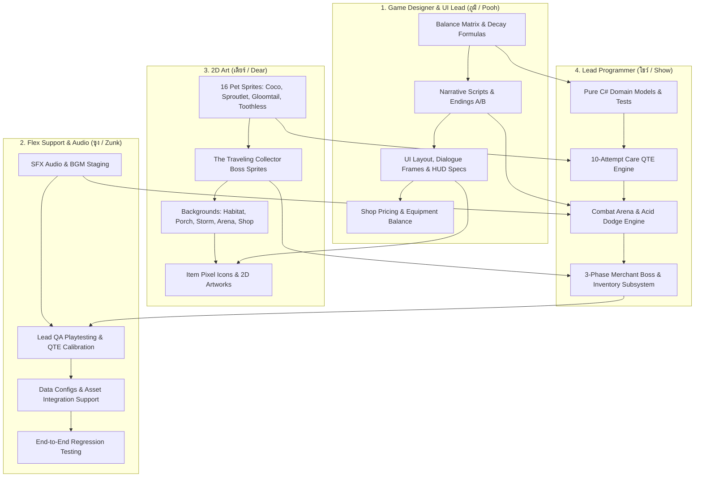
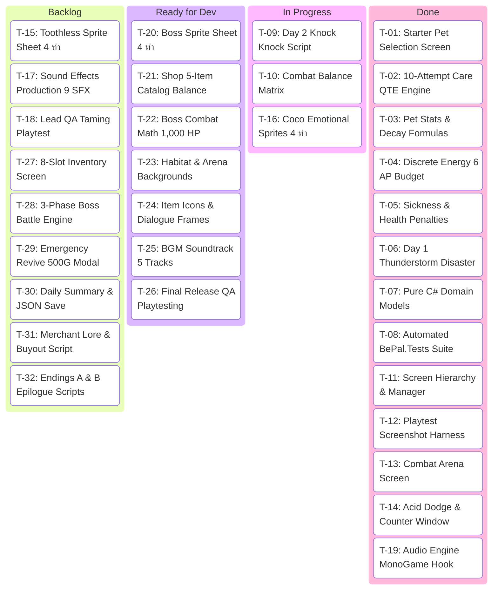

# BePal — Workload Breakdown & Kanban Board (v2.0)

เอกสารแจกแจงภาระงาน (Workload Breakdown) และกระดาน **Kanban Board** ที่ปรับจูนให้เหมาะสมกับบทบาทของสมาชิกแต่ละคน:
- **โชว์ (Show):** Lead Programmer (สถาปัตยกรรม, ระบบเกมเพลย์, วงล้อ QTE, ฉากต่อสู้บอส และมินิเกม)
- **ซุง (Zunk):** Flex (ระบบเสียง SFX/BGM, การทดสอบระบบ QA Playtesting, ปรับแต่งไฟล์ Config และสนับสนุนงานทั่วไป)
- **ภูมิ (Pooh):** Game Designer & UI Lead (ระบบกลไก, ตัวเลข Balance, กฎพฤติกรรมสัตว์, เนื้อเรื่อง/บทสนทนา และออกแบบ UI/HUD)
- **เดียร์ (Dear):** 2D Art (วาดภาพ Sprite สัตว์เลี้ยง, ภาพบอสพ่อค้าเร่, ฉากหลัง และไอคอนไอเทม)

---

## 1. Role-Based Workload Methodologies (ระเบียบวิธีและขอบเขตงาน)

---

## 2. Interactive Kanban Board (Mermaid Kanban)

---

## 3. Detailed Kanban Task Tracking Table (Tasks T-01 ถึง T-32)

| Task ID | Task Description | ผู้รับผิดชอบหลัก | MoSCoW | SP | Status | Sprint |
| --- | --- | --- | --- | --- | --- | --- |
| **T-01** | Starter Pet Selection & Base Habitat Room | โชว์ (Lead Prog) | Must | 4 | ✅ Done | Sprint 1 |
| **T-02** | 10-Attempt Care QTE Engine | โชว์ (Lead Prog) | Must | 5 | ✅ Done | Sprint 1 |
| **T-03** | Pet Stats Model & Mathematical Decay Rules | ซุง (Flex) | Must | 6 | ✅ Done | Sprint 1 |
| **T-04** | Discrete Energy Budget (6 AP) System | โชว์ (Lead Prog) | Must | 5 | ✅ Done | Sprint 1 |
| **T-05** | Sickness & Health Status Effects Design | ซุง (Flex) | Must | 5 | ✅ Done | Sprint 1 |
| **T-06** | Day 1 Thunderstorm Disaster & Calming QTE | ซุง (Flex) | Must | 4 | ✅ Done | Sprint 1 |
| **T-07** | Pure C# Domain Models Extraction | โชว์ (Lead Prog) | Should | 3 | ✅ Done | Sprint 2 |
| **T-08** | Automated Unit Testing (`BePal.Tests` Suite) | โชว์ (Lead Prog) | Should | 4 | ✅ Done | Sprint 2 |
| **T-09** | Day 2 "Knock Knock !!" Narrative Script | ภูมิ (Game Designer & UI Lead) | Must | 4 | ⏳ In Progress | Sprint 2 |
| **T-10** | Combat & Taming Balance Matrix | ภูมิ (Game Designer & UI Lead) | Should | 3 | ⏳ In Progress | Sprint 2 |
| **T-11** | Screen Hierarchy & State Transitions | โชว์ (Lead Prog) | Should | 3 | ✅ Done | Sprint 2 |
| **T-12** | Content Pipeline & Automated Screenshot Harness | โชว์ (Lead Prog) | Should | 2 | ✅ Done | Sprint 2 |
| **T-13** | Toothless Combat Taming Arena & QTE | โชว์ (Lead Prog) | Must | 5 | ✅ Done | Sprint 2 |
| **T-14** | Acid Spit Dodge Zone & Counter-Attack | โชว์ (Lead Prog) | Must | 5 | ✅ Done | Sprint 2 |
| **T-15** | Toothless Sprite Sheet (4 ท่า: Idle/Angry/Attack/Tamed) | เดียร์ (2D Art) | Must | 3 | 🗄️ Backlog | Sprint 2 |
| **T-16** | Dynamic Pet Emotional Sprites (Coco 4 ท่า) | เดียร์ (2D Art) | Should | 4 | ⏳ In Progress | Sprint 2 |
| **T-17** | Core Sound Effects Production (9 SFX) | ซุง (Flex) | Should | 3 | 🗄️ Backlog | Sprint 2 |
| **T-18** | Lead QA Playtesting & QTE Timing Calibration | ซุง (Flex) | Should | 3 | 🗄️ Backlog | Sprint 2 |
| **T-19** | MonoGame Audio Engine Integration | โชว์ (Lead Prog) | Should | 3 | ✅ Done | Sprint 2 |
| **T-20** | The Traveling Collector Boss Sprites (4 ท่า) | เดียร์ (2D Art) | Must | 4 | 📋 Ready | Sprint 3 |
| **T-21** | 5-Item Shop Catalog & 3 Equipment Balance | ภูมิ (Game Designer & UI Lead) | Should | 4 | 📋 Ready | Sprint 3 |
| **T-22** | Boss Combat 3 Phases Math & Ending Conditions | ภูมิ (Game Designer & UI Lead) | Must | 3 | 📋 Ready | Sprint 3 |
| **T-23** | Base Habitat Background & Environments (5 ฉาก) | เดียร์ (2D Art) | Must | 5 | 📋 Ready | Sprint 3 |
| **T-24** | Item Icons & UI Dialogue Frames | เดียร์ (2D Art) & ภูมิ (UI Lead) | Should | 3 | 📋 Ready | Sprint 3 |
| **T-25** | Atmospheric Cozy & Boss BGM Soundtrack (5 แทร็ก) | ซุง (Flex) | Should | 3 | 📋 Ready | Sprint 3 |
| **T-26** | End-to-End 3-Day Playtesting & Release QA | ซุง (Flex) | Must | 3 | 📋 Ready | Sprint 3 |
| **T-27** | 8-Slot Inventory & Item Consumption Subsystem | โชว์ (Lead Prog) | Must | 5 | 🗄️ Backlog | Sprint 3 |
| **T-28** | Merchant 3-Phase Boss Battle Engine | โชว์ (Lead Prog) | Must | 5 | 🗄️ Backlog | Sprint 3 |
| **T-29** | Emergency Revive & 500G Loan Subsystem | โชว์ (Lead Prog) | Must | 4 | 🗄️ Backlog | Sprint 3 |
| **T-30** | Daily Summary Report Card & JSON Save System | โชว์ (Lead Prog) | Must | 4 | 🗄️ Backlog | Sprint 3 |
| **T-31** | Day 3 Traveling Merchant Lore & Buyout Script | ภูมิ (Game Designer & UI Lead) | Must | 4 | 🗄️ Backlog | Sprint 3 |
| **T-32** | Endings A & B Epilogue Narrative Scripts | ภูมิ (Game Designer & UI Lead) | Must | 4 | 🗄️ Backlog | Sprint 3 |

---

## 4. Definition of Done (DoD)

งานทุกชิ้นจะถือว่าเสร็จสิ้น (Done) ได้ก็ต่อเมื่อผ่านเกณฑ์ครบทั้ง 4 ประการ:
1. **Code Review / Peer Review:** โค้ดผ่านการตรวจสอบโดย Lead Programmer หรือผ่านการตรวจรับเนื้อหา/ภาพโดย Designer/Art Lead
2. **Deterministic Mechanics:** กลไกตรงตามข้อกำหนดใน New GDD v2.0 (ค่าความคลาดเคลื่อน Perfect $\le 0.20$, Good $\le 0.45$, AP หักถูกต้อง)
3. **Automated Verification:** ชุดทดสอบ Unit Test (`dotnet test CoPoject/CoPoject.slnx`) ผ่าน 100% และ Screenshot Runner (`--screenshot`) ทำงานได้สมบูรณ์
4. **Gitflow Compliance:** Merge เข้าสาขา `Develop` ผ่าน Pull Request แบบ `--no-ff` ปราศจาก Conflict

---

## 5. Links
- [[BEPAL/Docs/NewAgile/01-product-backlog|Product Backlog]]
- [[BEPAL/Docs/NewAgile/02-sprint-backlog|Sprint Backlog]]
- [[BEPAL/Docs/NewAgile/04-Kanban-for-Obsidian|Obsidian Interactive Kanban]]
- [[BEPAL/Docs/NewGDD/03-mechanics|New GDD Mechanics]]
