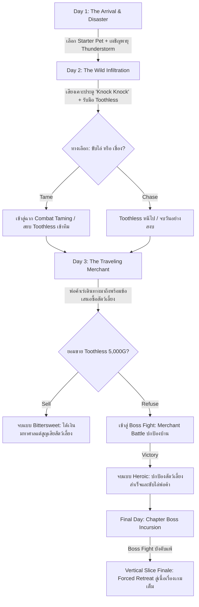

# BePal — Game Concept

## Elevator Pitch

**“BePal is a hardcore pet-care management simulation where domestic warmth collides with uncanny survival peril: care for abnormal creatures through rigorous time and energy budgeting, survive unexpected environmental disasters and lethal wild incursions, and confront moral dilemmas when shady merchants come knocking.”**

> **สโลแกนแนวคิด:** เกมจำลองการบริหารและดูแลสัตว์เลี้ยงผิดปกติ (Abnormal Pets) ที่ผสมผสานความน่ารักอบอุ่นของสัตว์เลี้ยง (Virtual Pet) เข้ากับความท้าทายและการเอาตัวรอดสุดขั้ว (Hardcore Survival) ทุกการตัดสินใจใช้พลังงานและเงินตรามีผลลัพธ์ถึงชีวิต ปกป้องพวกมันจากภัยพิบัติ สัตว์ป่าดุร้าย และข้อเสนออันดำมืดของพ่อค้าเร่

---

## Genre, Platform & Controls

- **Genre:** Hardcore Pet-Care Simulation | Resource Management | QTE Reflex Combat | Narrative Choice
- **Platform:** PC (Windows DesktopGL)
- **Engine:** MonoGame (.NET 8 C# 12)
- **Controls (การควบคุม):**
  - `W` `A` `S` `D` หรือ `Mouse`: เลือกเมนูและโต้ตอบ (Interact) กับสิ่งต่างๆ ภายในห้อง
  - `Spacebar`: กดแอ็กชันวงล้อ QTE, ปัดป้อง/หลบหลีก (Dodge), และยืนยันการเลือก
  - `E`: สิ้นสุดวัน (End Day) ข้ามไปยังช่วงค่ำ/สรุปวัน หรือเปิดรับเหตุการณ์หน้าประตู ("Knock Knock !!")
  - `1` `2` `3` `4`: ชอร์ตคัตคำสั่งดูแล (Train, Feed, Clean, Heal)
  - `B` / `S`: เปิดกระเป๋าเก็บไอเทม (Backpack 8 ช่อง) / เปิดร้านค้าพ่อค้าเร่ (Shop)
- **Target Audience:** ผู้เล่นที่ชื่นชอบเกมดูแลสัตว์เลี้ยงสไตล์คลาสสิก (Tamagotchi / Digimon V-Pet) แต่ต้องการความตื่นเต้นระทึกขวัญ ความเสี่ยงสูง (High Stakes) และระบบการต่อสู้หลบหลีกที่ต้องอาศัยทักษะความแม่นยำ

---

## Core Pillars

1. **Care × Hardcore Peril (การดูแลที่แฝงความตายรอบด้าน):**
   ไม่ใช่แค่การเลี้ยงสัตว์เพื่อความเพลิดเพลิน แต่เป็นสมรภูมิการจัดสรรทรัพยากรเพื่อความอยู่รอด สัตว์เลี้ยงมีค่าสเตตัสความต้องการพื้นฐาน (Stomach, Clean, Health) ที่ลดลงอย่างต่อเนื่อง และสามารถล้มป่วย บาดเจ็บ หรือเสียชีวิตได้จริงหากผู้เล่นละเลย

2. **Discrete Energy & Resource Economy (การบริหารพลังงานและเศรษฐกิจที่จำกัด):**
   ในแต่ละวัน ผู้เล่นได้รับโควตาพลังงานจำกัด (**3–6 Energy Points / AP**) ทุกการกระทำ—ให้อาหาร ทำความสะอาด ฝึกซ้อม หรือรักษาพยาบาล—ล้วนกินพลังงาน การใช้เงิน (Gold) ซื้ออาหาร ยารักษา หรืออุปกรณ์เสริมจากร้านค้าต้องผ่านการคำนวณอย่างรอบคอบ

3. **Precision QTE Mechanics (ความแม่นยำในการตอบสนอง):**
   การดูแลทุกหมวดหมู่และการเผชิญหน้าในสถานการณ์ต่อสู้ควบคุมผ่านระบบ Quick Time Events (QTE) 10 ครั้งต่อรอบ ที่มีทั้ง **Perfect Zone** ($\pm 0.20 \text{ rad}$) และ **Good Zone** ($\pm 0.45 \text{ rad}$) รวมถึงระบบหลบหลีกการโจมตี (Dodge QTE) และการสวนกลับ (Counter-Attack)

4. **Consequential Moral Dilemmas (ทางเลือกและผลลัพธ์เชิงจริยธรรม):**
   เนื้อเรื่องขับเคลื่อนด้วยทางเลือกที่มีน้ำหนักจริง เช่น การตัดสินใจว่าจะยอมเสี่ยงชีวิตฝึกสัตว์ป่าดุร้าย หรือขับไล่มันไป และการเลือกว่าจะยอมขายสัตว์เลี้ยงที่ร่วมทุกข์ร่วมสุขมาเพื่อเงินก้อนโต หรือยืนหยัดปกป้องพวกมันจนนำไปสู่การปะทะกับบอส

---

## Setting & Narrative

### The Setting (สถานที่และบรรยากาศ)
**ศูนย์พักพิงสัตว์เลี้ยงกึ่งทดลอง (Habitat Base Room):** อาคารอบอุ่นที่ดัดแปลงเป็นพื้นที่อยู่อาศัยที่ปลอดภัย (Sanctuary) ภายในมีอุปกรณ์อำนวยความสะดวกครบครัน:
- **มุมพักผ่อนและให้อาหาร:** เบาะนอน ชามข้าว และแท่นสังเกตการณ์สัตว์เลี้ยง
- **คอนโซลบริหารจัดการ (HUD Console):** แสดงสถานะค่าพลังงาน (Energy AP), วันที่ (Day), จำนวนเงิน (Gold), และเลเวลของผู้เล่น (Player Level & EXP Bar)
- **สถานีอัปเกรดฐาน (Upgrade Station):** พัฒนาทักษะ 3 สาย (QTE Zone, Max Energy, Progress Booster)
- **โต๊ะคลินิกและคุณหมอ (Doctor NPC):** ชุบชีวิตสัตว์เลี้ยงฉุกเฉิน (500G Revive) เมื่อ HP = 0
- **ชั้นวางอุปกรณ์และโต๊ะบันทึก (Survival Desk):** ค้นหาสมุดบันทึกสัตว์เลี้ยง (Pet Discovery) และบันทึกภัยพิบัติ (Disaster Log)
- **ประตูแดงคู่ (Front Door):** จุดเชื่อมต่อสู่โลกภายนอก ("Knock Knock !!") จุดเริ่มต้นของเหตุการณ์ประจำวัน

### Protagonist (ตัวละครเอก)
**The Sanctuarist (ผู้ดูแลสถานพักพิง):** ผู้ดูแลที่มีความมุ่งมั่นในการให้ที่พักพิงแก่สัตว์ประหลาดที่ไม่สามารถปรับตัวเข้ากับระบบนิเวศทั่วไปได้ ต้องรับมือทั้งปัญหาค่าใช้จ่าย ภัยพิบัติทางธรรมชาติ และการคุกคามจากภายนอก

### Starter Pets (สัตว์เลี้ยงเริ่มต้น 3 สายพันธุ์ / สัตว์ปริศนาประจำสถานพักพิง)

| สายพันธุ์ & ฉายา | บุคลิก & ลักษณะเด่น | สเตตัสเริ่มต้น | แอ็กชันที่ชอบ | สกิลติดตัว (Passive) |
| --- | --- | --- | --- | --- |
| **Coco (Mossling / ไอ่แดง)** | สิ่งมีชีวิตกึ่งพืช นุ่มฟูคล้ายตะไคร่น้ำ ดวงตากลมโต รักสงบ ตกใจง่าย | HP: 100 / St: 80 / Cl: 70 | **Feed, Clean** | *Photosynthesis:* ได้รับฟื้นฟู Health +5 อัตโนมัติเมื่อค่า Clean > 80 |
| **Sproutlet (Nibbleclaw / ไอ่ซุง)** | สิ่งมีชีวิตคล้ายแมวผสมตัวกินมด มีกรงเล็บแหลมยาวซ่อนใต้ขน คล่องแคล่ว ว่องไว | HP: 90 / St: 70 / Cl: 80 | **Train, Clean** | *Agile Reflex:* ขยายหน้าต่าง Perfect Zone ในมินิเกม Train ขึ้น +15% |
| **Gloomtail (Blinkbun / ไอ่เขียว)** | กระต่ายหูยาวขนสีม่วงเข้ม มีดวงตาที่สามตรงหน้าผาก ลึกลับ อดทนสูง | HP: 110 / St: 60 / Cl: 60 | **Heal, Feed** | *Shadow Barrier:* ลดความเสียหายจากการพลาดใน Dodge QTE ลง 25% |

### กฎความสะอาดและสภาพความพร้อมสู้ (Combat Readiness Rule)
- **Clean < 50 (สัตว์สกปรกเกินไป):** หากค่าความสะอาดของสัตว์เลี้ยงต่ำกว่า 50 สัตว์จะตื่นตระหนกและปฏิเสธที่จะออกไปต่อสู้ (Refuse to Fight) ผู้เล่นต้องใช้คำสั่ง Clean หรือใช้ไอเทมทำความสะอาดก่อนจึงจะเข้าสู่โหมดต่อสู้ได้

### Narrative Arc & Mystery (แก่นเรื่องและไทม์ไลน์ Vertical Slice: Day 1 - 3+)

1. **Day 1 — The Arrival & Disaster (การเริ่มต้นและภัยพิบัติ):**
   - ผู้เล่นเปิดร้าน เลือก Starter Pet ตัวแรก (Coco, Sproutlet, หรือ Gloomtail)
   - เรียนรู้ระบบพื้นฐาน: การจัดสรรพลังงาน 6 แต้ม, การให้อาหาร (Feed), ทำความสะอาด (Clean), และฝึกฝน (Train)
   - **Disaster Event:** ช่วงบ่ายเกิดพายุฝนฟ้าคะนองรุนแรง (**Thunderstorm**) สัตว์เลี้ยงตื่นตระหนก ค่า Clean ลดฮวบ และต้องบริหารพลังงานฉุกเฉินเพื่อปลอบประโลม

2. **Day 2 — The Wild Infiltration & Taming (ผู้มาเยือนปริศนา):**
   - มีเสียงเคาะประตูปริศนาดังขึ้น (**"Knock Knock !!"**)
   - พบสัตว์ประหลาดร่างดำดุร้ายที่มีกรดกัดกร่อน (**Toothless**) บุกเข้ามา
   - **ทางเลือกสำคัญ:** 
     - *Chase:* ขับไล่ไปอย่างปลอดภัย (ไม่เสี่ยงเจ็บตัว แต่ไม่ได้สัตว์เพิ่ม)
     - *Tame:* เข้าสู่ระบบการต่อสู้และฝึกให้เชื่อง (Taming Encounter) ต้องหลบกรดพิษ (Acid Dodge) และสวนกลับจนได้เป็นสัตว์เลี้ยงตัวที่สอง (หากสัตว์ HP หมด นำส่งชุบชีวิตที่ Doctor 500G)

3. **Day 3 — The Traveling Merchant & The Moral Crossroads (พ่อค้าเร่และทางแยกแห่งจิตใจ):**
   - พ่อค้าเร่ปริศนาแวะมาเยือน เปิดร้านขายไอเทมพิเศษ (**Crab Apple, Sea Tea, Cloudy Glasses, Torn Notebook, Ballet Shoes, Toy Knife, Faded Ribbon**)
   - พ่อค้าสังเกตเห็น Toothless และยื่นข้อเสนอซื้อตัวด้วยเงินสดมหาศาล (**5,000 Gold**)
   - **ทางแยกแห่งผลลัพธ์:**
     - *ยอมรับข้อเสนอ (Sell):* ได้รับเงิน 5,000G ปลดหนี้และจบวันด้วยความร่ำรวย แต่สูญเสีย Toothless ตลอดกาล (Ending A)
     - *ปฏิเสธข้อเสนอ (Refuse):* พ่อค้าโกรธเกรี้ยว นำไปสู่การต่อสู้ระดับบอส (**Merchant Boss Fight**) ผู้เล่นและสัตว์เลี้ยงต้องร่วมมือกันต่อสู้จนคว้าชัยชนะ (Ending B)

4. **Final Day — The Vertical Slice Finale (บอสประจำบทบุกรุกฐาน / บังคับแพ้):**
   - บอสประจำบทบุกรุกสถานพักพิงด้วยพลังมหาศาล
   - เข้าสู่การต่อสู้ฉากสุดท้าย **Boss Fight (บังคับแพ้ / Forced Defeat)** สัตว์เลี้ยงและผู้เล่นต้องถอยร่นเข้าสู่ห้องนิรภัยชั้นในเพื่อส่งต่อเข้าสู่เนื้อเรื่องตัวเกมเต็ม

---

## Inspiration & Competitor Analysis

### Game References

| ผลงานอ้างอิง | องค์ประกอบที่นำมาปรับใช้ใน BePal | จุดแตกต่างและวิวัฒนาการของ BePal |
| --- | --- | --- |
| **Tamagotchi / Digimon V-Pet** | วงจรการให้อาหาร ทำความสะอาด ฝึกซ้อม และความเสี่ยงจากการปล่อยปละละเลย | เพิ่มระบบจังหวะ QTE แบบแอ็กชัน และการตัดสินใจเชิงกลยุทธ์ผ่าน Energy Budget |
| **Undertale / Deltarune** | ระบบการหลบหลีกการโจมตีแบบเรียลไทม์ (Dodge Mechanics) และบุคลิกบอสที่มีเอกลักษณ์ | เชื่อมโยงความพร้อมในการต่อสู้เข้ากับความสมบูรณ์ของค่าสเตตัสการดูแล |
| **Lobotomy Corporation** | ความตื่นเต้นระทึกขวัญของการจัดการสิ่งมีชีวิตผิดปกติที่มีอันตรายถึงตาย | บรรยากาศเน้นความ Cozy อบอุ่น สัมผัสได้ใกล้ชิด ไม่ใช่ความสยองขวัญเลือดสาดแบบโรงงานปิด |
| **Papers, Please** | การจัดสรรทรัพยากรที่ตึงเครียด รายงานสรุปผลประจำวัน และแรงกดดันทางการเงิน | ถ่ายทอดผ่านการดูแลสัตว์เลี้ยงที่มีชีวิตจิตใจ มีการตอบสนองทางอารมณ์ชัดเจน |

---

## Art & Visual Direction

- **Visual Style:** 2D High-Contrast Modern Clean UI Theme & Pixel Illustration ที่ความละเอียด Backbuffer 1280x720 (Borderless Window)
- **Color Palette:** โทนสีห้องพักสไตล์ Charcoal Deep (#1E1E24) ตัดด้วย Accent Gold, Emerald, Coral และ Void Purple
- **Expressive Cues:** สัตว์เลี้ยงมี Sprite แสดงอารมณ์ละเอียด (Idle, Hungry, Distressed, Angry, Joyful) พร้อม Visual VFX บอกใบ้จังหวะ QTE
- **Audio Direction:**
  - **Soundtrack:** Lo-Fi Acoustic Guitar / Warm Electric Piano สำหรับช่วงเวลาดูแลในห้องพัก และแปรเปลี่ยนเป็น Up-tempo Chiptune Synthwave ผสมจังหวะกลองเขย่าขวัญในฉากต่อสู้ Boss Fight
  - **SFX:** เสียง Typewriter เวลาอ่านข้อความ, เสียงหยดน้ำ/สบู่ในโหมด Clean, เสียงเคี้ยวกรุบกรอบในโหมด Feed, และเสียงสะท้อนโลหะ (Metallic Parry) เมื่อกด Dodge สำเร็จ
