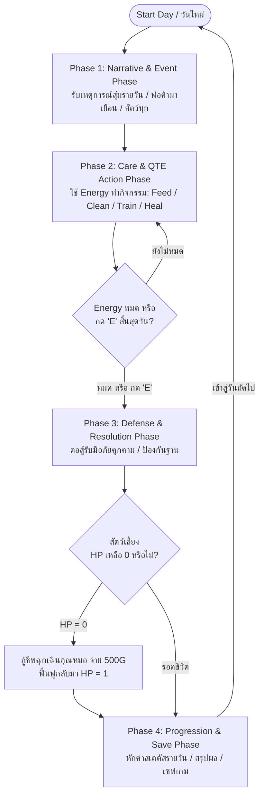

# BePal — Core Loop & Gameplay Flow

## Core Daily Loop

วงจรการเล่นหลักของ BePal ถูกออกแบบให้เป็นวัฏจักรประจำวัน 4 เฟส (4-Phase Daily Loop) ที่ผู้เล่นต้องบริหารจัดการเวลา พลังงาน และสถานะของสัตว์เลี้ยง ท่ามกลางวิกฤตและเหตุการณ์ไม่คาดฝัน:

---

## Detailed Breakdown of the 4-Phase Daily Cycle

### Phase 1: Narrative & Morning Event Phase (ยามเช้าและข่าวสาร)
1. **Morning Briefing:** เมื่อเริ่มต้นวันแรก ระบบจะยังไม่มี event อะไร เพื่อให้ผู้เล่นได้เรียนรู้กับระบบเสียก่อน
2. **Doorstep Arrival Check:** ในวันที่กำหนด (เช่น Day 2 มีเสียง "Knock Knock !!", Day 3 มีรถเข็นพ่อค้าเร่มาจอด) ประตูแดงคู่จะมีไอคอนแจ้งเตือนให้ผู้เล่นตรวจสอบเหตุการณ์ภายนอก

### Phase 2: Care & QTE Action Phase (การดูแลและบริหารพลังงาน)
1. **Energy Budgeting:** ผู้เล่นได้รับแต้มพลังงานเริ่มต้น **3–6 Energy Points (AP)** ต่อวัน
2. **Action Selection:** ผู้เล่นเลือกทำกิจกรรมการดูแลจาก 4 หมวดหมู่หลัก:
   - **Feed (ให้อาหาร):** ใช้ 1 AP ฟื้นฟูค่า Stomach และให้ EXP player
   - **Clean (ทำความสะอาด):** ใช้ 1 AP ขจัดสิ่งสกปรก ฟื้นฟูค่า Clean เพื่อไม่ให้สัตว์เลี้ยงสกปรก หาสัตว์เลี้ยงสกปรก สัตว์ตัวนั้นจะโจมตีเบาลงและถ้าหากสัตว์ตัวนั้นไม่มีความสะอาดเลย จะทำให้ max hp ลดลงอีกด้วย
   - **Train (ฝึกฝนทักษะ):** ใช้ 1 AP เพิ่มระดับเลเวลสัตว์เลี้ยงและ EXP player แต่ลดค่า Stomach
   - **Heal (รักษาพยาบาล):** ใช้ 1 AP (หรือร่วมกับไอเทมยา) ฟื้นฟูค่า Health ที่สูญเสีย
3. **10-Attempt Mini-Game Execution:** แต่ละแอ็กชันจะตัดเข้าสู่หน้าจอมินิเกมวงล้อ QTE จำนวน 10 ครั้งติดต่อกัน ผู้เล่นต้องจับจังหวะกด Spacebar ในโซน Perfect หรือ Good
4. **Day Progress Accumulation:** ผู้เล่นจะสามารถไปวันต่อไปได้โดยการกดคีย์ `E` สิ้นสุดวันเพื่อข้ามช่วงเวลา

### Phase 3: Defense & Resolution Phase (การเผชิญหน้าและการต่อสู้)
1. **Combat Readiness Condition (กฎความสะอาดก่อนออกรบ):**
   - **Clean < 50:** หากค่าความสะอาดต่ำกว่า 50 สัตว์เลี้ยงจะโจมตีเบาขึ้น (จาก 20 --> 15) และถ้าหากค่าความสะอาด < 25 จะทำให้ max hp ขอวสัตว์ตัวนั้นลดลงอีกด้วย (100 --> 80)
1. **Dynamic Encounters:**
   - **Day 1:** เริ่มต้นวันแรก สำรวจสิ่งรอบข้าง เรียนรู้ระบบ 
   - **Day 2 (Toothless Encounter):** สัตว์ป่ากรดพิษบุกเข้ามา ผู้เล่นต้องเลือกว่าจะขับไล่ (Chase) หรือฝึกให้เชื่อง (Tame Combat QTE)
   - **Day 3 (Merchant Boss Battle):** หากปฏิเสธข้อเสนอขายสัตว์เลี้ยง พ่อค้าจะเปลี่ยนร่างเข้าสู่การต่อสู้ 3 เฟส
   - **Final Day (Disaster):** รับมือกับ พายุ (Thunderstorm) ที่จะทำให้สัตว์ทุกตัวของคุณสกปรก(ค่าความสะอาด = 50) ผู้เล่นจะต้องทำความสะอาดพวกมัน
1. **Combat Loop:** สัตว์ศัตรูจะส่งคลื่นการโจมตี (Telegraphed Attacks) ผู้เล่นต้องกด Spacebar ในโซนหลบหลีก (Dodge Zone) หากกดไม่โดนหรือไม่กด ก่อนที่หลอดจะค่ิยๆสั้นลงจนหายไป สัตว์เลี้ยงของเราจะถูกโจมตี และเราจะต้องกดสวนกลับ (Counter-Attack) เมื่อเกิดจังหวะเปิดช่องโหว่

### Phase 4: Progression & Summary Phase (การสรุปผลและฟื้นฟู)
1. **Daily Stat Decay:** หักลบค่าสเตตัสความต้องการพื้นฐานตามสูตรประจำวัน (Stomach -20, Clean -15)
2. **Sickness & Penalty Check:** หากค่า Clean < 50 หรือ Stomach = 0 จะเกิดอาการป่วยและหักค่า Health ทันที
3. **Daily Summary Report Card:** นำเสนอผลประเมินเกรด (S, A, B, C, F) สรุปคะแนนสะสม โบนัสเงินรางวัล (Gold Reward ที่ได้จากพ่อค้า หรือ การต่อสู้) และปลดล็อกบันทึก Survival Log
4. **Night Rest:** บันทึกข้อมูลเซฟเกม (Auto-save) และรีเซ็ตพลังงานกลับเป็น 6 แต้มสำหรับวันถัดไป

---

## The Vertical Slice Progression Timeline (Day 1 - 3+)

| วันที่               | Phase 1 (Event)                                                                                                        | Phase 2 (Care Focus)                                                                       | Phase 3 (Encounter / Conflict)                                                                                                                            | Phase 4 (Resolution)                                                                               |
| -------------------- | ---------------------------------------------------------------------------------------------------------------------- | ------------------------------------------------------------------------------------------ | --------------------------------------------------------------------------------------------------------------------------------------------------------- | -------------------------------------------------------------------------------------------------- |
| **Day 1**            | - รับสัตว์เลี้ยงเริ่มต้น (Coco/Sproutlet/Gloomtail หรือ ไอ่แดง/ไอ่ซุง/ไอ่เขียว)                                     | - ทำความคุ้นเคยกับการใช้ Energy ทำกิจกรรมดูแลสัตว์                                         | - สำรวจเกมเบื้องต้น (ยังไม่มีการต่อสู้หรือภัยพิบัติ เพื่อให้ผู้เล่นทำความเข้าใจระบบการกด QTE)                                                             | - สรุปคะแนนวันแรก - หักค่าสเตตัสรายวัน (Daily Decay) - รับโบนัสเงินสนับสนุนเริ่มต้น          |
| **Day 2**            | - เสียงแจ้งเตือนหน้าประตู "Knock Knock !!" - ร่องรอยคราบกรดสีม่วง                                                   | - บริหารพลังงานและอัปเกรดสถานีฐาน - ตรวจสอบความสะอาดให้อยู่ในเกณฑ์พร้อมรบ (Clean >= 50) | - **Toothless Wild Encounter:** เลือกว่าจะขับไล่ (Chase) หรือฝึกให้เชื่อง (Tame) - เข้าสู่มินิเกมหลบหลีก (Dodge) และสวนกลับ                            | - ปลดล็อก Toothless เข้าเป็นสมาชิกใหม่ (หากเลือก Tame สำเร็จ) - อัปเดตสมุดบันทึก (Survival Log) |
| **Day 3**            | - พ่อค้าเร่เดินทางมาถึง - เปิดระบบร้านค้า (Merchant Shop) ซื้อไอเทมเช่น Crab Apple, Sea Tea ฯลฯ                     | - ซื้อไอเทมบัฟและอาหารฟื้นพลัง - จัดการบริหาร Energy เตรียมพร้อมสัตว์เลี้ยง             | - **The Merchant's Dilemma:** พ่อค้าเสนอเงิน 5,000G เพื่อขอซื้อสัตว์เลี้ยง - หากปฏิเสธ จะเข้าสู่ **Merchant Boss Fight** (ต่อสู้จนกว่าจะตีครบ 5 ครั้ง) | - รับเงินรางวัล (หากต่อสู้ชนะพ่อค้า) - หักค่าสเตตัส สรุปผลประจำวันเพื่อเล่นต่อ                  |
| **Day 4+ (Endless)** | - **ระบบสุ่มเหตุการณ์รายวัน:** - _ตัวอย่าง Event:_ การเผชิญกับภัยธรรมชาติ (เช่น Thunderstorm) หรือมีศัตรูใหม่บุกฐาน | - สัตว์เลี้ยงถูกฝนพายุ ทำให้สัตว์เลี้ยงทุกตัวของเราสกปรก                                   | - บริหาร Energy เพื่อจัดการสถานการณ์ฉุกเฉิน - _ตัวอย่าง:_ พายุทำให้สัตว์สกปรก (Clean = 50) ต้องเลือกใช้ Energy ทำความสะอาด                             | - สุ่มเผชิญหน้ากับการต่อสู้ (Combat QTE) หรือ มินิเกมแก้ปัญหาภัยคุกคามตาม Event ที่สุ่มได้         |

---

## Scene Breakdown

1. **Title Screen & Main Menu:**
   - **Title Screen & Main Menu:** หน้าจอไตเติลพร้อมชื่อเกม BePal เมนู Play, Option, และ Quit (รวมถึงภาพกราฟิกอธิบายการควบคุมด้วยปุ่ม Spacebar และการใช้ เมาส์/WASD)
2. **Prologue & Choose Starter Pet Scene:**
   - บทสนทนานำเข้าสู่เรื่องราว และหน้าจอเลือกรับอุปการะสัตว์เลี้ยงเริ่มต้น 1 ใน 3 ตัว: Coco (Mossling), Sproutlet, หรือ Gloomtail
3. **Morning Briefing:**
   - การแจ้งเตือนเหตุการณ์ประจำวัน เช่น การสุ่มเจอพายุฝนฟ้าคะนอง (Thunderstorm) หรือเสียงเคาะประตู
4. **Habitat Base Room HUD:** หน้าจอห้องฐานปฏิบัติการหลัก แสดงค่าสถานะ:
   -  วันที่ (Day) และ จำนวนเงิน (Gold) 
   - เลเวลของผู้เล่น (Player Level & EXP Bar)
   - หลอดพลังงาน (Energy AP)
   - ประตูแดงคู่ (Front Door) สำหรับรอรับเหตุการณ์
   - คลินิกคุณหมอ (Doctor NPC) สำหรับชุบชีวิตสัตว์
   - สถานีอัปเกรดฐาน (Upgrade Station) สำหรับอัปเกรด QTE, Max Energy, และ Progress
   - สมุดค้นคว้า (Survival Desk / Book) บันทึกข้อมูลสัตว์และภัยพิบัติ
   - ปุ่มคำสั่งการดูแล 4 หมวด (Feed, Clean, Train, Heal) เมื่อคลิกที่ตัวสัตว์
5. **10-Attempt Care QTE Mini-Game Screen:**
   - หน้าจอวงล้อมินิเกมดูแลสัตว์ แบ่งโซน Perfect ($\pm 0.20 \text{ rad}$) และ Good ($\pm 0.45 \text{ rad}$) พร้อมลูกเล่นความท้าทายตามสถานการณ์ เช่น เข็มหมุนกลับทิศ (Reverse), โซนหนีเข็ม (Escaping), เข็มกะพริบ (Blinking), และโซนหดสั้น (Shrinking)
6. **Combat Encounter & Taming Arena Screen:**
   - หน้าจอต่อสู้เมื่อเผชิญหน้าภัยคุกคาม เช่น สัตว์ป่า Toothless (Day 2), Merchant Boss Fight (Day 3), และ ศัตรูจากการสุ่มในวันถัดๆ ไป (Day 4+) ประกอบด้วยวงล้อหลบหลีก (Dodge Zone) และหน้าต่างกดโจมตีสวนกลับ (Attack/Counter-Attack)
7. **Emergency Revive Modal:**
   - หน้าต่างกู้ชีพฉุกเฉินจากคุณหมอเมื่อสัตว์เลี้ยง HP เหลือ 0 โดยต้องชำระค่าธรรมเนียม 500G (หรือเซ็นสัญญากู้ยืมเงินดอกเบี้ย 20% กรณีเงินไม่พอ)
1. **Daily Summary Report Card & Night Rest Screen:**
   - หน้าต่างสรุปผลรายวันสไตล์ _Papers, Please_ แสดงผลเกรดการดูแล (S, A, B, C, F) สรุปการหักสเตตัส (Daily Decay) โบนัสเงินรางวัลที่ได้รับ และบันทึกการเล่นก่อนเข้าสู่วันถัดไป

---

## Controls Mapping

| รูปแบบการควบคุม       | บริบทการใช้งาน          | หน้าที่และผลลัพธ์                                                                                                                                  |
| --------------------- | ----------------------- | -------------------------------------------------------------------------------------------------------------------------------------------------- |
| **Mouse Left Click**  | หน้าจอหลัก / HUD / เมนู | เลือกเมนูการดูแล (Feed/Clean/Train/Heal), เปิดกระเป๋า, เลือกคำตอบในบทสนทนา, และกดคลิกโต้ตอบกับสิ่งต่างๆ ในฐาน (ประตู, คุณหมอ, อัปเกรด, สมุดบันทึก) |
| **W / A / S / D**     | หน้าจอหลัก / ฐาน        | ใช้เป็นปุ่มนำทางเพื่อเลือกวัตถุสิ่งแวดล้อมภายในฐาน (ทางเลือกเสริมแทนการใช้เมาส์)                                                                   |
| **Spacebar (Tap)**    | มินิเกม Care QTE        | กดยืนยันเมื่อเข็มหมุนเข้าสู่โซนความสำเร็จ (Perfect / Good Zone)                                                                                    |
| **Spacebar (Combat)** | มินิเกม Combat QTE      | กดทันทีเมื่อเข็มหมุนเข้าสู่ **โซนสีเหลือง (Dodge Zone)** เพื่อหลบหลีก หรือ **โซนสีเขียว (Attack Zone)** เพื่อโจมตีสวนกลับศัตรู                     |
| **E Key**             | หน้าจอหลัก              | กดเพื่อ **สิ้นสุดวัน (End Day)** ข้ามช่วงเวลาเข้าสู่ช่วงประมวลผล (Phase 4) ทันที                                                                   |
| **B Key**             | กระเป๋าไอเทม            | เปิดหน้าต่างกระเป๋าเก็บไอเทมเพื่อกดใช้งาน                                                                                                          |
| **Escape (ESC)**      | เมนูและหน้าต่างเสริม    | ปิดหน้าต่าง Pop-up ต่างๆ (Bag/Log/Upgrade/Doctor) หรือเปิดเมนู Option/Pause                                                                        |

---

## Win / Lose & Emergency Revive Conditions

1. **Daily Victory Condition(เงื่อนไขการผ่านแต่ละวัน):**
   - บริหารทรัพยากรและสเตตัสสัตว์เลี้ยงให้อยู่รอดจนสิ้นสุดวัน โดยรักษาค่า Health ไม่ให้ลดลงเหลือ 0 รวมถึงการผ่านมินิเกมและรับมือกับเหตุการณ์สุ่ม (Event) ประจำวันให้สำเร็จ
1. **Incapacitation State (ภาวะสัตว์เลี้ยงหมดสภาพ):**
   - เกิดขึ้นเมื่อสัตว์เลี้ยงได้รับความเสียหายจากการโจมตี หรือป่วยจากค่าสเตตัสวิกฤต (เช่น Stomach = 0) จนค่า Health กลายเป็น 0 ตัวเกมจะยังไม่จบถาวร แต่สัตว์เลี้ยงตัวนั้นจะถูกส่งเข้าหน้าจอ Emergency Revive (คลินิกคุณหมอ) ซึ่งผู้เล่นต้องชำระค่าธรรมเนียม 500 Gold เพื่อกู้ชีพให้กลับมามีค่า HP = 1
1. **Fail State (การพ่ายแพ้สมบูรณ์ / Game Over):**
   - เกิดขึ้นเมื่อสัตว์เลี้ยงทั้งหมดตาย และผู้เล่นไม่มีเงินหรือช่องทางกู้ชีพเหลืออยู่
1. **Endless Progression (การดำเนินเกมแบบไร้จุดจบ):**
   - หลังจากผ่านเหตุการณ์ช่วง 3 วันแรก (รวมถึงการรับมือกับพ่อค้าใน Day 3) ตัวเกมจะเข้าสู่ลูปการเล่นหลักแบบ Endless ตัวเกมจะทำการสุ่มเหตุการณ์ ภัยธรรมชาติ (เช่น พายุฝน) และศัตรูที่บุกรุกฐานไปเรื่อยๆ เพื่อท้าทายขีดจำกัดของผู้เล่นในการเอาชีวิตรอดให้ได้จำนวนวัน (Day) มากที่สุด
