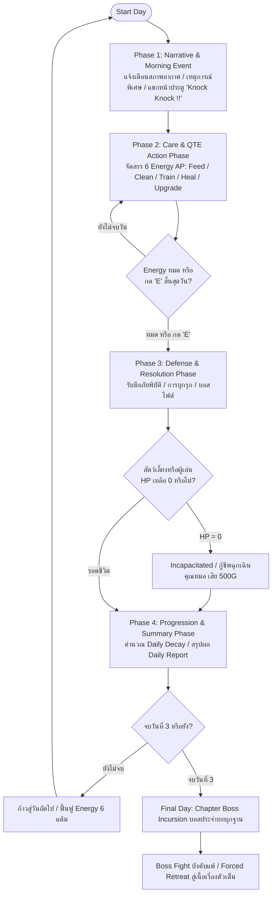

# BePal — Core Loop & Gameplay Flow

## Core Daily Loop

วงจรการเล่นหลักของ BePal ถูกออกแบบให้เป็นวัฏจักรประจำวัน 4 เฟส (4-Phase Daily Loop) ที่ผู้เล่นต้องบริหารจัดการเวลา พลังงาน และสถานะของสัตว์เลี้ยง ท่ามกลางวิกฤตและเหตุการณ์ไม่คาดฝัน:

---

## Detailed Breakdown of the 4-Phase Daily Cycle

### Phase 1: Narrative & Morning Event Phase (ยามเช้าและข่าวสาร)
1. **Morning Briefing:** เมื่อเริ่มต้นวันใหม่ ระบบจะแสดงหัวข้อข่าวหรือข้อความบันทึกประจำวัน แจ้งสภาพอากาศและเหตุการณ์สุ่ม
2. **Environmental Hazard Notification:** หากมีภัยพิบัติ (เช่น Thunderstorm ใน Day 1) หน้าจอจะแสดงแถบคำเตือนสีแดงกะพริบ แจ้งเตือนผลกระทบต่อสเตตัสสัตว์เลี้ยง
3. **Doorstep Arrival Check:** ในวันที่กำหนด (เช่น Day 2 มีเสียง "Knock Knock !!", Day 3 มีรถเข็นพ่อค้าเร่มาจอด) ประตูแดงคู่จะมีไอคอนแจ้งเตือนให้ผู้เล่นตรวจสอบเหตุการณ์ภายนอก

### Phase 2: Care & QTE Action Phase (การดูแลและบริหารพลังงาน)
1. **Energy Budgeting:** ผู้เล่นได้รับแต้มพลังงานเริ่มต้น **3–6 Energy Points (AP)** ต่อวัน
2. **Action Selection:** ผู้เล่นเลือกทำกิจกรรมการดูแลจาก 4 หมวดหมู่หลัก:
   - **Feed (ให้อาหาร):** ใช้ 1 AP ฟื้นฟูค่า Stomach และให้ EXP
   - **Clean (ทำความสะอาด):** ใช้ 1 AP ขจัดสิ่งสกปรก ฟื้นฟูค่า Clean ป้องกันการเจ็บป่วย
   - **Train (ฝึกฝนทักษะ):** ใช้ 1 AP เพิ่มระดับเลเวลและ EXP สูงสุด แต่ลดค่า Stomach
   - **Heal (รักษาพยาบาล):** ใช้ 1 AP (หรือร่วมกับไอเทมยา) ฟื้นฟูค่า Health ที่สูญเสีย
3. **10-Attempt Mini-Game Execution:** แต่ละแอ็กชันจะตัดเข้าสู่หน้าจอมินิเกมวงล้อ QTE จำนวน 10 ครั้งติดต่อกัน ผู้เล่นต้องจับจังหวะกด Spacebar ในโซน Perfect หรือ Good
4. **Day Progress Accumulation:** การกดสำเร็จแต่ละครั้งจะเพิ่มหลอดความคืบหน้าของวัน (`Day Progress += 10%`) พร้อมการกดคีย์ `E` สิ้นสุดวันเพื่อข้ามช่วงเวลา

### Phase 3: Defense & Resolution Phase (การเผชิญหน้าและการต่อสู้)
1. **Combat Readiness Condition (กฎความสะอาดก่อนออกรบ):**
   - **Clean < 50:** หากค่าความสะอาดต่ำกว่า 50 สัตว์เลี้ยงจะตื่นตระหนกและปฏิเสธที่จะต่อสู้ (**Combat Refusal**) ผู้เล่นต้องสั่ง Clean ก่อนจึงจะเข้าสู่สนามต่อสู้ได้
2. **Dynamic Encounters:**
   - **Day 1:** แก้ไขสถานการณ์พายุฟ้าคะนอง สัตว์เลี้ยงตกใจกลัว ต้องทำจังหวะกดปลอบประโลม (Calm QTE)
   - **Day 2 (Toothless Encounter):** สัตว์ป่ากรดพิษบุกเข้ามา ผู้เล่นต้องเลือกว่าจะขับไล่ (Chase) หรือฝึกให้เชื่อง (Tame Combat QTE)
   - **Day 3 (Merchant Boss Battle):** หากปฏิเสธข้อเสนอขายสัตว์เลี้ยง พ่อค้าจะเปลี่ยนร่างเข้าสู่การต่อสู้ 3 เฟส
   - **Final Day (Chapter Boss Incursion):** บอสประจำบทบุกฐาน เข้าสู่การต่อสู้บังคับแพ้ (Forced Defeat) เพื่อตัดเข้าสู่เนื้อเรื่องหลัก
3. **Combat Loop:** สัตว์ศัตรูจะส่งคลื่นการโจมตี (Telegraphed Attacks) ผู้เล่นต้องกด Spacebar ในโซนหลบหลีก (Dodge Zone) และกดสวนกลับ (Counter-Attack) เมื่อเกิดจังหวะเปิดช่องโหว่

### Phase 4: Progression & Summary Phase (การสรุปผลและฟื้นฟู)
1. **Daily Stat Decay:** หักลบค่าสเตตัสความต้องการพื้นฐานตามสูตรประจำวัน (Stomach -20, Clean -15)
2. **Sickness & Penalty Check:** หากค่า Clean < 50 หรือ Stomach = 0 จะเกิดอาการป่วยและหักค่า Health ทันที
3. **Daily Summary Report Card:** นำเสนอผลประเมินเกรด (S, A, B, C, F) สรุปคะแนนสะสม โบนัสเงินรางวัล (Gold Reward) และปลดล็อกบันทึก Survival Log
4. **Night Rest:** บันทึกข้อมูลเซฟเกม (Auto-save) ตัดเข้าสู่ฉากกลางคืน และรีเซ็ตพลังงานกลับเป็น 6 แต้มสำหรับวันถัดไป

---

## The Vertical Slice Progression Timeline (Day 1 - 3+)

| วันที่ | Phase 1 (Event) | Phase 2 (Care Focus) | Phase 3 (Encounter / Conflict) | Phase 4 (Resolution) |
| --- | --- | --- | --- | --- |
| **Day 1** | - รับสัตว์เลี้ยงเริ่มต้น (Coco/Sproutlet/Gloomtail หรือ ไอ่แดง/ไอ่ซุง/ไอ่เขียว) - แจ้งเตือนพายุ Thunderstorm | - ทำความคุ้นเคยกับการใช้ 6 AP - เลี้ยงดูตามความชอบของ Starter Pet | - **Thunderstorm Disaster:** ลมพายุพัดสิ่งสกปรกเข้ามา ค่า Clean ลดลง ต้องจัดการสถานการณ์ฉุกเฉิน | - สรุปคะแนนวันแรก - รับเงินสนับสนุนก้อนแรก 100G |
| **Day 2** | - เสียงประหลาดหน้าประตู **"Knock Knock !!"** - ร่องรอยคราบกรดสีม่วง | - บริหารพลังงานและอัปเกรดสถานีฐาน (Upgrade Station) - ตรวจสอบความสะอาด Clean >= 50 ก่อนรบ | - **Toothless Wild Encounter:** ทางเลือก: ขับไล่ (Chase) หรือ ปราบให้อยู่หมัด (Tame) - มินิเกมหลบกรด Acid Dodge & Counter | - ปลดล็อก Toothless เข้าเป็นสมาชิกที่สองในฟาร์ม (กรณี Tame) - อัปเดต Survival Log |
| **Day 3** | - พ่อค้าเร่เดินทางมาถึง - เปิดระบบร้านค้า (Merchant Shop) ซื้อ Crab Apple, Sea Tea ฯลฯ | - จับจ่ายซื้อไอเทมบัฟและอาหารฟื้นพลัง - ฝึกฝนสัตว์เลี้ยงเพื่อเตรียมพร้อม | - **The Merchant's Dilemma:** ทางเลือก: ขาย Toothless แลกเงิน 5,000G หรือ ปฏิเสธ - **Merchant Boss Fight (หากปฏิเสธ):** ต่อสู้ 3 เฟส | - **Ending A:** ร่ำรวยแต่เดียวดาย (หากขาย) - **Ending B:** ชัยชนะของมิตรภาพ (หากชนะบอส) |
| **Final Day** | - การเตือนภัยระดับสูงสุด: บอสประจำบทบุกรุกฐาน | - สัตว์เลี้ยงเตรียมพร้อมสู่การต่อสู้ขั้นแตกหัก | - **Chapter Boss Fight:** การต่อสู้ฉากสุดท้าย - บอสโจมตีรุนแรงและบีบให้เกิด **Forced Defeat** | - **Vertical Slice Finale:** ถอยร่นเข้าสู่ห้องนิรภัยชั้นใน จบการทดสอบและส่งต่อสู่เกมเต็ม |

---

## Scene Breakdown

1. **Title Screen & Main Menu:**
   - หน้าจอไตเติลพร้อมชื่อเกม BePal เมนู Start New Game, Help & Rules, และ Quit
2. **Prologue & Choose Starter Pet Scene:**
   - บทสนทนานำเข้าสู่เรื่องราวของผู้ดูแลสถานพักพิง (The Sanctuarist)
   - หน้าจอเลือกรับอุปการะสัตว์เลี้ยงเริ่มต้น 1 ใน 3 ตัว: Coco (Mossling), Sproutlet, หรือ Gloomtail
3. **Morning Briefing & Hazard Check:**
   - แสดงหัวข้อข่าวประจำวันและสภาพอากาศ เช่น แจ้งเตือนพายุฝนฟ้าคะนองใน Day 1
4. **Habitat Base Room HUD:**
   - หน้าจอหลักประจำวัน แสดงค่าสถานะ: วันที่ (Day), แต้มพลังงาน (6 AP Pips), เงิน (Gold), เลเวลของผู้เล่น (Player Level & EXP Bar), และแถบสถานะสัตว์เลี้ยง
   - ประตูแดงคู่ (Front Door): สำหรับเปิดรับเหตุการณ์และแขกที่มาเคาะประตู
   - คลินิกคุณหมอ (Doctor NPC): บริการกู้ชีพสัตว์เลี้ยงฉุกเฉิน 500 Gold เมื่อ HP = 0
   - สถานีอัปเกรดฐาน (Upgrade Station): อัปเกรด 3 สาย (QTE Window, Max Energy, Progress Booster)
   - โต๊ะค้นคว้า (Survival Desk): สมุดบันทึกสัตว์เลี้ยง (Pet Discovery) และบันทึกภัยพิบัติ (Disaster Log)
   - 4 ปุ่มคำสั่งการดูแลหลัก (Feed, Clean, Train, Heal)
5. **10-Attempt Care QTE Mini-Game Screen:**
   - วงล้อวัดความแม่นยำแบ่งโซน Perfect ($\pm 0.20 \text{ rad}$) และ Good ($\pm 0.45 \text{ rad}$)
   - ลูกเล่น QTE: เข็มหมุนกลับทิศ (Reverse Rotation), โซนหนีเข็ม (Escaping Zone), เข็มกะพริบ (Blinking Needle), และโซนหดสั้น (Shrinking Zone)
6. **Combat Encounter & Taming Arena Screen:**
   - หน้าจอเผชิญหน้า Toothless (Day 2), Merchant Boss Fight (Day 3), และ Chapter Boss
   - วงล้อเตือนภัยสีแดง วงหลบหลีกสีทอง (Dodge Zone) และหน้าต่างกดสวนกลับ (Counter-Attack)
7. **Emergency Revive Modal:**
   - หน้าต่างกู้ชีพฉุกเฉินเมื่อสัตว์เลี้ยง HP เหลือ 0 ชำระค่าธรรมเนียม 500G หรือเซ็นสัญญากู้ยืมเงินดอกเบี้ย 20%
8. **Daily Summary Report Card & Night Rest Screen:**
   - เอกสารรายงานผลสไตล์ Papers, Please แสดงเกรดการดูแล (S, A, B, C, F), โบนัสเงินรางวัล, และการปลดล็อกบันทึก

---

## Controls Mapping

| รูปแบบการควบคุม | บริบทการใช้งาน | หน้าที่และผลลัพธ์ |
| --- | --- | --- |
| **Mouse Left Click** | หน้าจอหลัก / HUD / เมนู | เลือกเมนูการดูแล (Feed/Clean/Train/Heal), เปิดกระเป๋า, ซื้อของในร้านค้า, เลือกคำตอบในบทสนทนา |
| **W / A / S / D** | หน้าจอหลัก / ฐาน | นำทางและเลือกวัตถุสิ่งแวดล้อม (ประตู, คุณหมอ, สถานีอัปเกรด, โต๊ะบันทึก) |
| **Spacebar (Tap)** | มินิเกม Care QTE | กดยืนยันจังหวะเข็มในวงล้อ QTE (Perfect / Good Zone) |
| **Spacebar (Reflex)** | Dodge QTE (หลบหลีก) | กดทันทีเมื่อเข็มวิ่งเข้าสู่โซนสีทอง (Dodge Zone) เพื่อหลบการโจมตี |
| **Spacebar (Counter)** | Attack / Counter Window | กดเมื่อวงแหวนหดเล็กลงมาบรรจบจุดกึ่งกลาง เพื่อสวนกลับศัตรู |
| **E Key** | หน้าจอหลัก / สิ้นสุดวัน | กดเพื่อสิ้นสุดวัน (End Day) ข้ามไปยังช่วงสรุปวัน หรือเปิดประตูรับเหตุการณ์ |
| **1, 2, 3, 4 Keys** | คีย์ลัดการดูแล | 1=Train, 2=Feed, 3=Clean, 4=Heal |
| **B Key** | กระเป๋าไอเทม | เปิดหน้าต่างกระเป๋าเก็บของ (Backpack 8 ช่อง) |
| **S Key** | ร้านค้า | เปิดหน้าต่างร้านค้าพ่อค้าเร่ (Shop Modal) |
| **Escape (ESC)** | เมนูและหน้าต่างเสริม | ปิดหน้าต่าง Modal (Shop/Bag/Log/Upgrade/Doctor) หรือเปิดเมนู Pause |

---

## Win / Lose & Emergency Revive Conditions

1. **Daily Victory Condition:**
   - บริหารสเตตัสสัตว์เลี้ยงให้อยู่รอดจนสิ้นสุดวันโดยที่ค่า Health ไม่ลดลงเหลือ 0
   - ผ่านมินิเกมและเหตุการณ์การเผชิญหน้าประจำวัน
2. **Incapacitation State (ภาวะสัตว์เลี้ยงหมดสภาพ):**
   - เกิดขึ้นเมื่อสัตว์เลี้ยงได้รับความเสียหายจากการโจมตี หรือการอดอาหารจนค่า Health กลายเป็น 0
   - เกมจะไม่จบลงแบบ Game Over ถาวร แต่จะเข้าสู่หน้าจอ **Emergency Revive (หน่วยแพทย์คุณหมอ)**
   - ผู้เล่นต้องชำระค่าธรรมเนียมกู้ชีพ **500 Gold** (หากเงินไม่พอ ระบบจะมีสัญญาเงินกู้ฉุกเฉินจากพ่อค้า คิดดอกเบี้ย 20% ทบต้นต่อวัน)
3. **Fail State (การพ่ายแพ้สมบูรณ์):**
   - เกิดขึ้นเมื่อสัตว์เลี้ยงทั้งหมดตาย และผู้เล่นไม่มีเงินหรือช่องทางกู้ชีพเหลืออยู่
4. **Campaign Clear & Forced Retreat:**
   - วันที่ 1-3 นำไปสู่ Ending A (ยอมขาย) หรือ Ending B (ปราบพ่อค้าสำเร็จ)
   - การเผชิญหน้า Chapter Boss ในช่วง Final Day จะจบลงด้วย **Forced Retreat** เพื่อตัดเข้าสู่เรื่องราวตัวเต็ม
