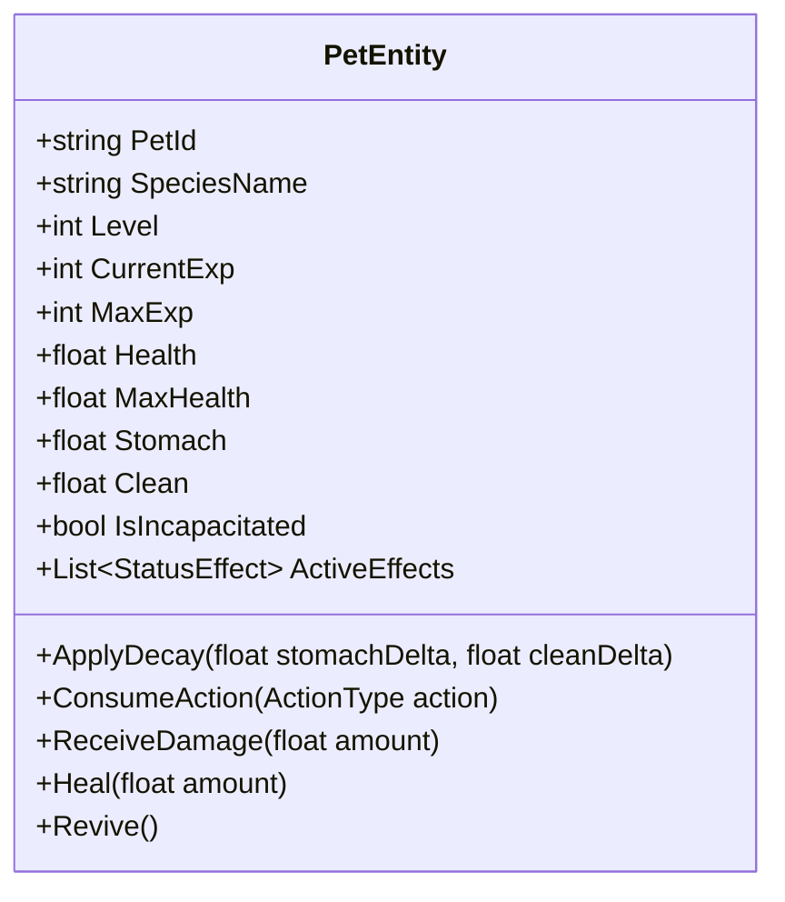
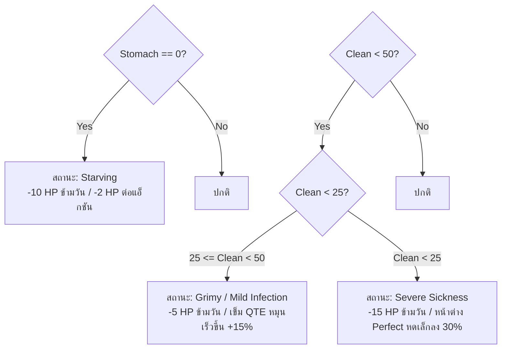

# BePal — Core Rules, Pet Stats & Energy Economy (v2)

## 1. Pet Stats Model (โครงสร้างสถานะของสัตว์เลี้ยง)

สัตว์เลี้ยงทุกตัวใน BePal มีค่าสถานะพื้นฐาน 4 มิติหลักที่ผู้เล่นต้องคอยติดตามและรักษาสมดุล:

### สเตตัสหลักทั้ง 4 ด้าน

| สเตตัส | ช่วงค่า (Range) | ค่าเริ่มต้น | ความสำคัญและบทบาทในเกมเพลย์ |
| --- | --- | --- | --- |
| **Health (HP)** | 0 – Max HP (90–120) | 100% | พลังชีวิตหลัก หากลดลงเหลือ 0 สัตว์เลี้ยงจะหมดสภาพ (Incapacitated) และต้องจ่ายค่ากู้ชีพ |
| **Stomach (ความอิ่ม)** | 0 – 100 | 70 – 80 | ระดับความอิ่ม หากลดลงเหลือ 0 จะเข้าสู่ภาวะอดโซ (Starving) และส่งผลให้ HP ลดลงอย่างต่อเนื่อง |
| **Clean (ความสะอาด)** | 0 – 100 | 70 – 80 | สุขอนามัยและภูมิต้านทาน หากต่ำกว่า 50 จะเริ่มติดเชื้อและมีโอกาสล้มป่วย |
| **EXP / Level** | Lv. 1 – 10 (EXP 0–1000) | Lv. 1 (0 EXP) | ระดับการเจริญเติบโต ทุกครั้งที่เลเวลอัปจะเพิ่ม Max HP และพลังโจมตีสวนกลับ (Counter Damage) |

---

## 2. Mathematical Decay Formulas & Penalties (สูตรการเสื่อมถอยและบทลงโทษ)

เพื่อสร้างความกดดันแบบ Hardcore Survival สเตตัสของสัตว์เลี้ยงจะไม่คงที่ แต่จะลดลงตามเงื่อนไขทางคณิตศาสตร์ที่กำหนดไว้อย่างแม่นยำ:

### 2.1 Daily Natural Decay (การลดลงตามธรรมชาติเมื่อข้ามวัน)
เมื่อสิ้นสุดวันและเข้าสู่ช่วงกลางคืน (Night Phase) สเตตัสจะถูกหักลบอัตโนมัติตามสูตร:
$$\text{Stomach}_{\text{new}} = \max(0, \text{Stomach}_{\text{current}} - 20)$$
$$\text{Clean}_{\text{new}} = \max(0, \text{Clean}_{\text{current}} - 15)$$

### 2.2 Per-Action Metabolic Burn (การเผาผลาญจากการกระทำ)
ทุกครั้งที่ผู้เล่นใช้พลังงานทำกิจกรรมใดๆ ที่ **ไม่ใช่การให้อาหาร (Non-Feed Actions)** เช่น Train, Clean หรือ Heal ร่างกายของสัตว์เลี้ยงจะเผาผลาญพลังงาน:
$$\text{Stomach} \leftarrow \text{Stomach} - 5 \quad (\text{เมื่อกระทำ Train, Clean หรือ Heal})$$
*หมายเหตุ:* หากเลือกทำกิจกรรม **Train** สัตว์จะใช้แรงมากกว่าปกติ จึงถูกหักค่า $\text{Stomach} - 10$

### 2.3 Environmental Disaster Modifiers (ผลกระทบจากภัยพิบัติ)
ในวันที่มีเหตุการณ์สภาพอากาศเลวร้าย สเตตัสจะถูกหักลบเพิ่มเติมทันทีเมื่อเข้าสู่เฟสเหตุการณ์:
- **Thunderstorm (Day 1):** ลมพายุและละอองโคลนทำให้ $\text{Clean} \leftarrow \text{Clean} - 25$ และความเครียดทำให้ $\text{Stomach} \leftarrow \text{Stomach} - 10$
- **Acid Leak (Day 2):** รอยกรดจาก Toothless ทำให้ $\text{Clean} \leftarrow \text{Clean} - 20$

---

## 3. Sickness & Negative Status Effects Matrix (ตารางสถานะผิดปกติ)

เมื่อค่าความต้องการพื้นฐานตกต่ำเกินเกณฑ์ สัตว์เลี้ยงจะได้รับสถานะผิดปกติ (Negative Status Effects) ทันที:

| สถานะผิดปกติ | เงื่อนไขที่เกิด | ผลกระทบต่อสเตตัส (Damage) | ผลกระทบต่อการควบคุม (Gameplay) | วิธีแก้ไข |
| --- | --- | --- | --- | --- |
| **Starving (อดโซ)** | $\text{Stomach} = 0$ | เสีย $-10 \text{ HP}$ เมื่อข้ามคืน และเสีย $-2 \text{ HP}$ ทุกครั้งที่ทำกิจกรรมอื่น | สัตว์ขู่และไม่ยอมตอบสนองต่อคำสั่ง Train | ให้อาหาร (Feed) จน $\text{Stomach} \ge 30$ |
| **Grimy (มอมแมม)** | $25 \le \text{Clean} < 50$ | เสีย $-5 \text{ HP}$ เมื่อข้ามคืน | เข็มในวงล้อ Care QTE หมุนเร็วขึ้น $+15\%$ เนื่องจากสัตว์คันและกระสับกระส่าย | อาบน้ำทำความสะอาด (Clean) |
| **Severe Sickness (ป่วยหนัก)** | $\text{Clean} < 25$ | เสีย $-15 \text{ HP}$ เมื่อข้ามคืน | หน้าต่าง Perfect Zone ในมินิเกมหดเล็กลง $30\%$ | อาบน้ำ Clean ให้พ้นเกณฑ์ และใช้ยา Heal |
| **Acid Burn (แผลกรด)** | โดนการโจมตีของ Toothless | เสีย $-5 \text{ HP}$ ต่อเทิร์นในฉากต่อสู้ | ล็อกช่องสวมใส่อุปกรณ์ 1 ช่อง | ใช้ไอเทมผ้าพันแผลหรือ Heal |

---

## 4. Energy Economy & Action Points (ระบบพลังงานและแต้มแอ็กชัน)

### โควตาพลังงานรายวัน (Daily Energy Budget)
- ผู้เล่นจะได้รับแต้มพลังงานคงที่ **6 Energy Points (AP)** ต่อ 1 Game Day
- แต้มพลังงานจะถูกเติมเต็มใหม่อัตโนมัติทุกเช้า (ไม่สามารถยกยอดสะสมข้ามวันได้ เว้นแต่ใช้ไอเทมเครื่องดื่มชูกำลัง)

### ตารางการใช้พลังงานในแต่ละกิจกรรม

| กิจกรรม (Care Action) | ต้นทุนพลังงาน (AP Cost) | เงื่อนไขทรัพยากรเพิ่มเติม | ผลลัพธ์เมื่อทำสำเร็จ (Perfect / Good) | ผลลัพธ์เมื่อพลาด (Miss) |
| --- | --- | --- | --- | --- |
| **Feed (ให้อาหาร)** | **1 AP** | อาหาร 1 ส่วน (หรือฟรีสำหรับมื้อพื้นฐาน) | $\text{Stomach} +30$ (Perfect) / $+20$ (Good), $\text{EXP} +25$ | $\text{Stomach} +5$, อาหารหกเลอะเปรอะเปื้อน ($\text{Clean} -5$) |
| **Clean (ทำความสะอาด)** | **1 AP** | น้ำสะอาดและสบู่ | $\text{Clean} +35$ (Perfect) / $+25$ (Good), $\text{EXP} +20$ | $\text{Clean} +10$, สัตว์ลื่นเสียหลักตกใจ |
| **Train (ฝึกฝนทักษะ)** | **1 AP** | $\text{Stomach} \ge 20$ (ห้ามฝึกตอนหิว) | $\text{EXP} +60$ (Perfect) / $+40$ (Good), $\text{Stomach} -10$ | $\text{EXP} +15$, สัตว์เหนื่อยล้า $\text{Stomach} -15$ |
| **Heal (รักษาพยาบาล)** | **1 AP** (มียา) / **2 AP** (ไม่มีไอเทม) | ไอเทมยาหรือพืชสมุนไพร | ฟื้นฟู $\text{Health} +30$ และล้างสถานะผิดปกติ 1 ชนิด | ฟื้นฟู $\text{Health} +10$ อาการไม่ทุเลาลง |
| **Emergency Action** | **2 AP** | เกิดเฉพาะตอนมีภัยพิบัติ | ระงับความเสียหายจากภัยพิบัติได้ $100\%$ | ระงับความเสียหายได้เพียง $50\%$ |

---

## 5. Leveling Curve & Stat Growth Matrix (การเติบโตและเลเวล)

เมื่อสัตว์เลี้ยงได้รับค่า EXP จากการฝึกฝนหรือการดูแลจนสะสมครบเกณฑ์ จะเลเวลอัปโดยอัตโนมัติ:

$$\text{EXP Required for Level } L = L \times 100$$

| เลเวล ($L$) | EXP สะสมที่ต้องการ | Max Health โบนัส | Counter Attack Damage | สิทธิ์พิเศษที่ปลดล็อก |
| --- | --- | --- | --- | --- |
| **Lv. 1** | 0 | 0 (Base HP) | Base (15 Dmg) | ปลดล็อกท่า Care พื้นฐาน |
| **Lv. 2** | 100 | $+10 \text{ HP}$ | 17 Dmg | ขยายโซน Good Zone ในมินิเกม $+5\%$ |
| **Lv. 3** | 300 | $+20 \text{ HP}$ | 20 Dmg | ปลดล็อกช่องสวมใส่อุปกรณ์ช่องที่ 2 |
| **Lv. 4** | 600 | $+30 \text{ HP}$ | 24 Dmg | เพิ่มดาเมจสวนกลับในฉากบอส $+15\%$ |
| **Lv. 5** | 1,000 | $+45 \text{ HP}$ | 30 Dmg | ทักษะ Master Care: เมื่อกด Perfect มีโอกาส $25\%$ ไม่เสีย AP |

---

## 6. Incapacitation State & Emergency Revive (การหมดสภาพและการกู้ชีพ)

หากค่า Health ของสัตว์เลี้ยงลดลงแตะระดับ $0$ สัตว์เลี้ยงจะล้มลงหมดสติทันที:
1. **Incapacitated Lock:** กิจกรรมการดูแลและการต่อสู้ทั้งหมดจะถูกระงับ
2. **Emergency Clinic Screen:** หน้าจอเปลี่ยนเป็นหน่วยกู้ชีพฉุกเฉิน
3. **Revival Fee (ค่ากู้ชีพ):** ผู้เล่นต้องจ่ายเงินสด **500 Gold** เพื่อซื้อเซรุ่มฟื้นชีวิตฉุกเฉิน (Revive Serum) ซึ่งจะฟื้นฟู Health กลับมาเป็น $50\%$
4. **Emergency Loan Mechanic (ระบบเงินกู้หน้าเลือด):**
   - หากผู้เล่นมีเงินไม่ถึง 500 Gold ในขณะที่สัตว์หมดสภาพ พ่อค้าเร่ (Merchant) จะยื่นสัญญาเงินกู้ฉุกเฉิน
   - ผู้เล่นจะได้รับเงิน 500G ทันทีเพื่อกู้ชีพสัตว์ แต่มีข้อผูกมัด **อัตราดอกเบี้ยทบต้น 20% ต่อวัน**:
     - *กู้ใน Day 1:* วันถัดไปหนี้จะกลายเป็น $600 \text{ Gold}$
     - *กู้ใน Day 2:* วันถัดไปหนี้จะกลายเป็น $720 \text{ Gold}$
   - *เงื่อนไขยึดทรัพย์ (Default Penalty):* หากไม่สามารถชำระหนี้ได้ครบก่อนจบวันที่ 3 พ่อค้าจะทำการยึดสัตว์เลี้ยง (Toothless หรือ Starter Pet) ไปเป็นทาสแรงงานทันที ส่งผลให้ได้ฉากจบ Bad Ending
