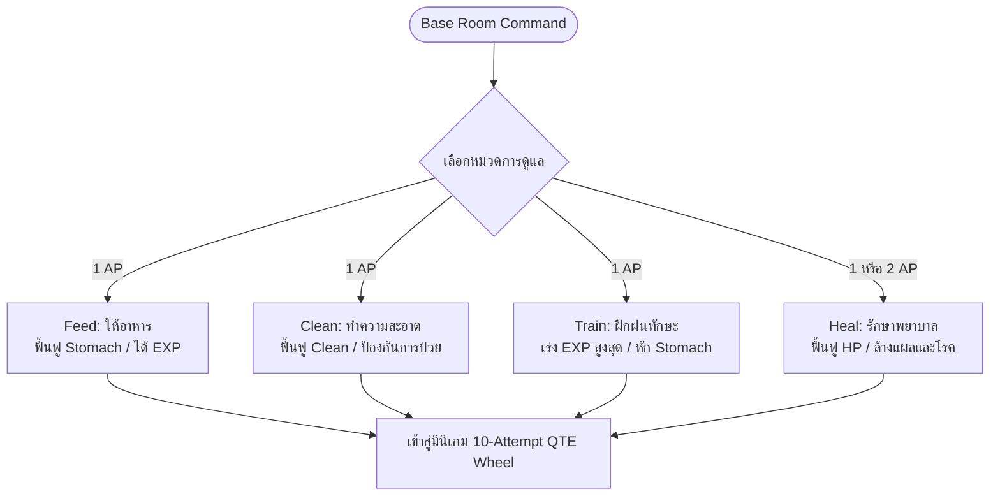
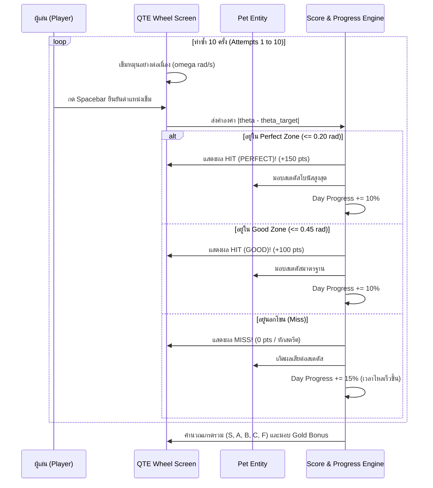

# BePal — Care & QTE Systems (v2)

## 1. Overview of the 4 Core Care Actions (4 กิจกรรมการดูแลหลัก)

การดูแลสัตว์เลี้ยงใน BePal ทำผ่านหน้าจอ Base Room โดยผู้เล่นสามารถเลือกกระทำกิจกรรมได้ 4 หมวดหมู่ ซึ่งแต่ละหมวดหมู่ตอบสนองต่อสเตตัสและความต้องการที่แตกต่างกัน:



| หมวดหมู่ | ต้นทุน (Cost) | วัตถุประสงค์หลัก | สเตตัสเมื่อสำเร็จ (Perfect / Good) | ผลกระทบข้างเคียง / ความเสี่ยง |
| --- | --- | --- | --- | --- |
| **Feed (ให้อาหาร)** | 1 AP | เติมเต็มพลังงานและระงับความหิว | $\text{Stomach} +30 / +20$<br>$\text{EXP} +25$ | หากกดพลาด อาหารจะตกพื้นสกปรก ($\text{Clean} -5$) |
| **Clean (ทำความสะอาด)** | 1 AP | ขจัดคราบโคลน สารพิษ และป้องกันโรค | $\text{Clean} +35 / +25$<br>$\text{EXP} +20$ | หากปล่อยให้ค่า Clean < 50 เข็ม QTE จะหมุนเร็วขึ้น |
| **Train (ฝึกฝนทักษะ)** | 1 AP | พัฒนาระดับเลเวลและพลังโจมตีสวนกลับ | $\text{EXP} +60 / +40$ | สัตว์จะเผาผลาญพลังงานมาก ($\text{Stomach} -10$) ห้ามฝึกเมื่อ $\text{Stomach} < 20$ |
| **Heal (รักษาพยาบาล)** | 1 AP (มียา)<br>2 AP (ปฐมพยาบาลสด) | ฟื้นฟูบาดแผลจากการโดนกรดหรือความเจ็บป่วย | $\text{Health} +30$<br>ลบสถานะผิดปกติ 1 ชนิด | หากไม่มีไอเทมยาในกระเป๋า จะต้องเสียพลังงานถึง 2 AP |

---

## 2. 10-Attempt Mini-Game Session Structure (โครงสร้างมินิเกม 10 ครั้งต่อรอบ)

เมื่อผู้เล่นเลือกกิจกรรมการดูแล ระบบจะตัดเข้าสู่หน้าจอมินิเกมวงล้อ โดยมีกติกาและโครงสร้างที่แน่นอน:
- **จำนวนครั้งต่อรอบ (Attempts):** ผู้เล่นต้องทำการกดจับจังหวะเข็มหมุนอย่างแม่นยำ **10 ครั้งติดต่อกัน (10 Attempts)** ต่อ 1 เซสชัน
- **Attempt Counter:** แสดงตัวเลขจำนวนครั้งปัจจุบันบนหน้าจอ เช่น `[ 03 / 10 ]`
- **ความเร็วเข็มพื้นฐาน (Needle Speed):** $\omega = 2.4 \text{ rad/s}$ (สามารถเร่งเร็วขึ้นได้หากสัตว์เลี้ยงป่วยหรือตื่นตระหนก)
- **การป้อนข้อมูล (Input):** กด **Spacebar** เพื่อยืนยันตำแหน่งเข็ม (QTE Confirmation)



---

## 3. Angular Tolerance Math & Precision Zones (การคำนวณองศาและความแม่นยำ)

วงล้อ QTE มีมุมเป้าหมาย (Target Angle) อยู่ที่ตำแหน่ง $\theta_{\text{target}}$ (เช่น $1.5\pi$ หรือ $270^\circ$ ที่กึ่งกลางด้านบน) โดยความคลาดเคลื่อนวัดจากค่าสัมบูรณ์ $|\theta_{\text{needle}} - \theta_{\text{target}}|$:

```
                  [ 1.5 Pi / 270 deg ]
                     Target Center
                           |
                     .-----^-----.
                   /   PERFECT     \
                 /   (+-0.20 rad)    \
               /       |       |       \
             /    GOOD |       | GOOD    \
            |  (+-0.45)|       |(+-0.45)  |
            |          |       |          |
            |-------------X---------------|
            |            MISS             |
             \                           /
               \                       /
                 \                   /
                   '---------------'
```

### รายละเอียดเกณฑ์ความแม่นยำ

1. **Perfect Zone (โซนแม่นยำสมบูรณ์แบบ):**
   - เงื่อนไข: $|\theta_{\text{needle}} - \theta_{\text{target}}| \le 0.20 \text{ rad}$ ($\approx \pm 11.5^\circ$)
   - เอฟเฟกต์ภาพ: ประกายแสงสีทอง (Gold Sparkles) พร้อมเสียงกระดิ่ง "Chime"
   - คะแนน: $+150 \text{ คะแนน}$
   - โบนัสสเตตัส: ได้รับสเตตัสเพิ่มขึ้น $+20\%$ จากค่ามาตรฐาน
   - ความคืบหน้าของวัน: $\text{Day Progress} += 10\%$

2. **Good Zone (โซนพอใช้):**
   - เงื่อนไข: $0.20 \text{ rad} < |\theta_{\text{needle}} - \theta_{\text{target}}| \le 0.45 \text{ rad}$ ($\approx \pm 25.8^\circ$)
   - เอฟเฟกต์ภาพ: วงแหวนแสงสีเขียวอ่อน พร้อมเสียง "Ding"
   - คะแนน: $+100 \text{ คะแนน}$
   - โบนัสสเตตัส: ได้รับสเตตัสตามเกณฑ์มาตรฐาน ($100\%$)
   - ความคืบหน้าของวัน: $\text{Day Progress} += 10\%$

3. **Miss Zone (พลาดเป้า):**
   - เงื่อนไข: $|\theta_{\text{needle}} - \theta_{\text{target}}| > 0.45 \text{ rad}$
   - เอฟเฟกต์ภาพ: หน้าจอสั่นสะเทือนสั้นๆ (Screen Shake) สีเทาหม่น พร้อมเสียง "Buzz"
   - คะแนน: $+0 \text{ คะแนน}$ (และหักลบ $-50 \text{ คะแนน}$ ในคะแนนรวมสุดท้าย)
   - ผลกระทบ: สตรีคสะสมถูกรีเซ็ตเป็น 0 และทำให้สเตตัสของสัตว์เลี้ยงสะดุด
   - ความคืบหน้าของวัน: $\text{Day Progress} += 15\%$

---

## 4. Day Progress Scaling Math (สูตรการเดินหน้าของเวลา)

ในระหว่างที่ทำมินิเกม หลอด **Day Progress** จะค่อยๆ สะสมขึ้นสู่ระดับ $100\%$ เพื่อส่งต่อไปยังเฟสถัดไปของวัน โดยมีสูตรคำนวณที่สำคัญ:

$$\text{DayProgress}_{\text{new}} = \min\left(100\%, \text{DayProgress}_{\text{current}} + (\text{IsHit} \ ? \ 10\% : 15\%)\right)$$

### เหตุผลและจิตวิทยาในการออกแบบ (+15% เมื่อ Miss):
- ในการออกแบบดั้งเดิมของ BePal หากผู้เล่นพลาด (Miss) หลอดความคืบหน้าจะเพิ่มขึ้น **เร็วกว่าปกติ (+15%)** 
- กลไกนี้สะท้อนถึง **"ความตื่นตระหนกและการเสียเวลาโดยเปล่าประโยชน์"** ในชีวิตจริง: เมื่อผู้เล่นทำพลาด สัตว์เลี้ยงจะกระสับกระส่าย การดูแลต้องรีบเร่ง ทำให้เวลาในแต่ละวันหมดเร็วขึ้น ส่งผลให้ผู้เล่นมีจำนวนครั้งในการดูแลเพื่อฟื้นฟูสัตว์เลี้ยงน้อยลง และต้องเผชิญหน้ากับความมืดและภัยพิบัติเร็วยิ่งขึ้น

---

## 5. Scoring Formula & Grade Evaluation (สูตรการประเมินผลและเกรด)

เมื่อจบเซสชัน 10 ครั้ง ระบบจะคำนวณคะแนนรวมตามสูตรคณิตศาสตร์:

$$\text{TotalScore} = (N_{\text{Perfect}} \times 150) + (N_{\text{Good}} \times 100) + (\text{MaxStreak} \times 25) - (N_{\text{Miss}} \times 50) + \text{HealthBonus}$$

- $N_{\text{Perfect}}$: จำนวนครั้งที่กดโดน Perfect Zone
- $N_{\text{Good}}$: จำนวนครั้งที่กดโดน Good Zone
- $\text{MaxStreak}$: จำนวนการกดโดนติดต่อกันสูงสุดในเซสชันนั้น
- $N_{\text{Miss}}$: จำนวนครั้งที่กดพลาด
- $\text{HealthBonus}$: $(\text{Health} / \text{MaxHealth}) \times 100$

### ตารางเกรดและรางวัลเงิน (Grade & Gold Rewards)

| เกรด (Grade) | ช่วงคะแนนรวม | โบนัสเงินรางวัล (Gold Reward) | ข้อความประเมินจากระบบ |
| --- | --- | --- | --- |
| **Rank S (ไร้ที่ติ)** | $\ge 1,200 \text{ pts}$ | **$+50 \text{ Gold}$** | "การดูแลระดับมืออาชีพ! สัตว์เลี้ยงรู้สึกผูกพันและปลอดภัยสูงสุด" |
| **Rank A (ยอดเยี่ยม)** | $900 – 1,199 \text{ pts}$ | **$+35 \text{ Gold}$** | "ผลงานดีเยี่ยม รักษาสภาพแวดล้อมได้เป็นอย่างดี" |
| **Rank B (ได้มาตรฐาน)** | $600 – 899 \text{ pts}$ | **$+20 \text{ Gold}$** | "ผ่านเกณฑ์มาตรฐาน แต่ยังมีความผิดพลาดเล็กน้อย" |
| **Rank C (เสี่ยงอันตราย)** | $300 – 599 \text{ pts}$ | **$+10 \text{ Gold}$** | "ต่ำกว่าเกณฑ์ สัตว์เลี้ยงเริ่มแสดงอาการหงุดหงิด" |
| **Rank F (ล้มเหลว)** | $< 300 \text{ pts}$ | **$+0 \text{ Gold}$** | "ล้มเหลวโดยสิ้นเชิง สัตว์เลี้ยงได้รับบาดเจ็บทางจิตใจ" |

---

## 6. Action-Specific Thematic Variations (ความแตกต่างเฉพาะหมวดหมู่)

เพื่อให้มินิเกมทั้ง 4 รูปแบบมีความรู้สึกในการควบคุมที่หลากหลาย:

1. **Feed Variation (ชามอาหาร):**
   - พื้นหลังวงล้อเป็นรูปชามอาหาร สัตว์เลี้ยงอ้าปากรอ
   - โซนเป้าหมายอยู่ตำแหน่ง $1.5\pi$ (ทิศเหนือ)
   - เมื่อกดสำเร็จ จะมีแอนิเมชันอาหารเทลงชามและเสียงเคี้ยวกรุบกรอบ
2. **Clean Variation (ฟองสบู่):**
   - บนวงล้อจะมีฟองสบู่ลอยผ่านบดบังทัศนวิสัยเป็นระยะ
   - โซนเป้าหมายกว้างขึ้น $+10\%$ แต่ความเร็วเข็มจะแกว่งเป็นลูกคลื่น (Sinusoidal Velocity)
3. **Train Variation (เป้าหมายเคลื่อนที่):**
   - ตำแหน่ง $\theta_{\text{target}}$ จะสุ่มย้ายตำแหน่งใหม่ทุกครั้งที่กดสำเร็จ (Dynamic Shifting Target)
   - มอบค่า EXP สูงสุด แต่ต้องใช้สมาธิและการกะจังหวะสายตาสูงสุด
4. **Heal Variation (เข็มฉีดยา & ผ่าตัดแผล):**
   - เข็มหมุนช้าลง $30\%$ ($\omega = 1.7 \text{ rad/s}$) แต่โซน Perfect Zone จะหดแคบลงเหลือเพียง $\pm 0.12 \text{ rad}$
   - ต้องใช้ความแม่นยำระดับศัลยแพทย์เพื่อไม่ให้สัตว์เลี้ยงเจ็บปวด
