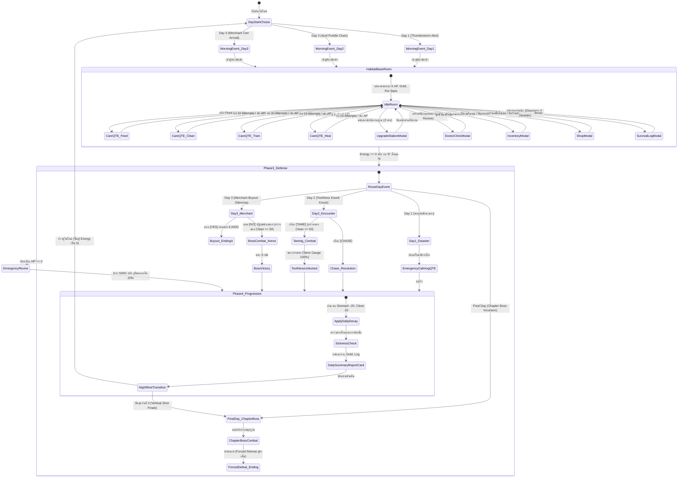

# BePal — Mechanic Design & Systems Specification

## State Machine Diagram

---

## Section 1: Habitat Room Navigation & Base Systems

### 1.1 Base Room HUD Layout & Hitboxes
ห้องพักพิงหลัก (Habitat Base Room) ทำงานที่ความละเอียด **1280x720 px** โดยมีองค์ประกอบการโต้ตอบหลักบนหน้าจอ:

- **Top Bar (แถบสถานะผู้ดูแล):**
  - แสดงตัวนับวัน `[ DAY 1 / 3 ]`
  - หลอดพลังงาน **Energy Pips** 6 ดวง (`#48CD82`)
  - จำนวนเงินคงเหลือ `[ GOLD: 150 G ]`
  - หลอดเลเวลผู้เล่น `[ PLAYER LV. 1 ]` พร้อมแถบ EXP
- **Center Habitat Stage (เวทีสัตว์เลี้ยง):**
  - แสดง Sprite สัตว์เลี้ยงปัจจุบัน (Coco, Sproutlet, Gloomtail, หรือ Toothless ในวันที่ 3)
  - แอนิเมชัน Idle ลอยขึ้นลงอย่างนุ่มนวล พร้อมแสดงบอลลูนบอกใบ้อารมณ์ (Dynamic Cues)
- **Left/Right Pet Status Bars (แถบสเตตัสสัตว์เลี้ยง):**
  - **HP Bar:** แสดงพลังชีวิต `[ HP: 100 / 100 ]` สีแดงทับทิม
  - **Stomach Bar:** แสดงระดับความอิ่ม `[ STOMACH: 80% ]` สีส้มอำพัน
  - **Clean Bar:** แสดงความสะอาด `[ CLEAN: 70% ]` สีฟ้าสดใส
  - **EXP / Level Badge:** ระดับเลเวลปัจจุบันและแถบค่าประสบการณ์
- **Bottom Command Console (คอนโซลคำสั่งการดูแล 4 ปุ่ม):**
  - ปุ่ม `[ FEED ]` (คีย์ 2) — ให้อาหาร (ใช้ 1 AP)
  - ปุ่ม `[ CLEAN ]` (คีย์ 3) — ขจัดคราบและทำความสะอาด (ใช้ 1 AP)
  - ปุ่ม `[ TRAIN ]` (คีย์ 1) — ฝึกซ้อมเพิ่ม EXP (ใช้ 1 AP)
  - ปุ่ม `[ HEAL ]` (คีย์ 4) — รักษาพยาบาลและถอนพิษ (ใช้ 1 หรือ 2 AP)
- **Quick-Access Modal Buttons:**
  - `[ BAG ]` (คีย์ B) — เปิดหน้าต่างกระเป๋าเก็บของ 8 ช่อง
  - `[ LOG ]` — เปิดหน้าต่างสมุดบันทึกวิจัย Survival Log (Pet Discovery & Disaster Log)
  - `[ SHOP ]` (คีย์ S) — เปิดร้านค้าของพ่อค้าเร่ (แสดงเฉพาะวันที่ 3)
  - `[ END DAY ]` (คีย์ E) — สิ้นสุดวัน ข้ามไปยังสรุปผลประจำวัน

### 1.2 Environment Objects (วัตถุโต้ตอบในฐาน)
- **ประตูแดงคู่ (Front Door):** จุดเปิดรับเหตุการณ์และแขกที่มาเคาะประตู ("Knock Knock !!")
- **NPC คุณหมอ (Doctor Clinic):** บริการกู้ชีพสัตว์เลี้ยงฉุกเฉิน 500 Gold เมื่อ HP = 0
- **สถานีอัปเกรดฐาน (Upgrade Skill Tree):** ใช้เงิน Gold เพื่ออัปเกรด 3 สาย:
  1. *สาย QTE (QTE Focus):* ขยายขนาดหน้าต่าง Hit Zone $+15\%$ (200 Gold)
  2. *สาย Energy (Stamina Tree):* เพิ่มขีดจำกัดพลังงานสูงสุด $+2 \text{ AP}$ (300 Gold)
  3. *สาย Progress Booster (Care Booster):* เพิ่มผลตอบแทนสเตตัสการดูแลขึ้น $+50\%$ (250 Gold)
- **โต๊ะค้นคว้า (Survival Desk):** ค้นหาสมุดบันทึกสัตว์เลี้ยง (Pet Discovery) และบันทึกภัยพิบัติ (Disaster Log)

---

## Section 2: Pet Stats & Decay Formulas

### 2.1 โครงสร้างสถานะพื้นฐาน 4 มิติ

| สเตตัส | ช่วงค่า (Range) | ค่าเริ่มต้น | ความสำคัญและบทบาทในเกมเพลย์ |
| --- | --- | --- | --- |
| **Health (HP)** | 0 – Max HP (90–120) | 100% | พลังชีวิตหลัก หากลดลงเหลือ 0 สัตว์เลี้ยงจะหมดสภาพ (Incapacitated) และต้องจ่ายค่ากู้ชีพ |
| **Stomach (ความอิ่ม)** | 0 – 100 | 70 – 80 | ระดับความอิ่ม หากลดลงเหลือ 0 จะเข้าสู่ภาวะอดโซ (Starving) และส่งผลให้ HP ลดลงอย่างต่อเนื่อง |
| **Clean (ความสะอาด)** | 0 – 100 | 70 – 80 | สุขอนามัยและภูมิต้านทาน หากต่ำกว่า 50 สัตว์จะไม่ยอมออกไปต่อสู้ และมีโอกาสติดเชื้อ |
| **EXP / Level** | Lv. 1 – 10 (EXP 0–1000) | Lv. 1 (0 EXP) | ระดับการเจริญเติบโต ทุกครั้งที่เลเวลอัปจะเพิ่ม Max HP และพลังโจมตีสวนกลับ (Counter Damage) |

### 2.2 Mathematical Decay Formulas (สูตรการเสื่อมถอย)

1. **Daily Natural Decay (การลดลงตามธรรมชาติเมื่อข้ามวัน):**
   $$\text{Stomach}_{\text{new}} = \max(0, \text{Stomach}_{\text{current}} - 20)$$
   $$\text{Clean}_{\text{new}} = \max(0, \text{Clean}_{\text{current}} - 15)$$

2. **Per-Action Metabolic Burn (การเผาผลาญจากการกระทำ):**
   ทุกครั้งที่ผู้เล่นใช้พลังงานทำกิจกรรมใดๆ ที่ **ไม่ใช่การให้อาหาร (Non-Feed Actions)** เช่น Clean หรือ Heal ร่างกายของสัตว์เลี้ยงจะเผาผลาญพลังงาน:
   $$\text{Stomach} \leftarrow \text{Stomach} - 5$$
   *ข้อยกเว้น:* หากเลือกทำกิจกรรม **Train** สัตว์จะใช้แรงมากกว่าปกติ จึงถูกหักค่า $\text{Stomach} - 10$

3. **Environmental Disaster Modifiers (ผลกระทบจากภัยพิบัติ):**
   - **Thunderstorm (Day 1):** ลมพายุพัดพาฝุ่นโคลนเข้ามา $\text{Clean} \leftarrow \text{Clean} - 25$ และความตื่นตระหนกทำให้ $\text{Stomach} \leftarrow \text{Stomach} - 10$
   - **Acid Leak (Day 2):** รอยกรดจาก Toothless ทำให้ $\text{Clean} \leftarrow \text{Clean} - 20$

### 2.3 Sickness & Negative Status Effects Matrix

| สถานะผิดปกติ | เงื่อนไขที่เกิด | ผลกระทบต่อสเตตัส (Damage) | ผลกระทบต่อการควบคุม (Gameplay) | วิธีแก้ไข |
| --- | --- | --- | --- | --- |
| **Starving (หิวโซ)** | Stomach = 0 | เสีย $-10 \text{ HP}$ เมื่อข้ามวัน, $-2 \text{ HP}$ ต่อทุกแอ็กชัน | สัตว์ไม่ยอมร่วมมือในโหมด Train | ดำเนินการ Feed ให้อาหารทันที |
| **Grimy / Filthy** | Clean < 50 | เสีย $-5 \text{ HP}$ เมื่อข้ามวัน | **สัตว์ปฏิเสธการต่อสู้ (Refuse to Fight)** และเข็ม QTE หมุนเร็วขึ้น $+15\%$ | ดำเนินการ Clean ขัดถูทำความสะอาด |
| **Infected (ติดเชื้อรุนแรง)** | Clean < 25 | เสีย $-15 \text{ HP}$ เมื่อข้ามวัน | หน้าต่าง Perfect Zone แคบลง $30\%$ | ดำเนินการ Heal ร่วมกับยาปฏิชีวนะ |
| **Acid Burn (แผลกรด)** | โดนการโจมตีของ Toothless | เสีย $-5 \text{ HP}$ ต่อเทิร์นในฉากต่อสู้ | ล็อกช่องสวมใส่อุปกรณ์ 1 ช่อง | ใช้ไอเทมผ้าพันแผลหรือ Heal |

---

## Section 3: Care QTE Mini-Game & Gimmicks

### 3.1 10-Attempt Wheel Structure
- จำนวนความพยายาม: **10 ครั้งต่อรอบ**
- เข็มชี้หมุนด้วยความเร็วพื้นฐาน $2.4 \text{ rad/s}$
- โซนความแม่นยำ:
  - **Perfect Zone:** $\pm 0.20 \text{ rad}$ (+คะแนนสูงสุด, เพิ่ม Streak)
  - **Good Zone:** $\pm 0.45 \text{ rad}$ (+คะแนนปกติ, รักษาระดับ Streak)
  - **Miss:** เข็มอยู่นอกโซน (เสียโอกาส, รีเซ็ต Streak)

### 3.2 Dynamic QTE Gimmicks (ลูกเล่นความยาก)
1. **Reverse Rotation (เปลี่ยนทิศทางการหมุน):** เข็มหมุนสลับทิศทางตามเข็ม-ทวนเข็มกะทันหันในโหมด Feed
2. **Escaping Zone (ปุ่มหมุนหนี):** จุดความสำเร็จเคลื่อนที่หนีเข็มในโหมด Clean
3. **Blinking Needle (เข็มหมุนกะพริบ):** จุดความสำเร็จกะพริบหายไปเป็นระยะในโหมด Heal
4. **Shrinking Zone (ปุ่มหดสั้นลง):** โซน QTE จะบีบเล็กลงเรื่อยๆ ตามจำนวนความพยายามที่เพิ่มขึ้น

---

## Section 4: Combat Engine & Encounters

### 4.1 กฎความสะอาดก่อนออกรบ (Combat Readiness)
สัตว์เลี้ยงที่มีค่า **Clean < 50** จะอยู่ในสภาพสกปรกมอมแมมและตื่นกลัว ทำให้ปฏิเสธการลงสนามต่อสู้ (**Combat Refusal**) ผู้เล่นต้องทำความสะอาดสัตว์เลี้ยงให้มี Clean $\ge 50$ เสียก่อน

### 4.2 การเผชิญหน้าและบอสประจำวัน
1. **Day 2 — Toothless Taming:**
   - ผู้เล่นเลือก Tame เพื่อนำสัตว์เข้าสู่การต่อสู้ QTE
   - หลบการโจมตีกรด (Acid Dodge) และกดสวนกลับเพื่อเติมหลอด Tame Gauge ให้ครบ 100%
2. **Day 3 — Merchant Boss Battle (3 เฟส):**
   - *Phase 1 (Greed's Splash):* ขวดกรด 3 ลูก (HP 1000 $\rightarrow$ 700)
   - *Phase 2 (Gold Gatling):* ปืนกลเหรียญทอง (HP 700 $\rightarrow$ 300) หลบพ้นได้เงิน $+2\text{G}$ ต่อครั้ง
   - *Phase 3 (Collector's Cane):* ฟาดไม้เท้า & ภาพลวงตา (HP 300 $\rightarrow$ 0) หน้าต่าง Parry Window สีม่วง
3. **Final Day — Chapter Boss Incursion (Vertical Slice Finale):**
   - บอสประจำบทบุกฐานด้วยพลังมหาศาล ($2,000 \text{ HP}$) โจมตีรุนแรงครั้งละ $35 \text{ HP}$
   - ออกแบบเป็น **Forced Defeat Encounter (การต่อสู้บังคับแพ้)** สัตว์เลี้ยงและผู้เล่นต้องถอยร่นเข้าสู่ห้องนิรภัยชั้นใน จบเนื้อหา Vertical Slice อย่างตื่นเต้น

---

## Section 5: Economy, Shop & Inventory

### 5.1 Currency Economy Model (Gold Flow)
- **Starting Wallet:** 150 Gold เมื่อเริ่มต้นเกม Day 1
- **Daily Subsidy:** รับเงินสนับสนุน $+100 \text{ Gold}$ ทุกเช้า
- **Care Performance Bonus:** ได้รับ $10 – 50 \text{ Gold}$ ตามเกรด S–C ในแต่ละรอบ
- **Emergency Revive:** ค่าบริการกู้ชีพของคุณหมอ $500 \text{ Gold}$ (หากเงินไม่พอ กู้ยืมดอกเบี้ย $20\%$ ทบต้นต่อวัน)

### 5.2 Item Catalog (สินค้าและอุปกรณ์)

| รายการสินค้า | ราคา | ประเภท | คุณสมบัติและการใช้งาน |
| --- | --- | --- | --- |
| **Crab Apple** | 25 G | อาหารพิเศษ | ฟื้นฟู $+18 \text{ HP}$ และเพิ่ม $+20 \text{ Stomach}$ ทันทีโดยไม่เสีย AP |
| **Sea Tea** | 18 G | เครื่องดื่มบัฟ | ขยายความกว้างของ Dodge Zone ขึ้น $+20\%$ เป็นเวลา 1 วัน |
| **Cloudy Glasses** | 30 G | อุปกรณ์เสริม | มอบโล่ป้องกัน (Invulnerability Shield) 2 ครั้งในฉากต่อสู้ |
| **Torn Notebook** | 55 G | ตำราวิจัย | เพิ่มค่า EXP จากการกระทำ Train ถาวรขึ้น $+50\%$ |
| **Caffeine Tonic** | 40 G | ยาชูกำลัง | ฟื้นฟูแต้มพลังงาน $+2 \text{ AP}$ ทันทีในวันนั้น |
| **Ballet Shoes** | 50 G | อุปกรณ์สวมใส่ | หน้าต่าง Perfect Zone กว้างขึ้น $+15\%$ (แลกกับ Stomach ลดเร็วขึ้น $+5$) |
| **Toy Knife** | 45 G | อุปกรณ์สวมใส่ | เพิ่มพลังโจมตีสวนกลับ (Counter Damage) ในบอสไฟต์ $+35\%$ |
| **Faded Ribbon** | 35 G | อุปกรณ์สวมใส่ | อัตราความสะอาดลดลงช้าลง $30\%$ (Clean Decay -30%) |
