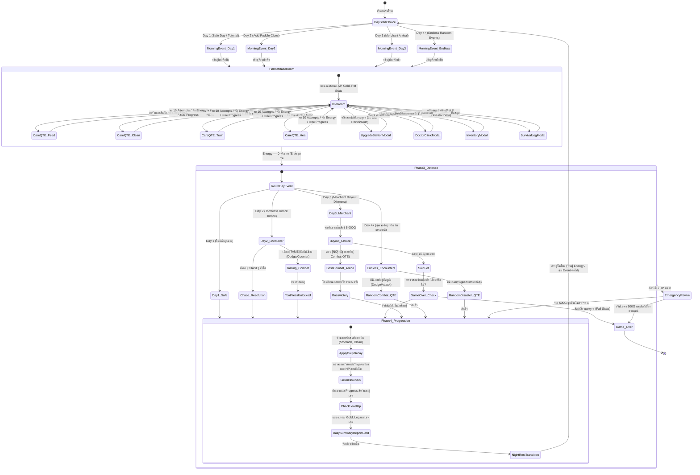

# BePal — Mechanic Design & Systems Specification

## State Machine Diagram

---
## Section 0: Game Architecture & The Endless Loop

### 0.1 Story & Setting Overview (เรื่องราวและฉากหลัง)

- **The Lone Sanctuarist:** ผู้เล่นรับบทเป็นสิ่งมีชีวิตสายพันธุ์ Humanoid ลึกลับที่อาศัยอยู่เพียงลำพังบนดาวเคราะห์อันห่างไกล โดยเปลี่ยนดาวทั้งดวงให้เป็น "สถานพักพิงสัตว์อวกาศ" (Alien Pet Sanctuary)
- **The Red Door Encounters:** "ประตูแดง" ศูนย์กลางของฐานทำหน้าที่ต้อนรับสิ่งมีชีวิตแปลกประหลาดที่หลงทาง บาดเจ็บ หรือบุกรุกเข้ามา
- **Beyond the Pets:** ภัยคุกคามที่ไม่แน่นอน ทั้งสิ่งมีชีวิตทรงภูมิปัญญาจอมขูดรีด พ่อค้าเร่ หรือภัยพิบัติทางธรรมชาติระดับจักรวาล
### 0.2 Unique Selling Point (USP)

- **Cozy Sci-Fi Sanctuary with Hardcore Survival Peril:** บรรยากาศอบอุ่นที่ซ่อนความตึงเครียดของการเอาชีวิตรอด สัตว์อวกาศมีระบบความต้องการสมจริง (Stomach, Clean) หากพลาดอาจเจ็บป่วยและตายได้
- **Discrete Energy Economy (The Lone Caretaker's Budget):** บีบคั้นการตัดสินใจด้วยแต้ม Energy สูงสุดเพียง 6 แต้มต่อวัน บังคับให้ผู้เล่นต้องจัดลำดับความสำคัญอย่างเด็ดขาด
- **10-Attempt Precision Care QTE Engine:** มินิเกมวงล้อความแม่นยำ 10 จังหวะ ผูกผลลัพธ์เข้ากับระบบ Progression โดยให้รางวัลระดับ High Reward เฉพาะการกดเข้า Perfect Zone
- **The Unpredictable "Red Door" & Dynamic Combat:** สุ่มเจอศัตรูและเหตุการณ์แบบ Endless พร้อมระบบต่อสู้กะจังหวะ Dodge หลบหลีก และ Counter-Attack สวนกลับ
- **High-Stakes Moral Crossroads:** ทางเลือกเดิมพันสูง เช่น การยอมขายสัตว์เลี้ยงแลกเงิน 5,000G ที่อาจนำไปสู่ความล่มสลายและ Game Over หากโลภจนไม่เหลือสัตว์เลี้ยงในฐาน

### 0.3 The Endless Core Loop (โครงสร้างลูปประจำวัน)
_(สามารถนำโค้ด stateDiagram-v2 ที่ร่างไว้มาแปะในส่วนนี้เพื่อให้ทีมเห็น Flow chart ทั้งหมด)_

- **Phase 1: Morning Event** — สุ่มเหตุการณ์หน้าประตู (Safe Day, พายุ, ศัตรูบุก, พ่อค้าเร่)
- **Phase 2: Care & QTE** — บริหาร 6 AP เพื่อเข้าวงล้อดูแลสัตว์ (Feed, Clean, Train, Heal)
- **Phase 3: Defense & Resolution** — ตัดสินใจรับมือเหตุการณ์ประจำวัน หรือเข้าสู่ฉาก Combat QTE
- **Phase 4: Progression & Save** — คำนวณหักสเตตัสรายวัน (Decay), ตรวจสอบการเจ็บป่วย, อัปเลเวล และข้ามเข้าสู่วันใหม่

## Section 1: The Sanctuary (Base Systems & UI)
### 1.1 Base Room HUD Layout & Hitboxes
ห้องพักพิงหลัก (Habitat Base Room) เป็นหน้าจอหลักสำหรับการบริหารจัดการ โดยมีองค์ประกอบการโต้ตอบหลักบนหน้าจอดังนี้:

**Top Bar (แถบสถานะผู้ดูแล):**
- - ตัวนับวัน [ Day (ตามจำนวนวันที่รอดชีวิต) ] บ่งบอกถึงความก้าวหน้าในโหมด Endless
- หลอดพลังงาน Energy Pips (สูงสุด 6 ดวง) สำหรับใช้ทำกิจกรรม
- จำนวนเงินคงเหลือ [ GOLD: 150 G ]
- หลอดเลเวลผู้เล่น [ PLAYER LV. 1 ] พร้อมแถบ EXP (หลอดจะเพิ่มขึ้นเมื่อผู้เล่นกด QTE ดูแลสัตว์ได้ระดับ "Perfect" เท่านั้น)
**Center Habitat Stage (พื้นที่พักพิงสัตว์เลี้ยง):**
- แสดง Sprite สัตว์เลี้ยงปัจจุบัน (เช่น ไอ่แดง, ไอ่ซุง, ไอ่เขียว, Toothless) เดินไปมาหรือมีแอนิเมชัน Idle ในห้อง
**Pet Status Interaction (การเช็กสเตตัสสัตว์เลี้ยง):**
- เมื่อตรวจสอบสัตว์เลี้ยง จะแสดงหลอดสเตตัสหลัก 3 อย่าง: **HP** (พลังชีวิต), **Stomach** (ความอิ่ม), และ **Clean** (ความสะอาด) พร้อมแสดง **Level / Progress Bar** ของสัตว์เลี้ยงตัวนั้นๆ
**Command Interaction (การสั่งการดูแลสัตว์เลี้ยง):**
- ผู้เล่นต้อง **"คลิกซ้ายที่ตัวสัตว์เลี้ยง"** เพื่อเปิดหน้าต่างวงล้อคำสั่ง (Action Selection Wheel)
- เข็มจะหมุนไปรอบวงล้อที่มี 4 คำสั่ง ผู้เล่นต้องกด Spacebar เล็งให้ตรงเพื่อเลือก:
	- **[ FEED ]** — ให้อาหาร (ใช้ 1 AP / หิวเพิ่ม)
	- **[ CLEAN ]** — ทำความสะอาด (ใช้ 1 AP / ความสะอาดเพิ่ม)
	- **[ TRAIN ]** — ฝึกซ้อม (ใช้ 1 AP / เพิ่มหลอด Progress เพื่ออัปเลเวล)
	- **[ HEAL ]** — รักษาพยาบาล (ใช้ 1 AP / ฟื้นฟู HP)
**Quick-Access UI Buttons (ปุ่มลัดหน้าจอหลัก):**
- - **[ BAG ] (คีย์ B):** เปิดหน้าต่างกระเป๋าเก็บไอเทมเพื่อกดใช้งานฟื้นฟูสเตตัสสัตว์เลี้ยง
- **[ END DAY ] (คีย์ E):** ปุ่มสิ้นสุดวัน เพื่อข้ามเวลาไปยังช่วงประมวลผล (Phase 4) ทันที

### 1.2 Environment Objects (วัตถุโต้ตอบในฐาน)
ผู้เล่นสามารถใช้เมาส์คลิกเพื่อโต้ตอบกับสิ่งอำนวยความสะดวกในห้องได้ ดังนี้:

- - **ประตูแดงคู่ (Front Door):** จุดเปิดรับเหตุการณ์และแขกที่มาเคาะประตู ("Knock Knock !!") เพื่อสุ่ม Event ประจำวัน (เช่น สัตว์บุก, พ่อค้าเร่มาเยือน)
- **NPC คุณหมอ (Doctor Clinic):** บริการกู้ชีพสัตว์เลี้ยงฉุกเฉิน ผู้เล่นสามารถจ่ายเงิน 500 Gold เมื่อสัตว์เลี้ยง HP = 0 เพื่อชุบชีวิตให้ฟื้นกลับมามี HP = 1
- **สถานีอัปเกรดฐาน (Upgrade Station / ไอคอนรูปเฟือง):** ใช้แต้ม Skill Points (ที่ได้จากการอัปเลเวลผู้เล่น) และเงิน Gold เพื่ออัปเกรด 3 สาย:
	- **สาย QTE:** ทำให้กด QTE ง่ายขึ้น (ขยายขนาดหน้าต่าง Hit Zone หรือลดความเร็วเข็ม)
	- **สาย Progress Booster:** เพิ่มประสิทธิภาพการดูแล ทำให้หลอด Progress เพิ่มเยอะขึ้นเมื่อกดสำเร็จ (เช่น จากเพิ่มทีละ 10% เป็น 15%)
	- **สาย Energy:** เพิ่มขีดจำกัดพลังงานรายวันให้ผู้เล่น (Max Energy อัปได้สูงสุดไม่เกิน 6 AP)
- **โต๊ะค้นคว้า (Survival Desk / ไอคอนสมุด):** สำหรับเปิดสมุดบันทึก เพื่อดูคำอธิบายของสัตว์เลี้ยง (ข้อมูลธาตุต่างๆ) และรวบรวมบันทึกภัยพิบัติหรือศัตรูที่เคยเผชิญหน้า

---

## Section 2: Pet Stats, Progression & Decay Systems

### 2.1 โครงสร้างสถานะพื้นฐาน 4 มิต

| สเตตัส                 | ช่วงค่า (Range)   | ค่าเริ่มต้น        | ความสำคัญและบทบาทในเกมเพลย์                                                                                                                                                          |
| ---------------------- | ----------------- | ------------------ | ------------------------------------------------------------------------------------------------------------------------------------------------------------------------------------ |
| **Health (HP)**        | 0 – Max HP (100+) | 100                | พลังชีวิตหลัก หากลดลงเหลือ 0 สัตว์เลี้ยงจะหมดสภาพ (ตาย) ทันที และต้องจ่ายค่ากู้ชีพ 500G ให้คุณหมอเพื่อชุบชีวิตให้ฟื้นกลับมา HP = 1                                                   |
| **Stomach (ความอิ่ม)** | 0 – 100           | 70 – 80            | ระดับความอิ่ม หากลดลงเหลือ 0 สัตว์จะเข้าสู่ภาวะป่วยและส่งผลให้โดนหักค่า HP ทันที                                                                                                     |
| **Clean (ความสะอาด)**  | 0 – 100           | 70 – 80            | สุขอนามัยที่ส่งผลต่อประสิทธิภาพการต่อสู้โดยตรง: • **หาก Clean < 50:** สัตว์เลี้ยงจะโจมตีเบาลง • **หาก Clean < 25:** สัตว์เลี้ยงจะถูกเนิร์ฟลด Max HP ลง (เช่น จาก 100 เหลือ 80) |
| **Progress / Level**   | Lv. 1 เป็นต้นไป   | Lv. 1 (0 Progress) | ระดับการเติบโต หลอด Progress จะเพิ่มขึ้นเมื่อกด QTE สำเร็จ หากหลอดเต็มสัตว์จะอัปเลเวล (เพิ่ม Max HP และ พลังโจมตี) **โดยยิ่งเลเวลสูง หลอดจะยิ่งเพิ่มยากขึ้น**                        |

### 2.2 Mathematical Decay Formulas (สูตรการเสื่อมถอย)

1. **Daily Natural Decay (การลดลงตามธรรมชาติเมื่อจบวัน):** เมื่อผู้เล่นกด End Day หรือข้ามวัน ระบบจะคำนวณหักลบค่าสเตตัสพื้นฐานตามสูตรคงที่ เพื่อกดดันให้ผู้เล่นต้องบริหาร Energy ในวันถัดไป
2. 
$$\text{Stomach}_{\text{new}} = \max(0, \text{Stomach}_{\text{current}} - 20)$$

$$\text{Clean}_{\text{new}} = \max(0, \text{Clean}_{\text{current}} - 15)$$

2. **Per-Action Metabolic Burn (การเผาผลาญจากการกระทำ):** ทุกครั้งที่ผู้เล่นใช้พลังงาน (Energy) ทำกิจกรรมดูแลที่ไม่ใช่การให้อาหาร (Non-Feed Actions) เช่น การเลือก Clean หรือ Heal ร่างกายของสัตว์เลี้ยงจะเผาผลาญพลังงาน ทำให้ความอิ่มลดลง

$$\text{Stomach}_{\text{new}} = \text{Stomach}_{\text{current}} - 5$$
  
**ข้อยกเว้น:** หากผู้เล่นเลือกทำกิจกรรม **Train (ฝึกฝน)** สัตว์เลี้ยงจะต้องใช้แรงและเผาผลาญพลังงานมากกว่าปกติ จึงถูกหักค่าความอิ่มเพิ่มขึ้น 

$$\text{Stomach}_{\text{new}} = \text{Stomach}_{\text{current}} - 10$$

3. **Environmental Disaster Modifiers (ผลกระทบจาก Event และภัยพิบัติ):** _(ปรับแก้ให้สอดคล้องกับระบบ Endless Management)_
   - **Thunderstorm (Endless Random Event):** หากสุ่มเจอเหตุการณ์พายุฝนฟ้าคะนองในวันใดก็ตาม (ตั้งแต่ Day 4 เป็นต้นไป) ลมพายุจะพัดพาฝุ่นโคลนเข้ามา ทำให้ค่าความสะอาดของสัตว์เลี้ยงทุกตัวตกลงไปอยู่ที่เกณฑ์อันตรายทันที
   $$\text{Clean}_{\text{new}} = 50$$

   - **Acid Leak (Day 2 Encounter):** ร่องรอยกรดที่เกิดจากการบุกรุกของ Toothless ทำให้สภาพแวดล้อมปนเปื้อน
   - 
$$\text{Clean}_{\text{new}} = \text{Clean}_{\text{current}} - 20$$

### 2.3 Sickness & Negative Status Effects Matrix

| สถานะผิดปกติ                  | เงื่อนไขที่เกิด                | ผลกระทบต่อสเตตัส (Damage)                                | ผลกระทบต่อการควบคุม (Gameplay)                                         | วิธีแก้ไข                                                      |
| ----------------------------- | ------------------------------ | -------------------------------------------------------- | ---------------------------------------------------------------------- | -------------------------------------------------------------- |
| **Starving (หิวโซ)**          | Stomach = 0                    | เสีย $25 percent$ ของ HP เมื่อข้ามวัน                    | สัตว์ไม่ยอมร่วมมือในคำสั่ง Train (ไม่สามารถอัปเลเวลได้)                | เลือกคำสั่ง Feed หรือใช้ไอเทมอาหารทันที                        |
| **Grimy / Filthy**            | Clean < 50                     | สัตว์เลี้ยงจะโจมตีสวนกลับได้เบาลงในฉากต่อสู้             | เข็ม QTE จะหมุนเร็วขึ้น $+15\%$ ในทุกๆ แอ็กชัน                         | เลือกคำสั่ง Clean เพื่อขัดถูกำจัดคราบ                          |
| **Infected (ติดเชื้อรุนแรง)** | Clean < 25                     | สัตว์เลี้ยงถูกเนิร์ฟลด Max HP ลง (เช่น จาก 100 เหลือ 80) | **หน้าต่างโซนความสำเร็จ (Perfect Zone)**  แคบลง 30%                    | เลือกคำสั่ง Clean เพื่อขัดถูกำจัดคราบและใช้ heal เพื่อเพิ่ม HP |
| **Burn (เผาไหม้)**            | โดนโจมตีจากไฟ (เช่น Toothless) | เสีย $-5$ HP ต่อเทิร์นเมื่ออยู่ในฉากต่อสู้               | **โซนสีเหลือง (Dodge Zone)** ในการต่อสู้จะหดสั้นลง ทำให้หลบหลีกยากขึ้น | ใช้ไอเทมรักษาบาดแผล หรือรอใช้คำสั่ง Heal นอกฉากต่อสู้          |

---

## Section 3: Care QTE Mini-Game & Gimmicks

### 3.1 10-Attempt Wheel Structure (โครงสร้างวงล้อ 10 จังหวะ)
- **ความเร็วเข็มพื้นฐาน:** $2.4 \text{ rad/s}$
- **โควตาการกด:** 10 ครั้ง ต่อ 1 Energy (AP)

| ระดับการกด (Accuracy) | องศาโซนเป้าหมาย (Hit Zone) | ผลต่อหลอด Progress สัตว์       | ผลต่อ EXP ผู้เล่น          | ผลต่อเนื่อง (Combo/Streak)             |
| --------------------- | -------------------------- | ------------------------------ | -------------------------- | -------------------------------------- |
| Perfect               | $\pm 0.20 \text{ rad}$     | เพิ่มขึ้นสูงสุด (เช่น $+10\%$) | ได้รับแต้มสำหรับอัปเกรดฐาน | สะสมเพิ่ม Combo Streak                 |
| Good                  | $\pm 0.45 \text{ rad}$     | เพิ่มขึ้นปานกลาง (เช่น $+5\%$) | ไม่มีผล                    | รักษาระดับ Streak ปัจจุบัน             |
| Miss                  | นอกโซนเป้าหมาย             | ไม่มีผล                        | ไม่มีผล                    | รีเซ็ต Streak เป็น 0 และเสียโควตากดฟรี |
### 3.2 Dynamic QTE Gimmicks (ลูกเล่นความยากแบบไดนามิก)

- **Reverse Rotation (เปลี่ยนทิศทางการหมุน):** เข็มหมุนสลับทิศทางตามเข็มและทวนเข็มนาฬิกากะทันหัน (มักพบในโหมด Feed)
- **Escaping Zone (เป้าหมายเคลื่อนที่หนี):** จุดความสำเร็จบนวงล้อจะขยับหนีเมื่อเข็มหมุนเข้าใกล้ (มักพบในโหมด Clean)
- **Blinking Needle (เข็มหมุนกะพริบ):** ตัวเข็มชี้บนวงล้อจะกะพริบหายไปจากหน้าจอและโผล่กลับมาเป็นระยะ (มักพบในโหมด Heal)
- **Shrinking Zone (เป้าหมายหดสั้นลง):** โซน QTE จะบีบเล็กลงเรื่อยๆ ตามจำนวนความพยายาม หรือเมื่อสัตว์อยู่ในสถานะติดเชื้อ (Infected)

### 3.3 Progression Math & Level Scaling (ระบบสมการคำนวณการเติบโต)
เพื่อให้นำไปเขียนโค้ดและปรับจูนสมดุล (Balancing) ได้ง่าย เราจะเปลี่ยนค่าเปอร์เซ็นต์ให้เป็น **Progress Points (PP)** เพื่อให้รองรับการเติบโตแบบขั้นบันไดเมื่อสัตว์เลี้ยงหรือผู้เล่นมีเลเวลสูงขึ้น

**1. การคำนวณแต้มที่ได้รับจาก QTE (Per-Attempt Yield)**
ในการกดวงล้อ 1 ครั้ง (จากโควตา 10 ครั้งต่อ 1 AP) จะได้รับแต้มตามความแม่นยำดังนี้:
- **Perfect:** ได้รับสัตว์เลี้ยง $+10 \text{ PP}$ และได้ผู้เล่น $+1 \text{ EXP}$
- **Good:** ได้รับสัตว์เลี้ยง $+5 \text{ PP}$ (ไม่ได้ EXP ผู้เล่น)
- **Miss:** ไม่ได้รับแต้มใดๆ
**2. สมการอัปเลเวลสัตว์เลี้ยง (Pet Level Curve)**
ใช้สมการเชิงเส้น (Linear Scaling) เพื่อให้ความต้องการแต้มเพิ่มขึ้นอย่างคงที่ในแต่ละเลเวล ป้องกันไม่ให้ผู้เล่นฟาร์มสเตตัสได้เร็วเกินไปในช่วงท้ายเกม โดยกำหนดให้ค่า Base เริ่มต้นที่ 100 และเพิ่มขึ้นเลเวลละ 50

$$\text{MaxProgress}_{L} = 100 + (L - 1) \times 50$$
| เลเวลปัจจุบัน ($L$)   | แต้มที่ต้องการ (Max PP) | เทียบเป็นการกด Perfect ล้วน | ผลลัพธ์เมื่ออัปเลเวล       |
| --------------------- | ----------------------- | --------------------------- | -------------------------- |
| Lv. 1 $\rightarrow$ 2 | 100                     | 10 ครั้ง (ใช้ 1 AP)         | เพิ่ม Max HP ถาวร +10      |
| Lv. 2 $\rightarrow$ 3 | 150                     | 15 ครั้ง (ใช้ 1.5 AP)       | เพิ่มพลังโจมตีสวนกลับ +10% |
| Lv. 3 $\rightarrow$ 4 | 200                     | 20 ครั้ง (ใช้ 2 AP)         | เพิ่ม Max HP ถาวร +10      |
| Lv. 4 $\rightarrow$ 5 | 250                     | 25 ครั้ง (ใช้ 2.5 AP)       | เพิ่มพลังโจมตีสวนกลับ +10% |
| ...                   | 300                     | 30 ครั้ง (ใช้ 3 AP)         | เพิ่ม Max HP ถาวร +10      |

หมายเหตุ: หากผู้เล่นกดได้แค่ Good ตลอด จะต้องใช้จำนวน AP ในการฟาร์มเลเวลเพิ่มขึ้นเป็น 2 เท่า

**3. สมการอัปเลเวลผู้เล่นและ Skill Points (Player Level Curve)** เนื่องจากแต้ม EXP ของผู้เล่นได้มาจากการกดเข้า Perfect Zone เท่านั้น การอัปเลเวลจึงเป็นการวัดฝีมือล้วนๆ เราสามารถใช้สมการที่ต้องการแต้มเพิ่มขึ้นทีละ 10 เพื่อให้ความท้าทายสูงขึ้นเรื่อยๆ

$$\text{PlayerMaxEXP}_{L} = 10 + (L - 1) \times 10$$

| **เลเวลผู้เล่น (L)**  | **Perfect ที่ต้องการ (EXP)** | **รางวัลที่ได้รับ** | **นำไปใช้งานที่สถานีอัปเกรด**    |
| --------------------- | ---------------------------- | ------------------- | -------------------------------- |
| Lv. 1 $\rightarrow$ 2 | 10                           | 1 Skill Point       | ใช้อัปเกรดความกว้างเป้าหมาย QTE  |
| Lv. 2 $\rightarrow$ 3 | 20                           | 1 Skill Point       | ใช้อัปเกรดตัวคูณแต้ม PP ของสัตว์ |
| Lv. 3 $\rightarrow$ 4 | 30                           | 1 Skill Point       | ใช้อัปเกรด Max Energy (AP)       |

---

## Section 4: The Red Door Encounters & Combat Mechanics

### 4.1 กฎความสะอาดและผลกระทบต่อการต่อสู้ (Combat Readiness & Penalties)

- **Clean < 50 (Grimy):** สัตว์เลี้ยงจะตื่นตระหนกและอ่อนแรง ทำให้ **พลังโจมตีสวนกลับ (Counter-Damage) เบาลง** ผู้เล่นจะต้องกะจังหวะกด QTE โจมตีสวนกลับหลายครั้งขึ้นกว่าจะล้มศัตรูได้
- **Clean < 25 (Infected):** สัตว์เลี้ยงจะป่วยจน **ถูกลด Max HP ถาวรในขณะนั้น** (เช่น จาก 100 เหลือ 80) ทำให้ตัวบางลงและเสี่ยงต่อสภาวะ HP = 0 (หมดสภาพ) หากผู้เล่นกดหลบการโจมตีพลาดเพียงไม่กี่ครั้ง

### 4.2 การเผชิญหน้าและระบบต่อสู้แบบไร้จุดจบ (Endless Encounters)
ระบบการต่อสู้ใช้กลไก QTE วงล้อ โดยมี **โซนสีเหลือง (Dodge Zone)** สำหรับกดหลบการโจมตีเพื่อรักษา HP และ **โซนสีเขียว (Attack Zone)** สำหรับสวนกลับ

- **Day 2 — Toothless Taming:** ผู้เล่นเลือกคำสั่ง [TAME] เพื่อเข้าสู่ฉากต่อสู้ ต้องกดหลบการโจมตีด้วยน้ำกรด (Acid Dodge) และกดสวนกลับให้สำเร็จเพื่อสยบและรับ Toothless เข้ามาดูแลในสถานพักพิง
- **Day 3 — Merchant Combat:** หากผู้เล่นปฏิเสธข้อเสนอขายสัตว์เลี้ยงแลก 5,000G จะเข้าสู่การดวลกับพ่อค้า _(ตัดระบบบอส 3 เฟสทิ้ง)_ ผู้เล่นต้องกะจังหวะกด Dodge เพื่อหลบการโจมตี และต้องกด Attack สวนกลับให้เข้าเป้าครบ **5 ครั้ง** จึงจะเป็นผู้ชนะและขับไล่พ่อค้าไปได้
- **Day 4+ — Endless Incursions:** เมื่อก้าวเข้าสู่วันที่ 4 เกมจะปลดล็อกระบบสุ่มศัตรูแบบ Endless ตัวเกมจะส่งภัยคุกคามรูปแบบต่างๆ (สัตว์กลายพันธุ์, ภัยอวกาศ, หรือแม้แต่พ่อค้าเร่ที่กลับมาล้างแค้น) มาบุกฐาน ความยากจะค่อยๆ สเกลขึ้นตามจำนวนวันที่รอดชีวิต เช่น ศัตรูอึดขึ้นต้องสวนกลับ 10 ครั้ง หรือโซน Dodge แคบลงและมีลูกเล่นเข็มกะพริบแทรกเข้ามา

---

## Section 5: Sanctuary Economy & Resources

### 5.1 Currency Economy Model (ระบบการไหลเวียนของเงิน)
- **Starting Wallet:** เริ่มต้นเกม Day 1 ด้วยเงิน 150 Gold
- **Daily Subsidy:** รับเงินสนับสนุน +100 Gold ทุกเช้าของวันใหม่
- **Care Performance Bonus:** ได้รับโบนัส 10–50 Gold ตอนจบวันตามเกรดการประเมินการดูแลสัตว์ (S–C)
- **Endless Event Rewards (เพิ่มใหม่):** ได้รับ Gold เพิ่มเติมเมื่อเอาชนะการต่อสู้ หรือเคลียร์ภัยพิบัติในแบบสุ่ม (RNG Events) เพื่อเป็นแหล่งหาเงินหลักในช่วงท้ายเกม
- **Emergency Revive:** ค่าบริการกู้ชีพของคุณหมอ 500 Gold หากเงินไม่พอจ่ายและไม่มีสัตว์เลี้ยงตัวอื่นเหลืออยู่ จะเข้าสู่สถานะ Game Over ทันที

### 5.2 Item Catalog (สินค้าและไอเทมใช้งาน)

| รายการสินค้า       | ราคา | ประเภท         | คุณสมบัติและการใช้งาน                                                                                |
| ------------------ | ---- | -------------- | ---------------------------------------------------------------------------------------------------- |
| **Crab Apple**     | 25 G | อาหารพิเศษ     | ฟื้นฟู +18 HP และเพิ่ม +20 Stomach ทันทีโดยไม่เสีย Energy (AP)                                       |
| **Sea Tea**        | 18 G | เครื่องดื่มบัฟ | ขยายความกว้างของ Dodge Zone ขึ้น +20% เป็นเวลา 1 วัน                                                 |
| **Cloudy Glasses** | 30 G | ไอเทมใช้งาน    | มอบโล่ป้องกัน (Invulnerability Shield) ให้สัตว์เลี้ยง 2 ครั้ง ในฉากต่อสู้รอบถัดไป                    |
| **Torn Notebook**  | 55 G | ตำราวิจัย      | บูสต์หลอด Progress จากการ Train +50% เป็นเวลา 1 วัน (ย้ายอัปเกรดแบบถาวรไปไว้ที่ Upgrade Station แทน) |
| **Caffeine Tonic** | 40 G | ยาชูกำลัง      | ฟื้นฟูแต้มพลังงานให้ผู้เล่น +2 AP ทันทีในวันนั้น                                                     |
| **Ballet Shoes**   | 50 G | ของเล่นบัฟ     | หน้าต่าง Perfect Zone กว้างขึ้น +15% เป็นเวลา 1 วัน (แลกกับ Stomach ลดเร็วขึ้น +5)                   |
| **Toy Knife**      | 45 G | ของเล่นบัฟ     | เพิ่มพลังโจมตีสวนกลับ (Counter Damage) ในการต่อสู้รอบถัดไป +35%                                      |
| **Faded Ribbon**   | 35 G | ของประดับบัฟ   | อัตราความสะอาดลดลงช้าลง (Clean Decay -30%) เป็นเวลา 1 วัน                                            |
