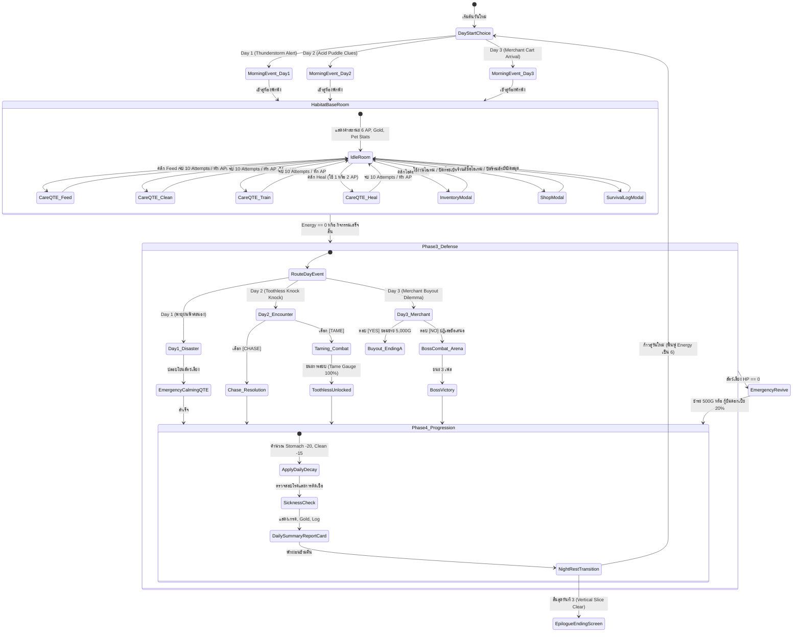
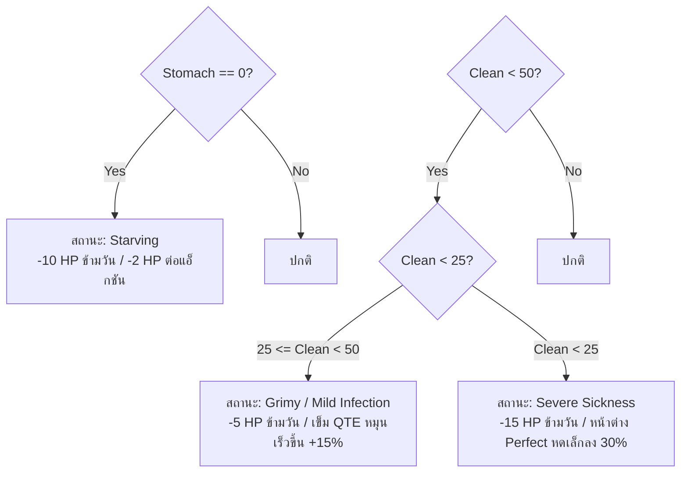
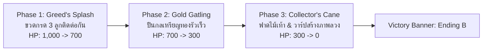

# BePal — Mechanic Design & Systems Specification

## State Machine Diagram



---

## Section 1: Habitat Room Navigation & Interaction

### 1.1 Base Room HUD Layout & Hitboxes
ห้องพักพิงหลัก (Habitat Base Room) ทำงานที่ความละเอียด **1280x720 px** โดยมีองค์ประกอบการโต้ตอบหลักบนหน้าจอ:

- **Top Bar (แถบสถานะผู้ดูแล):**
  - แสดงตัวนับวัน `[ DAY 1 / 3 ]`
  - หลอดพลังงาน **Energy Pips** 6 ดวงสีเขียวมรกต (`#48CD82`)
  - จำนวนเงินคงเหลือ `[ GOLD: 150 G ]`
- **Center Habitat Stage (เวทีสัตว์เลี้ยง):**
  - แสดง Sprite สัตว์เลี้ยงปัจจุบัน (Coco, Sproutlet, Gloomtail, หรือ Toothless ในวันที่ 3)
  - แอนิเมชัน Idle ลอยขึ้นลงอย่างนุ่มนวล พร้อมแสดงบอลลูนบอกใบ้อารมณ์ (Dynamic Cues)
- **Left/Right Pet Status Bars (แถบสเตตัสสัตว์เลี้ยง):**
  - **HP Bar:** แสดงพลังชีวิต `[ HP: 100 / 100 ]` สีแดงทับทิม
  - **Stomach Bar:** แสดงระดับความอิ่ม `[ STOMACH: 80% ]` สีส้มอำพัน
  - **Clean Bar:** แสดงความสะอาด `[ CLEAN: 70% ]` สีฟ้าสดใส
  - **EXP / Level Badge:** ระดับเลเวลปัจจุบันและแถบค่าประสบการณ์
- **Bottom Command Console (คอนโซลคำสั่งการดูแล 4 ปุ่ม):**
  - ปุ่ม `[ FEED ]` (1 AP) — ให้อาหาร
  - ปุ่ม `[ CLEAN ]` (1 AP) — ขจัดคราบและทำความสะอาด
  - ปุ่ม `[ TRAIN ]` (1 AP) — ฝึกซ้อมเพิ่ม EXP
  - ปุ่ม `[ HEAL ]` (1 หรือ 2 AP) — รักษาพยาบาลและถอนพิษ
- **Quick-Access Modal Buttons:**
  - `[ BAG ]` — เปิดหน้าต่างกระเป๋าเก็บของ 8 ช่อง
  - `[ LOG ]` — เปิดหน้าต่างสมุดบันทึกวิจัย Survival Log
  - `[ SHOP ]` — เปิดร้านค้าของพ่อค้าเร่ (แสดงเฉพาะวันที่ 3)

---

## Section 2: Pet Stats & Decay Formulas

### 2.1 โครงสร้างสถานะพื้นฐาน 4 มิติ

| สเตตัส | ช่วงค่า (Range) | ค่าเริ่มต้น | ความสำคัญและบทบาทในเกมเพลย์ |
| --- | --- | --- | --- |
| **Health (HP)** | 0 – Max HP (90–120) | 100% | พลังชีวิตหลัก หากลดลงเหลือ 0 สัตว์เลี้ยงจะหมดสภาพ (Incapacitated) และต้องจ่ายค่ากู้ชีพ |
| **Stomach (ความอิ่ม)** | 0 – 100 | 70 – 80 | ระดับความอิ่ม หากลดลงเหลือ 0 จะเข้าสู่ภาวะอดโซ (Starving) และส่งผลให้ HP ลดลงอย่างต่อเนื่อง |
| **Clean (ความสะอาด)** | 0 – 100 | 70 – 80 | สุขอนามัยและภูมิต้านทาน หากต่ำกว่า 50 จะเริ่มติดเชื้อและมีโอกาสล้มป่วย |
| **EXP / Level** | Lv. 1 – 10 (EXP 0–1000) | Lv. 1 (0 EXP) | ระดับการเจริญเติบโต ทุกครั้งที่เลเวลอัปจะเพิ่ม Max HP และพลังโจมตีสวนกลับ (Counter Damage) |

### 2.2 Mathematical Decay Formulas (สูตรการเสื่อมถอย)

1. **Daily Natural Decay (การลดลงตามธรรมชาติเมื่อข้ามวัน):**
   $$\text{Stomach}_{\text{new}} = \max(0, \text{Stomach}_{\text{current}} - 20)$$
   $$\text{Clean}_{\text{new}} = \max(0, \text{Clean}_{\text{current}} - 15)$$

2. **Per-Action Metabolic Burn (การเผาผลาญจากการกระทำ):**
   ทุกครั้งที่ผู้เล่นใช้พลังงานทำกิจกรรมใดๆ ที่ **ไม่ใช่การให้อาหาร (Non-Feed Actions)** เช่น Clean หรือ Heal ร่างกายของสัตว์เลี้ยงจะเผาผลาญพลังงาน:
   $$\text{Stomach} \leftarrow \text{Stomach} - 5$$
   *ข้อยกเว้น:* หากเลือกทำกิจกรรม **Train** สัตว์จะใช้แรงมากกว่าปกติ จึงถูกหักค่า $\text{Stomach} - 10$

3. **Environmental Disaster Modifiers (ผลกระทบจากภัยพิบัติ):**
   - **Thunderstorm (Day 1):** ลมพายุพัดพาฝุ่นโคลนเข้ามา $\text{Clean} \leftarrow \text{Clean} - 25$ และความตื่นตระหนกทำให้ $\text{Stomach} \leftarrow \text{Stomach} - 10$
   - **Acid Leak (Day 2):** รอยกรดจาก Toothless ทำให้ $\text{Clean} \leftarrow \text{Clean} - 20$

### 2.3 Sickness & Negative Status Effects Matrix



| สถานะผิดปกติ | เงื่อนไขที่เกิด | ผลกระทบต่อสเตตัส (Damage) | ผลกระทบต่อการควบคุม (Gameplay) | วิธีแก้ไข |
| --- | --- | --- | --- | --- |
| **Starving (หิวโซ)** | Stomach = 0 | เสีย $-10 \text{ HP}$ เมื่อข้ามวัน, $-2 \text{ HP}$ ต่อทุกแอ็กชัน | สัตว์ไม่ยอมร่วมมือในโหมด Train | ดำเนินการ Feed ให้อาหารทันที |
| **Grimy (เนื้อตัวมอมแมม)** | Clean < 50 | เสีย $-5 \text{ HP}$ เมื่อข้ามวัน | เข็ม QTE หมุนเร็วขึ้น $+15\%$ | ดำเนินการ Clean ขัดถูทำความสะอาด |
| **Infected (ติดเชื้อรุนแรง)** | Clean < 25 | เสีย $-15 \text{ HP}$ เมื่อข้ามวัน | หน้าต่าง Perfect Zone แคบลง $30\%$ | ดำเนินการ Heal ร่วมกับยาปฏิชีวนะ |
| **Acid Burn (แผลกรด)** | โดนการโจมตีของ Toothless | เสีย $-5 \text{ HP}$ ต่อเทิร์นในฉากต่อสู้ | ล็อกช่องสวมใส่อุปกรณ์ 1 ช่อง | ใช้ไอเทมผ้าพันแผลหรือ Heal |

---

## Section 3: Energy Economy & Action Points

### 3.1 กฎการบริหารพลังงาน 6 AP
- ผู้เล่นได้รับ **6 Energy Points (AP)** เมื่อเริ่มต้นวันใหม่เสมอ
- ทุกคำสั่งการดูแลจะหักลบค่า AP ตามอัตราที่กำหนด:
  - **Feed:** ใช้ 1 AP
  - **Clean:** ใช้ 1 AP
  - **Train:** ใช้ 1 AP (ห้ามฝึกเมื่อค่า Stomach < 20 หรือสัตว์มีสถานะ Starving)
  - **Heal:** ใช้ 1 AP (หากมีไอเทมยาในช่องเก็บของ) หรือใช้ 2 AP (หากไม่มีไอเทมยา ต้องปฐมพยาบาลสด)
- เมื่อแต้มพลังงานลดลงเหลือ 0 ระบบจะตัดเข้าสู่ Phase 3 (Defense & Resolution Phase) ทันที

---

## Section 4: 10-Attempt Care QTE Wheel Mechanics

### 4.1 โครงสร้างเซสชันมินิเกม 10 ครั้ง (10 Attempts)
- การดูแลในแต่ละแอ็กชันจะตัดเข้าสู่หน้าจอมินิเกมวงล้อ โดยผู้เล่นต้องจับจังหวะกด Spacebar ต่อเนื่อง **10 ครั้ง (10 Attempts)**
- **ความเร็วเข็มพื้นฐาน:** $\omega = 2.4 \text{ rad/s}$
- **ตำแหน่งศูนย์กลางเป้าหมาย:** $\theta_{\text{target}} = 1.5\pi \text{ rad} \ (270^\circ)$ ด้านบนสุดของวงล้อ
- **ความคลาดเคลื่อนเชิงมุม:** วัดจากค่าสัมบูรณ์ $|\theta_{\text{needle}} - \theta_{\text{target}}|$

```
                  [ 1.5 Pi / 270 deg ]
                     Target Center
                           |
                     .-----^-----.
                    /   PERFECT   \     <- |theta - target| <= 0.20 rad
                   /  .---------.  \
                  /  /   GOOD    \  \   <- |theta - target| <= 0.45 rad
                 '  '             '  '
                 |  |    MISS     |  |  <- |theta - target| >  0.45 rad
```

### 4.2 ตารางคำนวณคะแนนและผลลัพธ์เชิงสถิติ

| ระดับความแม่นยำ | เงื่อนไขเชิงมุม | คะแนน (Score) | โบนัสสเตตัสที่ได้รับ | ความคืบหน้าเวลา (Day Progress) |
| --- | --- | --- | --- | --- |
| **PERFECT** | $|\Delta\theta| \le 0.20 \text{ rad}$ | $+150 \text{ pts}$ | ฟื้นฟูสเตตัสสูงสุด $+100\%$ พร้อม EXP โบนัส | $\text{Day Progress} += 10\%$ |
| **GOOD** | $0.20 < |\Delta\theta| \le 0.45 \text{ rad}$ | $+100 \text{ pts}$ | ฟื้นฟูสเตตัสมาตรฐาน $+70\%$ | $\text{Day Progress} += 10\%$ |
| **MISS** | $|\Delta\theta| > 0.45 \text{ rad}$ | $0 \text{ pts}$ | ไม่ได้รับสเตตัส / หักล้างสตรีค | $\text{Day Progress} += 15\%$ (เวลาเร่งเร็วขึ้น) |

### 4.3 สูตรการคำนวณเกรดรวมและรางวัลเงินประจำรอบ

$$\text{Final Score} = \sum_{i=1}^{10} \text{AttemptScore}_i + \text{StreakBonus}$$
$$\text{StreakBonus} = \text{MaxStreak} \times 25 \text{ pts}$$

| เกรดรวม | ช่วงคะแนนสุทธิ | รางวัลเงินสนับสนุน (Gold Bonus) | การประเมินผล |
| --- | --- | --- | --- |
| **S** | $1,400 – 1,750 \text{ pts}$ | $+50 \text{ Gold}$ | การดูแลระดับยอดเยี่ยม สมบูรณ์แบบไร้ที่ติ |
| **A** | $1,100 – 1,399 \text{ pts}$ | $+35 \text{ Gold}$ | การดูแลดีเยี่ยม สัตว์มีความสุขสูง |
| **B** | $800 – 1,099 \text{ pts}$ | $+20 \text{ Gold}$ | การดูแลระดับมาตรฐาน ผ่านเกณฑ์ความปลอดภัย |
| **C** | $500 – 799 \text{ pts}$ | $+10 \text{ Gold}$ | การดูแลต่ำกว่ามาตรฐาน สัตว์ยังคงเครียด |
| **F** | $< 500 \text{ pts}$ | $0 \text{ Gold}$ | ล้มเหลว สัตว์ตกใจกลัวและค่า Clean ลดลง |

---

## Section 5: Events & Encounters

### 5.1 Day 1 Event: The Thunderstorm (พายุฝนฟ้าคะนอง)
- ท้องฟ้ามืดครึ้ม ลมพัดพาละอองโคลนเข้ามาทางรอยแตกของหลังคา สัตว์เลี้ยงตื่นตระหนก:
  $$\text{Clean} \leftarrow \text{Clean} - 25, \quad \text{Stomach} \leftarrow \text{Stomach} - 10$$
- **Emergency Calming QTE:** ผู้เล่นใช้ 2 AP หรือไอเทม *Warm Blanket* เพื่อเข้าสู่มินิเกมปลอบโยน วงล้อแสดงโซนสีฟ้าอ่อนกว้าง $\pm 0.35 \text{ rad}$ กดสำเร็จ 3 ครั้งเพื่อระงับความตื่นตระหนกและฟื้นฟู Health $+15$

### 5.2 Day 2 Wild Encounter: "Knock Knock !!" & Toothless Taming
- ในช่วงบ่าย มีเสียงกระแทกประตูดังสนั่น **"Knock Knock !!"** พร้อมรอยกรดสีม่วงกัดกร่อนขอบประตู
- ผู้เล่นส่องกระจกพบ **Toothless** สัตว์เลื้อยคลานสีดำทมิฬที่มีถุงกรดที่ลำคอ
- **ทางเลือกของผู้เล่น:**
  - **[ CHASE (ขับไล่) ]:** ใช้ไม้กวาดหรือส่งเสียงดังเพื่อไล่มันหนีไป ปลอดภัย 100% แต่ไม่ได้รับสัตว์เลี้ยงเพิ่ม
  - **[ TAME (สยบให้เชื่อง) ]:** ก้าวออกไปเผชิญหน้า เข้าสู่ฉาก **Combat Taming Arena**

### 5.3 Combat Taming Mechanics (Toothless Arena)
- Toothless มีหลอด **Tame Gauge (0–100%)** และพลังชีวิตของผู้เล่น 100 HP
- รูปแบบการโจมตีของ Toothless:
  1. **Acid Spit (พ่นกรด):** ส่งคลื่นกรดวิถีตรง วงล้อแสดง Dodge Zone สีทองกว้าง $\pm 0.30 \text{ rad}$ ที่มุมด้านบน กด Spacebar หลบพ้น หากพลาดเสีย 15 HP และติดสถานะ Acid Burn
  2. **Tail Swipe (ตวัดหาง):** เข็มหมุนสองทิศทางสลับกันอย่างรวดเร็ว ต้องกดหลบในจังหวะสวนทาง
- **Counter-Attack Opportunity:** เมื่อหลบพ้นการโจมตี จะเกิดวงแหวนเล็งเป้าหมายสีเขียว (Counter Ring) หดเข้าสู่จุดกึ่งกลาง กด Spacebar ภายใน $0.3 \text{ วินาที}$ เพื่อโยนอาหารหรือลูบตัว สยบค่า $\text{Tame Gauge} += 25\%$
- เมื่อ $\text{Tame Gauge} = 100\%$ Toothless จะยอมจำนนและเข้าร่วมสถานพักพิงเป็นสัตว์เลี้ยงตัวที่สองใน Day 3

---

## Section 6: The Merchant Dilemma & 3-Phase Boss Battle

### 6.1 The Merchant Persona (The Traveling Collector)
ในเช้าวันที่ 3 พ่อค้าเร่ในชุดคลุมสีทมิฬสวมหมวกปีกกว้างเดินทางมาถึง เปิดร้านค้าขายไอเทมพิเศษ และสังเกตเห็น Toothless ในสถานพักพิง

### 6.2 The Buyout Dilemma Script & Moral Crossroads
> **Merchant:** "ฉันกำลังสนใจเจ้า Toothless ของเธอเป็นพิเศษ... จะรังเกียจไหมถ้าฉันจะขอซื้อมันต่อจากเธอ? ฉันยินดีจ่ายให้เธอถึง **5,000 Gold** เป็นเงินสดทันที!"

- **ทางเลือกที่ 1: ตอบ [ YES (ยอมขาย Toothless) ] — Ending A (The Wealthy Betrayal)**
  - ผู้เล่นได้รับเงินสด 5,000 Gold ทันที แต่ Toothless ถูกลากใส่กรงเหล็กร้องโหยหวน
  - จบเกมด้วยฉากจบ Ending A: ผู้เล่นร่ำรวย ปลดหนี้สิน แต่ต้องเผชิญกับความว่างเปล่าและความรู้สึกผิดในใจไปตลอดกาล
- **ทางเลือกที่ 2: ตอบ [ NO (ปฏิเสธข้อเสนอ) ] — เข้าสู่ Merchant Boss Battle**
  - พ่อค้าโกรธเกรี้ยว ชักดาบซ่อนในไม้เท้า และเปิดฉากโจมตีสถานพักพิงเพื่อชิงตัวสัตว์เลี้ยง

### 6.3 3-Phase Boss Battle Mechanics (Merchant Fight)

บอสมีพลังชีวิตรวม **1,000 HP** แบ่งออกเป็น 3 เฟสการต่อสู้:



1. **Phase 1: Greed's Splash (ขวดกรดแห่งความโลภ — บอส HP 1,000 $\rightarrow$ 700):**
   - พ่อค้าขว้างขวดแก้วบรรจุกรด 3 ลูกติดต่อกัน เข็มหมุนที่ความเร็ว $3.0 \text{ rad/s}$
   - ผู้เล่นต้องกด Spacebar หลบใน Dodge Zone สีทองที่สุ่มตำแหน่ง 3 ครั้งซ้อน
   - หากหลบพ้นครบ 3 ครั้ง สัตว์เลี้ยงจะกระโจนเข้ากัดบอส สร้างดาเมจ $-100 \text{ HP}$

2. **Phase 2: Gold Gatling (ห่ากระสุนเหรียญทอง — บอส HP 700 $\rightarrow$ 300):**
   - พ่อค้าเปิดกลไกกระเป๋า ยิงเหรียญทองคำกระจายรอบทิศทาง
   - หน้าจอแสดง Dodge Zone แคบเพียง $\pm 0.15 \text{ rad}$ หมุนวนต่อเนื่อง
   - *Special Risk/Reward:* ทุกครั้งที่กด Spacebar หลบเหรียญทองพ้น ผู้เล่นจะเก็บเหรียญเข้ากระเป๋าได้ $+2 \text{ Gold}$ ต่อเหรียญ!

3. **Phase 3: Collector's Cane (กระหน่ำไม้เท้าทมิฬ — บอส HP 300 $\rightarrow$ 0):**
   - พ่อค้าเข้าสู่สถานะ Enrage เงาร่างแยกเป็นภาพลวงตา 2 ร่าง และเตรียมฟาดไม้เท้า
   - วงล้อจะเกิดการกระตุกและสุ่มเทเลพอร์ตตำแหน่งเข็ม
   - ผู้เล่นต้องกด Spacebar สวนกลับในหน้าต่าง **Parry Window** สีม่วงเข้ม เพื่อสะท้อนการโจมตีสร้างดาเมจ $-150 \text{ HP}$

### 6.4 Pet Synergies in Combat
- **Coco Synergy:** ปล่อยละอองสปอร์ลดความเร็วเข็มลง $20\%$
- **Sproutlet Synergy:** เพิ่มความกว้างของ Dodge Zone ขึ้น $25\%$
- **Gloomtail Synergy:** กางเกราะเงาลดความเสียหายจากการพลาดลง $50\%$
- **Toothless Synergy:** พ่นกรดหลอมละลายเกราะบอส ทำให้ดาเมจสวนกลับเพิ่มขึ้น $2 \times$

---

## Section 7: Economy, Shop & Inventory

### 7.1 Currency Economy Model (Gold Flow)
- **Starting Wallet:** 150 Gold เมื่อเริ่มต้นเกม Day 1
- **Daily Subsidy:** รับเงินสนับสนุน $+100 \text{ Gold}$ ทุกเช้า
- **Care Performance Bonus:** ได้รับ $10 – 50 \text{ Gold}$ ตามเกรด S–C ในแต่ละรอบ
- **Boss Bounty:** ได้รับ $+500 \text{ Gold}$ เมื่อเอาชนะบอสในวันที่ 3

### 7.2 Merchant Shop Catalog (รายการสินค้า 5 ชนิด)

| รายการสินค้า | ราคา | ประเภท | คุณสมบัติและการใช้งาน |
| --- | --- | --- | --- |
| **1. Crab Apple** | 25 G | อาหารพิเศษ | ฟื้นฟู $+18 \text{ HP}$ และเพิ่ม $+20 \text{ Stomach}$ ทันทีโดยไม่เสีย AP |
| **2. Sea Tea** | 18 G | เครื่องดื่มบัฟ | ขยายความกว้างของ Dodge Zone ขึ้น $+20\%$ เป็นเวลา 1 วัน |
| **3. Cloudy Glasses** | 30 G | อุปกรณ์เสริม | มอบโล่ป้องกัน (Invulnerability Shield) 2 ครั้งในฉากต่อสู้ |
| **4. Torn Notebook** | 55 G | ตำราวิจัย | เพิ่มค่า EXP จากการกระทำ Train ถาวรขึ้น $+50\%$ |
| **5. Caffeine Tonic** | 40 G | ยาชูกำลัง | ฟื้นฟูแต้มพลังงาน $+2 \text{ AP}$ ทันทีในวันนั้น |

### 7.3 Equipment Matrix (ไอเทมสวมใส่)

| อุปกรณ์ | ช่องสวมใส่ | ผลกระทบเชิงบวก (Buff) | ข้อเสียเปรียบ (Drawback) |
| --- | --- | --- | --- |
| **Ballet Shoes** | รองเท้า | หน้าต่าง Perfect Zone ในมินิเกมกว้างขึ้น $+15\%$ | สัตว์เคลื่อนไหวเร็วขึ้นทำให้ Stomach ลดลงเร็วขึ้น $+5$ |
| **Toy Knife** | อาวุธเสริม | เพิ่มพลังโจมตีสวนกลับ (Counter Damage) ในบอสไฟต์ $+35\%$ | ทำให้สัตว์เลี้ยงมีโอกาสตื่นตระหนกง่ายขึ้นเมื่อเกิดพายุ |
| **Faded Ribbon** | เครื่องประดับ | อัตราความสะอาดลดลงช้าลง $30\%$ (Clean Decay -30%) | ไม่มีข้อเสีย |

### 7.4 8-Slot Inventory Grid Specifications
- ช่องเก็บของแบบตาราง 8 ช่อง (2 แถว $\times$ 4 คอลัมน์)
- คลิกซ้ายที่ไอเทมเพื่อแสดงหน้าต่างคุณสมบัติ (Item Inspector Modal) พร้อมปุ่ม `[ USE ]` และ `[ DISCARD ]`
- ไอเทมประเภทอุปกรณ์สามารถกดสวมใส่ลงในช่อง **Equipped Slot** ได้ตัวละ 1 ชิ้น

---

## Section 8: Incapacitation & Emergency Revive Loan

### 8.1 เงื่อนไขการหมดสภาพ (Incapacitation Trigger)
หากสัตว์เลี้ยงหรือผู้เล่นได้รับความเสียหายจน **Health ลดลงเหลือ 0** ในช่วงการดูแลหรือการต่อสู้:
1. ฉากเกมจะหยุดลงทันทีและตัดเข้าสู่หน้าจอ **Emergency Medical Service (หน่วยแพทย์ฉุกเฉิน)**
2. สัตว์เลี้ยงจะได้รับการกู้ชีพฉุกเฉิน ฟื้นฟู Health กลับมาที่ 50 HP เพื่อให้สามารถดำเนินวันต่อไปได้

### 8.2 ข้อกำหนดทางการเงินและการกู้ยืม (500G Revive Loan)
- **กรณีมีเงินเพียงพอ ($Gold \ge 500$):** หักเงินค่ารักษา $-500 \text{ Gold}$ ทันที
- **กรณีเงินไม่เพียงพอ ($Gold < 500$):**
  - บังคับเซ็นสัญญา **Emergency Merchant Loan** ยอดหนี้ $500 \text{ Gold}$
  - คิดดอกเบี้ย **20% ทบต้นต่อวัน** (Compound Daily Interest)
  - *ข้อกำหนดการยึดทรัพย์ (Foreclosure):* หากไม่สามารถชำระหนี้ได้ครบก่อนสิ้นสุดวันที่ 3 พ่อค้าจะทำการยึดสัตว์เลี้ยงไปเป็นทาสแรงงาน นำไปสู่ฉากจบ Bad Ending ทันที
