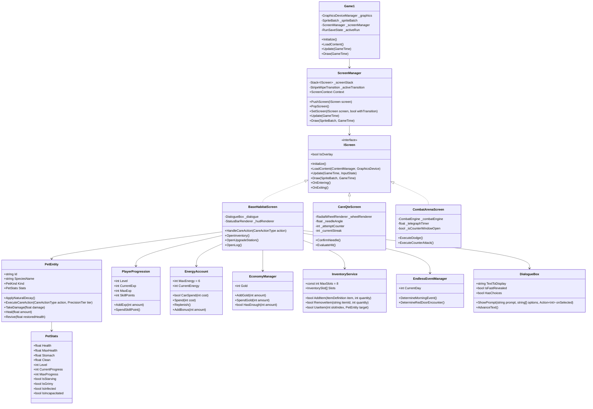
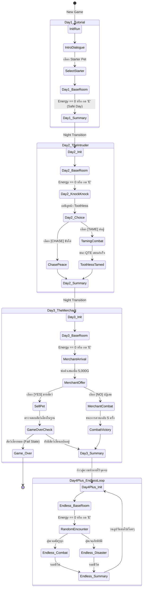

# Class Diagram — BePal Architecture (v2.0)

## Architecture Overview

BePal ได้รับการพัฒนาบนเฟรมเวิร์ก **MonoGame DesktopGL (.NET 8 C# 12)** โดยยึดหลักการออกแบบสถาปัตยกรรมที่แยกชั้นความรับผิดชอบอย่างเด็ดขาด (Clean Architecture / Domain-Driven Separation) ระหว่างชั้นการแสดงผลกราฟิก (MonoGame Presentation Layer) และตรรกะเชิงธุรกิจของเกม (Pure C# Domain Model):

```
┌────────────────────────────────────────────────────────────────────────┐
│                        MONOGAME ENGINE HOST                            │
│           (Program.cs, Game1.cs, ContentManager, SpriteBatch)          │
└───────────────────────────────────┬────────────────────────────────────┘
                                    │
           ┌────────────────────────┴────────────────────────┐
           ▼                                                 ▼
┌──────────────────────────────────────┐  ┌──────────────────────────────┐
│       PRESENTATION & VIEW LAYER      │  │      UI COMPONENT LAYER      │
│            (BePal.Screens)           │  │          (BePal.UI)          │
├──────────────────────────────────────┤  ├──────────────────────────────┤
│ - MainMenuScreen                     │  │ - DialogueBox                │
│ - ChoosePetScreen                    │  │ - StatusBarRenderer          │
│ - BaseHabitatScreen                  │  │ - RadialWheelRenderer        │
│ - CareQteScreen (10 Attempts)        │  │ - InventoryGridModal         │
│ - CombatArenaScreen (Encounters      │  │ - ShopModalRenderer          │
│     / Tame)                          │  │ - ReportCardRenderer         │
│ - EmergencyReviveModal               │  │ - UpgradeStationModal:       │
│ - DailySummaryScreen                 │  │   หน้าต่างสำหรับใช้แต้ม Skill     │
│ - SurvivalLogModal สมุดบันทึกข้อมูล      │  │   Points อัปเกรดฐาน            │
└──────────────────┬───────────────────┘  └──────────────┬───────────────┘
                   │                                     │
                   └──────────────────┬──────────────────┘
                                      ▼
┌────────────────────────────────────────────────────────────────────────┐
│                      PURE C# GAMEPLAY DOMAIN LAYER                     │
│                            (BePal.Gameplay)                            │
├────────────────────────────────────────────────────────────────────────┤
│ - PetEntity & PetStats (HP, Stomach, Clean, EXP, StatusEffects)        │
│ - EnergyAccount (6 AP Daily Budget, Spend, Reset)                      │
│ - EconomyManager (Gold, Daily Subsidy, Revive Fee)                     │
│ - InventoryService & ItemRegistry (8-Slot Grid, Consumables)           │
│ - CombatEngine (Telegraphs, Needle Math, Dodge Zones, Counter Window)  │
│ - RunSaveState (JSON Serialization Schema for Endless Run)             │
│ - EndlessEventManager` (หรือ `RandomEncounterService`):                 │
│   ควบคุมลอจิกการสุ่มเหตุการณ์รายวัน (พายุ, ศัตรูบุก, พ่อค้า) สำหรับ Day 4+            │
│ - UpgradeService` (หรือ `PlayerProgression`):                           │
│   จัดการแต้ม Player EXP, Skill Points และสถานะการอัปเกรดฐาน                 │
└────────────────────────────────────────────────────────────────────────┘
```

### กฎเหล็กด้านสถาปัตยกรรม (Architectural Invariants)
1. **Zero MonoGame Dependency in Domain:** 
    * **ประโยชน์ที่เห็นชัด:** คุณสามารถเขียน Unit Test (เช่น xUnit หรือ NUnit) จำลองสถานการณ์ "เล่นเกมรวดเดียว 100 วัน" เพื่อทดสอบความน่าจะเป็นของเหตุการณ์สุ่ม (Endless RNG), เช็กบาลานซ์การเสื่อมถอยของค่าความอิ่ม/ความสะอาด, และทดสอบสมการอัปเลเวลสัตว์เลี้ยงได้ในเวลาไม่ถึง 1 วินาทีแบบ Headless
    * **ข้อควรระวัง/เทคนิค:** หากใน Domain Layer จำเป็นต้องคำนวณมุมหรือพิกัด (เช่น การเช็กองศาเข็ม QTE) ให้ใช้ C# Math พื้นฐาน หรือ `System.Numerics.Vector2` ของ .NET Core 8 แทนการใช้ `Vector2` ของ XNA เพื่อรักษาความบริสุทธิ์ของ Layer ไว้ครับ
2. **Deterministic State Mutation:** 
	- **ประโยชน์ที่เห็นชัด:** การบังคับให้ใช้เมธอดอย่าง `energy.Spend()` จะช่วยให้เราฝัง Logic การหักค่าความอิ่ม (Stomach -5) หรือการเช็กสถานะหิวโซไว้ที่จุดเดียวได้เลย ป้องกันปัญหาที่ฝั่ง UI สั่งหักแต้ม Energy แต่ลืมสั่งหักค่าความอิ่มของสัตว์เลี้ยง
	- **ข้อควรระวัง/เทคนิค:** ใช้หลักการ Encapsulation แบบ `public int Stomach { get; private set; }` เพื่อให้หน้าจอ UI อ่านค่าไปแสดงผลได้อย่างเดียว แต่ห้ามเขียนทับ
3. **Synchronous Single-Threaded Game Loop:** 
	- **ประโยชน์ที่เห็นชัด:** ระบบ QTE วงล้อ 10 จังหวะของเรามีความท้าทายสูง (Perfect Zone $\pm 0.20 \text{ rad}$) การรัน Logic และ Render บน Main Thread เดียวกันที่ 60 FPS จะรับประกันว่าจังหวะที่ผู้เล่นกด Spacebar และจังหวะที่เกมตรวจจับตำแหน่งเข็ม คือ "เสี้ยววินาทีเดียวกัน" แน่นอน
	- **ข้อควรระวัง/เทคนิค:** แม้จะล็อกที่ 60 FPS แต่การคำนวณฟิสิกส์การหมุนของเข็ม ($2.4 \text{ rad/s}$) ควรคูณด้วย Delta Time (`GameTime.ElapsedGameTime.TotalSeconds`) เสมอ เพื่อป้องกันปัญหาเข็มหมุนวาร์ปเวลาที่คอมพิวเตอร์ของผู้เล่นเกิดอาการเฟรมดรอป (Lag) ชั่วขณะ
---

## Comprehensive Mermaid Class Diagram



---

## Screen Lifecycle & Navigation (IScreen & ScreenManager)

ระบบหน้าจอได้รับการจัดการผ่าน `ScreenManager` ซึ่งสนับสนุนทั้งการสลับหน้าจอหลัก (Full Screen Transition) และการเปิดหน้าต่างซ้อนทับ (Modal / Overlay Stack):

```csharp
namespace BePal.Screens;

public interface IScreen
{
    bool IsOverlay { get; }
    
    // ส่ง ScreenManager เข้ามาเพื่อให้หน้านี้สั่งเปลี่ยนหน้าจออื่นต่อได้
    void Initialize(ScreenManager screenManager); 
    
    void LoadContent(ContentManager content, GraphicsDevice graphicsDevice);
    void Update(GameTime gameTime, InputState input);
    void Draw(SpriteBatch spriteBatch, GameTime gameTime);
    
    // อาจจะส่ง context หรือข้อมูลที่ใช้ข้ามจอมาตอน Entering ด้วยก็ได้
    void OnEntering(); 
    void OnExiting();
}
```

### Screen Registration Matrix

| หน้าจอ (Screen)          | ชนิดหน้าจอ      | บทบาทและหน้าที่หลัก                                                                                                              |
| ------------------------ | --------------- | -------------------------------------------------------------------------------------------------------------------------------- |
| `MainMenuScreen`         | Full Screen     | หน้าจอเริ่มต้น แสดงโลโก้ เมนู New Game / Continue / Settings                                                                     |
| `CutsceneDialogueScreen` | Full Screen     | หน้าจอเล่าเรื่อง บทนำ บทสนทนา **รวมถึงการสุ่ม Event หน้าประตูแดง (Red Door) ในโหมด Endless พร้อมตัวเลือก Choice**                |
| `ChoosePetScreen`        | Full Screen     | หน้าต่างเลือกรับอุปการะ Starter Pet (Coco / Sproutlet / Gloomtail)                                                               |
| `BaseHabitatScreen`      | Full Screen     | หน้าจอหลักสถานพักพิง แสดง HUD, สเตตัสสัตว์เลี้ยง, ปุ่มคำสั่ง 4 แอ็กชัน                                                           |
| `CareQteScreen`          | Overlay / Modal | หน้าจอมินิเกมวงล้อ QTE 10 ครั้ง จับจังหวะ Perfect / Good / Miss                                                                  |
| `CombatArenaScreen`      | Full Screen     | สนามประลองการต่อสู้ (Toothless Taming ใน Day 2 / Merchant ใน Day 3 / **และ Endless Encounters มินิเกมต่อสู้ศัตรูสุ่มใน Day 4+**) |
| `InventoryOverlayScreen` | Modal Overlay   | หน้าต่างกระเป๋าเก็บของ 8 ช่อง แสดงคำอธิบายไอเทม **และปุ่ม USE**                                                                  |
| `ShopModalScreen`        | Modal Overlay   | ร้านค้าพ่อค้าเร่ เลือกซื้อไอเทม 5 ชนิด ตรวจสอบราคาก่อนซื้อ                                                                       |
| `EmergencyReviveModal`   | Modal Overlay   | หน้าต่างกู้ชีพฉุกเฉินเมื่อ HP สัตว์เลี้ยง = 0 **ต้องจ่าย 500G เท่านั้น**                                                         |
| `DailySummaryScreen`     | Full Screen     | ใบสรุปผลงานประจำวัน คำนวณเกรด มอบเงินรางวัล และบันทึกเซฟ                                                                         |
| `UpgradeStationModal`    | Modal Overlay   | หน้าต่างสถานีอัปเกรดฐาน ใช้แต้ม Skill Points อัปเกรดสาย QTE, Progress, หรือ Energy                                               |
| `SurvivalLogModal`       | Modal Overlay   | หน้าต่างสมุดบันทึก (Logbook) แสดงข้อมูลสัตว์เลี้ยงและบันทึกภัยพิบัติ                                                             |


---

## Game State Flow & The Endless Loop

ลำดับเหตุการณ์ตั้งแต่ต้นจนจบถูกควบคุมผ่าน `RunStateMachine`:




ข้อแนะนำเพิ่มเติมสำหรับโปรแกรมเมอร์:
ในการเขียนโค้ดจริง (Implementation) ไม่จำเป็นต้องสร้างคลาสแยกทุกวัน (เช่น `Day1_BaseRoom`, `Day2_BaseRoom`) แต่ให้ใช้คลาส `BaseHabitatScreen` ตัวเดียวกัน แล้วให้ตัว `EndlessEventManager` เช็กค่าตัวแปร `CurrentDay` ว่าวันนี้เป็นวันที่เท่าไหร่ เพื่อดึง Event (Safe Day, Toothless, Merchant, Random) มาเล่นในช่วงจบวันแทน


---

## Save Data & Persistence Schema (JSON)

ความคืบหน้าของเกมจะถูกบันทึกลงในไฟล์ `savegame.json` ทุกครั้งที่ผ่านเข้าสู่ `DailySummaryScreen`:

```json
{
  "Version": "2.1",
  "SaveTimestamp": "2026-09-20T18:00:00Z",
  "RunState": {
    "CurrentDay": 2,
    "Gold": 285,
    "EnergyRemaining": 6,
    
    "PlayerStats": {
      "Level": 1,
      "CurrentExp": 0,
      "SkillPoints": 1
    },
    
    "BaseUpgrades": {
      "QteFocusLevel": 0,
      "ProgressBoosterLevel": 0,
      "EnergyCapacityLevel": 0
    },

    "ActivePets": [
      {
        "SpeciesId": "coco",
        "Level": 2,
        "CurrentProgress": 120,
        "Health": 100.0,
        "MaxHealth": 110.0,
        "Stomach": 75.0,
        "Clean": 85.0,
        "IsInfected": false
      },
      {
        "SpeciesId": "toothless",
        "Level": 1,
        "CurrentProgress": 40,
        "Health": 60.0,
        "MaxHealth": 60.0,
        "Stomach": 50.0,
        "Clean": 60.0,
        "IsInfected": false
      }
    ],

    "EncounterFlags": {
      "HasEncounteredToothless": true,
      "HasEncounteredMerchant": false
    },

    "Inventory": [
      { "ItemId": "crab_apple", "Quantity": 2 },
      { "ItemId": "sea_tea", "Quantity": 1 },
      { "ItemId": "ballet_shoes", "Quantity": 1 }
    ],

    "SurvivalLogDiscoveredSpecies": [
      "coco",
      "toothless"
    ]
  }
}
```

---

## Technical Migration Roadmap from Legacy Codebase

เพื่อให้โปรแกรมเมอร์สามารถนำ GDD v2 ไปต่อยอดกับโค้ดปัจจุบันในโฟลเดอร์ `CoPoject/BePal/` ได้อย่างราบรื่น:

**เฟสที่ 1: Domain Refactoring (การแยกโมเดลโดเมน)** แตกโครงสร้างข้อมูลออกจาก `PrototypeRun.cs`:
- สร้าง `PetEntity.cs` และ `PetStats.cs` เพื่อรองรับค่า HP, Stomach, Clean, `CurrentProgress` (แทน EXP), เลเวล, และสถานะ `IsInfected`
- สร้าง `PlayerProgression.cs` สำหรับจัดการแต้มเลเวลและ Skill Points ของผู้เล่น
- สร้าง `EnergyAccount.cs` รองรับโควตา 6 AP ประจำวัน
- สร้าง `EconomyManager.cs` สำหรับจัดการเงิน Gold **(ตัดระบบเงินกู้ออกทั้งหมด)**
- สร้าง `EndlessEventManager.cs` สำหรับควบคุมลอจิกการสุ่มเหตุการณ์รายวัน

**เฟสที่ 2: Care QTE Engine Upgrade (การยกระดับวงล้อ QTE)**:
ปรับปรุง `CareQteScreen.cs` จากการหมุนเลือก 4 ช่องเดิม ให้รองรับ 10-Attempt Session:
- เพิ่มตัวแปรนับ `_attemptCounter` (1 ถึง 10)
- กำหนดมุมความคลาดเคลื่อน $\pm 0.20 \text{ rad}$ (Perfect) และ $\pm 0.45 \text{ rad}$ (Good)
- **ปรับสูตรผลลัพธ์ใหม่:** กด Perfect ได้ +10 Progress (สัตว์) และ +1 EXP (ผู้เล่น), กด Good ได้ +5 Progress, กด Miss ไม่ได้แต้มและรีเซ็ต Streak

**เฟสที่ 3: Narrative & Event Subsystem (ระบบเนื้อเรื่องและลูปเหตุการณ์)** ต่อยอด `DialogueBox.cs` ให้รองรับกล่องตัวเลือกสองทาง (PromptOptions):
- สร้าง Event State เชิงเส้นสำหรับ 3 วันแรก: วันที่ 1 (Safe Day / Tutorial), วันที่ 2 (Toothless Door Knock), และวันที่ 3 (Merchant Buyout)
- **เพิ่มลูป Endless สำหรับ Day 4+:** รันลอจิกสุ่มเหตุการณ์รายวัน (ภัยพิบัติ, ศัตรูบุก, พ่อค้าเร่) ผ่านตัวแปร

**เฟสที่ 4: Combat Arena Subsystem (ระบบการต่อสู้และสยบสัตว์)** 
พัฒนา `CombatArenaScreen.cs` ให้รองรับทั้งโหมดเนื้อเรื่องและ Endless:
- บรรจุระบบหลบการโจมตี (Telegraphed Attacks & Dodge Zones) และระบบสวนกลับ (Counter-Attack Window)
- **ตัดบอส 3 เฟสออก:** ปรับระบบต่อสู้กับพ่อค้า (Day 3) เป็นการหลบและกดสวนกลับให้สำเร็จครบ 5 ครั้ง
- เพิ่ม Dynamic Scaling สำหรับศัตรูใน Day 4+ (ความเร็วเข็มและการโจมตีที่โหดขึ้น)

**เฟสที่ 5: UI & Facility Upgrades (ระบบหน้าต่างอำนวยความสะดวก)**
- พัฒนา `InventoryOverlayScreen.cs` (8 ช่อง แสดงคำอธิบายและมี **ปุ่ม USE อย่างเดียว ตัดปุ่ม EQUIP ทิ้ง**)
- พัฒนา `ShopModalScreen.cs` (แสดงรายการไอเทม 5 ชิ้น พร้อมคำนวณเงิน โดยจะถูกเรียกใช้ผ่าน Event พ่อค้าเท่านั้น)
- พัฒนา `EmergencyReviveModal.cs` (ระบบชำระ 500G ชุบชีวิต **หากเงินไม่พอจะบังคับ Game Over ทันที**)
- **พัฒนา `UpgradeStationModal.cs`** (เพิ่มใหม่) สำหรับให้ผู้เล่นใช้ Skill Points อัปเกรดฐาน
- **พัฒนา `SurvivalLogModal.cs`** (เพิ่มใหม่) สำหรับบันทึกข้อมูลสัตว์เลี้ยงและประวัติภัยพิบัติ
