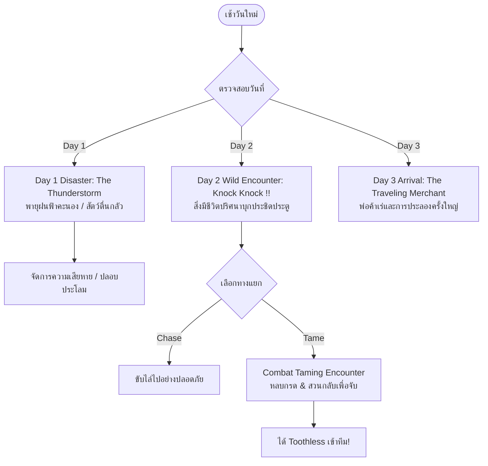
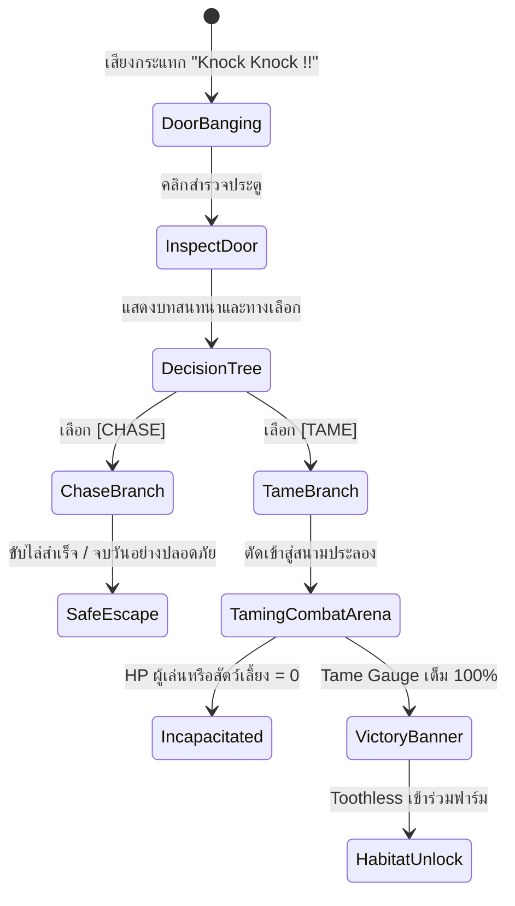
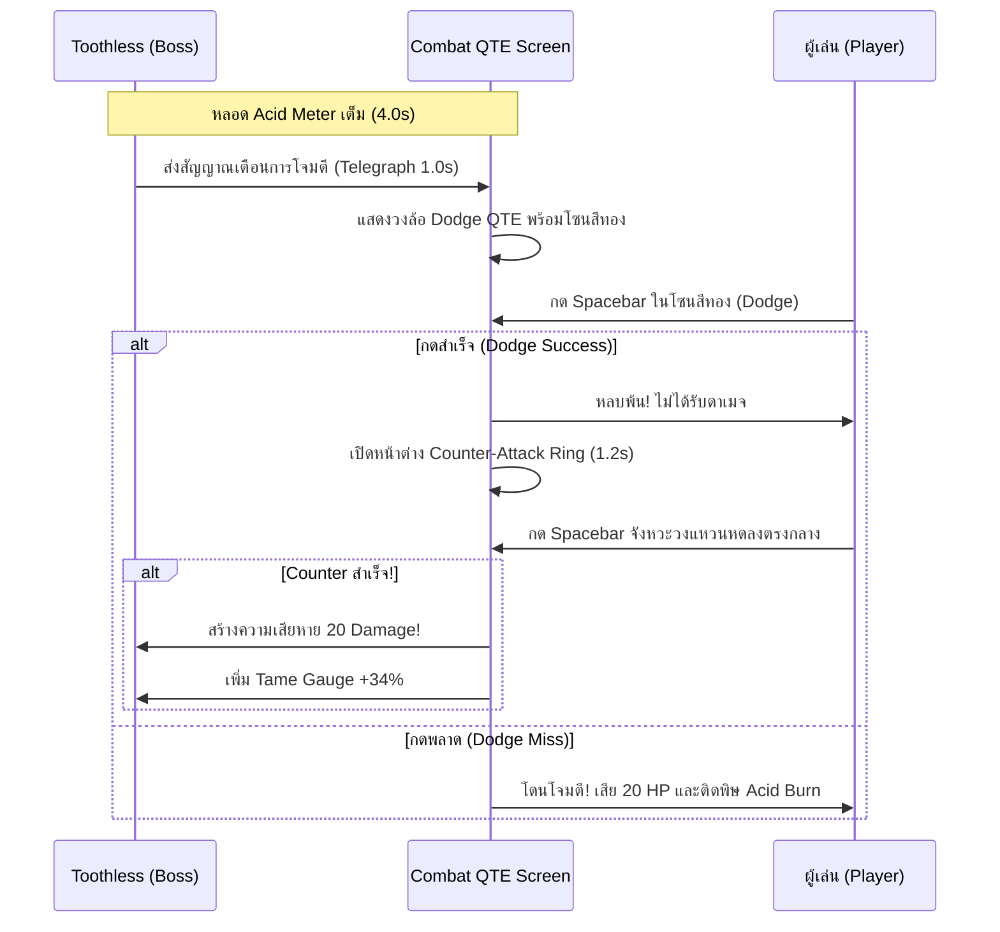

# BePal — Events & Encounters (v2)

## 1. Overview of Daily Events & Disasters (ภาพรวมเหตุการณ์และภัยพิบัติ)

ใน BePal วันแต่ละวันไม่ได้มีเพียงแค่กิจวัตรการดูแลตามปกติ แต่จะถูกแทรกด้วยเหตุการณ์สุ่มและภัยพิบัติตามเนื้อเรื่องหลัก เพื่อทดสอบการจัดสรรทรัพยากร ความใจเย็น และความแม่นยำในการตอบสนองของผู้เล่น



---

## 2. Day 1 Event: The Thunderstorm (พายุฝนฟ้าคะนอง)

### สภาพแวดล้อมและบรรยากาศ (Narrative Buildup)
- ท้องฟ้าภายนอกหน้าต่างเริ่มเปลี่ยนเป็นสีเทาดำ ลมกระโชกแรง มีเสียงฟ้าร้องคำรามเป็นระยะ (Audio Cues: Low Thunder Rumble)
- สัตว์เลี้ยงตัวแรกเริ่มแสดงอาการตื่นตระหนก: ตัวสั่น หูตก ขนพอง และส่งเสียงครางด้วยความกลัว

### บทลงโทษและผลกระทบทางสเตตัส (Disaster Impact)
- ลมพัดพาฝุ่นและละอองน้ำโคลนเข้ามาทางรอยแยกของหลังคา ส่งผลให้:
  $$\text{Clean} \leftarrow \text{Clean} - 25$$
  $$\text{Stomach} \leftarrow \text{Stomach} - 10 \quad (\text{สัตว์เครียดจนท้องไส้ปั่นป่วน})$$

### การแก้ปัญหาฉุกเฉิน (Emergency Calming QTE)
- ผู้เล่นสามารถเลือกใช้ **2 Energy Points (AP)** หรือไอเทม **ผ้าห่มอุ่น (Warm Blanket)** เพื่อเข้าสู่มินิเกมปลอบประโลมฉุกเฉิน
- วงล้อ QTE จะปรากฏพร้อมหน้าต่างเป้าหมายสีฟ้าอ่อน (Soothing Zone) กว้าง $\pm 0.35 \text{ rad}$
- เมื่อกดสำเร็จครบ 3 จังหวะ สัตว์เลี้ยงจะสงบลง ฟื้นฟูค่า Health $+15$ และหยุดการสูญเสียสเตตัสเพิ่มเติม

---

## 3. Day 2 Wild Encounter: "Knock Knock !!" (การบุกรุกของสัตว์ป่า)

ในช่วงบ่ายของวันที่ 2 หลังจากการดูแลสัตว์เลี้ยงรอบแรกเสร็จสิ้น จะมีเสียงกระแทกประตูดังขึ้นอย่างรุนแรงขัดจังหวะความสงบ



### บทสนทนาและการเล่าเรื่องแบบเต็ม (Full Dialogue Script)

> **[SFX: เสียงเคาะประตูดังสนั่น — ตึง! ตึง! โครม!!]**  
> **Narrator:** "เสียงกระแทกดังสนั่นมาจากทางประตูหน้าบ้าน... ไม่ใช่จังหวะการเคาะของผู้มาเยือนทั่วไป แต่มันเหมือนบางสิ่งกำลังพยายามพังประตูเข้ามา!"  
> **[SFX: เสียงขู่ฟ่อในลำคอแหลมสูง — Hssssssss!!]**  
> **Narrator:** "ที่ขอบประตูด้านล่าง คุณสังเกตเห็นของเหลวสีม่วงเหนียวข้นค่อยๆ ไหลซึมผ่านร่องไม้... ไม้กระดานเริ่มมีควันลอยขึ้นพร้อมเสียงฉ่า มันคือน้ำกรดฤทธิ์รุนแรง!"  
> **Narrator:** "เมื่อคุณชะโงกหน้ามองผ่านช่องกระจก... ดวงตาสีอำพันคู่หนึ่งกำลังจ้องเขม็งกลับมา ร่างกายสีดำทมิฬปกคลุมด้วยเกล็ดลื่นไร้ฟัน แต่มือกรงเล็บแหลมคมกำลังขูดประตูดังแสบแก้วหู"

#### หน้าต่างทางเลือกของผู้เล่น (Player Decision Prompt):

```
┌─────────────────────────────────────────────────────────────┐
│             AN UNKNOWN ABNORMAL ENTITY APPROACHES!          │
│                                                             │
│   [ CHASE (ขับไล่) ]               [ TAME (ฝึกให้เชื่อง) ]   │
│   เคาะหม้อส่งเสียงดังเพื่อไล่มันไป      เปิดประตู เผชิญหน้า และฝึกมัน  │
│   (ปลอดภัย ไม่เสี่ยงบาดเจ็บ)         (เสี่ยงอันตรายสูง / รับสัตว์ใหม่)│
└─────────────────────────────────────────────────────────────┘
```

- **หากเลือก [ CHASE ]:**
  > **Narrator:** "คุณหยิบถาดเหล็กและไม้กวาด เคาะขู่เสียงดังลั่นพร้อมตะโกนสุดเสียง... สัตว์ประหลาดตัวนั้นส่งเสียงแหลมสูงด้วยความตกใจ มันกระโจนถอยหลังและวิ่งหายลับเข้าไปในป่ารกทึบ"  
  > *ผลลัพธ์:* ปลอดภัยอย่างสมบูรณ์ ไม่มีใครได้รับบาดเจ็บ ผู้เล่นกลับเข้าสู่ห้องดูแลตามปกติ แต่จะพลาดโอกาสได้รับ Toothless
- **หากเลือก [ TAME ]:**
  > **Narrator:** "คุณสูดหายใจเข้าลึกๆ คว้าปลอกคอและอุปกรณ์ควบคุม... ค่อยๆ แง้มประตูออก สัตว์ร้ายสีดำไม่รอช้า มันกระโจนแผ่พังผาน้ำกรดเข้ามาทันที!"  
  > *ผลลัพธ์:* ตัดเข้าสู่หน้าจอ **Combat Taming QTE Screen** ทันที!

---

## 4. Combat Taming Mechanics: Slaying or Befriending Toothless

ในฉาก Combat Taming ผู้เล่นจะต้องใช้ทักษะการหลบหลีก (Dodge) และสวนกลับ (Counter) เพื่อสะสมแต้มความเชื่อง (Tame Gauge):

### ข้อมูลสเตตัสของ Toothless (Boss Entity)
- **ชื่อสายพันธุ์:** Toothless (Abnormal Stalker / Acid Spitter)
- **Health:** 60 HP
- **Tame Gauge:** 0% (เป้าหมาย: 100%)
- **Acid Pouch Meter:** หลอดพลังกรด ชาร์จเต็มทุก 4.0 วินาที



### รูปแบบการโจมตีของ Toothless (Attack Patterns)

1. **Attack 1 — Acid Spit (พ่นกรดพิษระยะไกล):**
   - **สัญญาณเตือน (Telegraph):** ถุงกรดใต้คอของ Toothless จะพองตัวและเปล่งแสงสีเขียวมะนาววาบ เป็นเวลา 1.0 วินาที
   - **Dodge Zone (โซนหลบสีทอง):** อยู่ที่มุม $1.5\pi$ ($270^\circ$ ด้านบนสุด) กว้าง $\pi/3$ ($60^\circ$)
   - **ความเร็วเข็ม:** $\omega = 3.0 \text{ rad/s}$
   - **ผลลัพธ์หากพลาด:** ได้รับความเสียหาย $20 \text{ HP}$ ทันที และสูญเสียค่า $\text{Clean} -20$

2. **Attack 2 — Tail Swipe (ตวัดหางเกล็ดคม):**
   - **สัญญาณเตือน (Telegraph):** Toothless หันข้างและส่งเสียงขู่สั้นๆ 0.6 วินาที
   - **Dodge Zone (โซนหลบสีทอง):** อยู่ที่มุม $0.5\pi$ ($90^\circ$ ด้านล่างสุด) กว้าง $\pi/4$ ($45^\circ$)
   - **ความเร็วเข็ม:** $\omega = 3.5 \text{ rad/s}$ (เร็วกว่าท่าแรก)
   - **ผลลัพธ์หากพลาด:** ได้รับความเสียหาย $15 \text{ HP}$ และทำให้สัตว์เลี้ยงตัวหลักกระเด็น

---

## 5. Counter-Attack Timing & Taming Victory

### หน้าต่างการสวนกลับ (The Counter-Attack Ring Window)
- ทันทีที่ผู้เล่นกด Dodge หลบการโจมตีของ Toothless ได้สำเร็จ หน้าจอจะเกิดเอฟเฟกต์ Slow Motion สั้นๆ (1.2 วินาที)
- จะมีวงแหวนสีขาวหดตัวลงเข้าหาจุดศูนย์กลางเป้าหมาย (Shrinking Target Ring)
- **การป้อนคำสั่ง:** ผู้เล่นต้องกด **Spacebar** ในจังหวะที่วงแหวนทับซ้อนกับเป้าหมายพอดี (ความคลาดเคลื่อนไม่เกิน $\pm 0.15 \text{s}$)
- **ผลลัพธ์ของการสวนกลับ:**
  - สร้างความเสียหาย $20 \text{ Damage}$ ต่อ Toothless
  - เพิ่มระดับ **Tame Gauge $+34\%$**

### เงื่อนไขชัยชนะ (Victory & Tame Resolution)
- เมื่อสวนกลับสำเร็จครบ **3 ครั้ง** (Tame Gauge ครบ $100\%$ หรือ HP ของ Toothless ลดลงเหลือ $0$):
  1. Toothless จะหยุดการโจมตี หดกรงเล็บ และหมอบลงกับพื้น ส่งเสียงครางในลำคอคล้ายเสียงฟองน้ำเดือดอย่างเป็นมิตร
  2. หน้าจอตัดเข้าสู่แบนเนอร์ชัยชนะ:  
     **"YOU GOT NEW PET !!! Toothless has been tamed and welcomed into your sanctuary!"**
  3. Toothless จะถูกย้ายเข้าไปอยู่ใน Base Room กลายเป็นสัตว์เลี้ยงตัวที่สอง พร้อมให้การดูแลในวันที่ 3 เป็นต้นไป!
