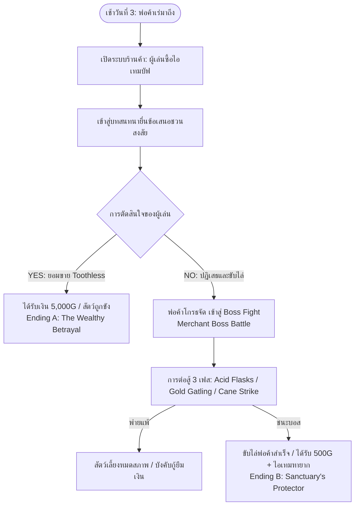
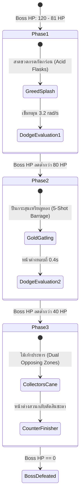

# BePal — The Merchant Encounter & Boss Combat (v2)

## 1. The Merchant Persona & Narrative Introduction (พ่อค้าเร่พเนจร)

ในเช้าของวันที่ 3 จะมีเกวียนบรรทุกสัมภาระลึกลับแล่นเข้ามาจอดที่หน้าศูนย์พักพิง ชายร่างสูงในชุดคลุมยาวสีทมิฬ สวมหมวกปีกกว้างที่บดบังใบหน้าเกือบมิด ยกเว้นรอยยิ้มที่มีฟันทองส่องประกาย เขาแนะนำตัวเองในนาม **"The Traveling Collector" (นักสะสมพเนจร)**



### บุคลิกและการออกแบบตัวละคร (Character Concept)
- **ฉายา:** The Traveling Collector
- **ลักษณะภายนอก:** สวมสูทเก่าซอมซ่อคลุมทับด้วยเสื้อกักหนัง แบกกระเป๋าหนังใบใหญ่ที่ส่งเสียงกระทบของขวดแก้วและโซ่ตรวน ด้านหลังรถเข็นมีกรงขังสัตว์ประหลาดที่ถูกคลุมด้วยผ้าดำหนาทึบ
- **พฤติกรรม:** พูดจาสุภาพ นอบน้อม แต่แฝงไปด้วยความโลภและสายตาที่คอยจับจ้องสัตว์เลี้ยงของผู้เล่นตลอดเวลา

---

## 2. The Buyout Dilemma & Full Dialogue Tree (ทางแยกแห่งศีลธรรม)

หลังจากการซื้อขายไอเทมหรือเมื่อผู้เล่นสนทนากับพ่อค้า พ่อค้าจะหันไปสบตากับ **Toothless** ที่หมอบอยู่ข้างตัวผู้เล่น:

### บทสนทนาการยื่นข้อเสนอ (The Dilemma Script)

> **Merchant:** *(หัวเราะในลำคอเบาๆ — หึ... หึ... หึ...)*  
> **Merchant:** "พ่อหนุ่ม/แม่หนูผู้ดูแลที่น่ารัก... ฉันสังเกตเห็นเจ้าสิ่งมีชีวิตสีดำตรงนั้นมาพักใหญ่แล้ว ผิวเกล็ดเรียบลื่น ถุงกรดสีม่วงที่ลำคอ... นั่นมัน **Toothless** สัตว์หายากระดับตำนานไม่ใช่รึ?"  
> **Merchant:** "น่าเสียดายจริงๆ ที่สิ่งมีชีวิตอันทรงคุณค่าทางวิทยาศาสตร์แบบนี้ ต้องมานอนเกลือกกลิ้งในสถานพักพิงโกโรโกโส..."  
> **Merchant:** *(ก้าวประชิดเข้ามา ยื่นมือที่สวมถุงมือหนังออกมาข้างหน้า)*  
> **Merchant:** **"ฉันกำลังสนใจเจ้า Toothless ของเธอเป็นพิเศษ... จะรังเกียจไหมถ้าฉันจะขอซื้อมันต่อจากเธอ? ฉันยินดีจ่ายให้เธอถึง 5,000 Gold เป็นเงินสดทันที!"**  
> **Merchant:** "คิดดูให้ดีๆ สิ เงิน 5,000 Gold เชียวนะ! มากพอที่จะทำให้เธอปลดหนี้ ขยายสถานพักพิง หรือย้ายไปเสวยสุขในเมืองใหญ่ได้สบายๆ... เจ้าตัวประหลาดนี่ตัวเดียว แลกกับอนาคตที่สดใสของเธอนะ?"

#### หน้าต่างตัวเลือกบนหน้าจอ (Choice UI):

```
┌─────────────────────────────────────────────────────────────┐
│             THE TRAVELING COLLECTOR'S OFFER                 │
│                                                             │
│   [ YES (ยอมขาย Toothless) ]       [ NO (ปฏิเสธข้อเสนอ) ]    │
│   รับเงินสดมหาศาล 5,000 Gold        "สัตว์ตัวนี้ไม่ใช่สิ่งของ!"    │
│   (สูญเสียสัตว์เลี้ยง / ได้ Ending A)   (เข้าสู่ Boss Fight ทันที!) │
└─────────────────────────────────────────────────────────────┘
```

---

## 3. Branching Narrative Outcomes (ผลลัพธ์ของทางเลือก)

### ทางเลือกที่ 1: ตอบ [ YES ] — Ending A (The Wealthy Betrayal)
> **Merchant:** "ฮ่าๆๆๆ! ยอดเยี่ยม! ฉลาดสมเป็นนักธุรกิจ! รู้จักเลือกสิ่งที่สร้างกำไรสูงสุด!"  
> **[SFX: เสียงเหรียญทองเทลงบนโต๊ะ — ชิ้ง! กริ๊งงง!]**  
> **Narrator:** "พ่อค้ารีบโยนถุงทองคำหนักอึ้ง 5,000 Gold ลงตรงหน้าคุณ ก่อนจะเหวี่ยงแหเหล็กกระชากร่างของ Toothless เข้าไปในกรงขังหลังรถอย่างรุนแรง"  
> **[SFX: เสียงหวีดร้องอย่างเจ็บปวดและตื่นตระหนกของ Toothless]**  
> **Narrator:** "Toothless จ้องมองคุณผ่านซี่กรงเหล็กด้วยดวงตาที่เบิกกว้างเต็มไปด้วยความหวาดกลัวและการถูกหักหลัง... ก่อนที่เกวียนของพ่อค้าจะแล่นลับตาไปในสายหมอก"  
> **Epilogue Screen:**  
> **"ENDING A: THE WEALTHY BETRAYAL"**  
> *คุณมีเงินทองมากมายจนล้นกระเป๋า สามารถสร้างศูนย์พักพิงใหม่ได้อย่างหรูหรา... แต่เมื่อคุณก้าวเข้าไปในห้องโถงที่ว่างเปล่า ความเงียบงันและความรู้สึกผิดกลับตามหลอกหลอนคุณไปตลอดกาล*

---

### ทางเลือกที่ 2: ตอบ [ NO ] — Transition to Boss Battle
> **[SFX: เสียงชะงักของดนตรี — Sudden Silence]**  
> **Merchant:** *(รอยยิ้มบนใบหน้าหุบลงทันที แววตาเปลี่ยนเป็นสีแดงก่ำด้วยความโกรธแค้น)*  
> **Merchant:** "อะไรนะ...? ปฏิเสธงั้นเรอะ?! เจ้าเด็กไม่รู้จักที่ต่ำที่สูง!"  
> **Merchant:** "เจ้าคิดว่าสถานพักพิงชั้นต่ำแบบนี้ มีปัญญาจะดึงศักยภาพของสัตว์ระดับภัยพิบัติแบบมันได้รึไง?! ถ้าเจ้าไม่ยอมยกมันให้ฉันดีๆ... **ฉันก็จะกระชากมันมาจากซากศพของเจ้าและสัตว์เลี้ยงของเจ้าซะ!!**"  
> **[SFX: เสียงชักดาบซ่อนในไม้เท้า — เคร้งงง!]**  
> **Narrator:** "พ่อค้าคว้าไม้เท้าหัวกะโหลก เหวี่ยงขวดสารเคมีและเปิดฉากโจมตีสถานพักพิงทันที!"  
> **[BGM: Up-tempo Boss Battle Theme Starts!]**

---

## 4. Boss Battle: The Merchant Fight (โครงสร้างการต่อสู้กับบอส)

### ข้อมูลสเตตัสของบอส (Merchant Boss Stats)
- **Boss Health:** 120 HP
- **เกราะป้องกัน:** ลดความเสียหายจากการโจมตีธรรมดา $20\%$
- **ระบบสลับตัวสัตว์เลี้ยง (Companion Pet Selection):** ก่อนเริ่มต่อสู้ ผู้เล่นสามารถเลือกส่งสัตว์เลี้ยงหลัก (Coco / Sproutlet / Gloomtail) ลงสนามเพื่อมอบบัฟสนับสนุน:

| สัตว์เลี้ยงคู่หู | บัฟพิเศษระหว่างการต่อสู้ (Combat Synergy) | ท่าสนับสนุนอัตโนมัติ |
| --- | --- | --- |
| **Coco (Mossling)** | ขยายแถบ **Dodge Zone สีทอง กว้างขึ้น $+20\%$** | ปล่อยสปอร์ฟื้นฟู Health $+5$ ให้ผู้เล่นทุก 2 เทิร์น |
| **Sproutlet** | เพิ่มความเสียหายของ **Counter-Attack $+10 \text{ Damage}$** | เพิ่มระยะเวลา Slow-motion ในหน้าต่างสวนกลับ $+0.4\text{s}$ |
| **Gloomtail** | ลดความเสียหายเมื่อกดหลบพลาดลง **$50\%$ (Damage Reduction)** | สร้างม่านหมอกบดบัง ทำให้บอสชาร์จท่าโจมตีช้าลง $25\%$ |
| **Toothless (ร่วมรบ)** | สัตว์ที่ถูกปกป้องจะร่วมพ่นกรดพิษ (**Acid Assist**) | สร้างความเสียหายเสริม $15 \text{ Dmg}$ ทุก 3 เทิร์นอัตโนมัติ |

---

## 5. Multi-Phase Boss Mechanics & Attack Patterns

การต่อสู้แบ่งออกเป็น 3 เฟสตามระดับพลังชีวิตของบอส โดยมีความเร็วและความซับซ้อนเพิ่มขึ้น:



### Phase 1: Greed's Splash (ขวดกรดกัดกร่อน — 120 ถึง 81 HP)
- **ท่าโจมตี:** พ่อค้าปาขวดน้ำยาพิษ 3 ขวดติดต่อกัน
- **กลไกการหลบ:** วงล้อจะแสดงแถบ Dodge Zone สีทอง 3 จุดต่อเนื่องกัน ($0^\circ, 120^\circ, 240^\circ$)
- **ความเร็วเข็ม:** $\omega = 3.2 \text{ rad/s}$
- **ดาเมจเมื่อพลาด:** โดนขวดละ $12 \text{ Damage}$ พร้อมติดสถานะ Acid Burn

### Phase 2: Gold Gatling (กระสุนเหรียญทองสังหาร — 80 ถึง 41 HP)
- **ท่าโจมตี:** พ่อค้าหยิบปืนยิงเหรียญทองกลไกสปริง รัวกระสุนเหรียญทอง 5 นัดรวด
- **กลไกการหลบ:** เป็นมินิเกม Rhythm Dodge จังหวะสั้น 5 ครั้งต่อเนื่อง โดยต้องกด Spacebar ในจังหวะที่เหรียญวิ่งเข้าสู่กรอบกึ่งกลางจอ (ระยะเวลาตอบสนอง $0.4 \text{ วินาที}$ ต่อนัด)
- **ดาเมจเมื่อพลาด:** เหรียญละ $6 \text{ Damage}$ (โดนหมดเสีย $30 \text{ HP}$)
- **ความคุ้มค่า:** เหรียญที่ผู้เล่นกดหลบพ้น จะตกลงพื้นและกลายเป็นเงินสะสมเข้ากระเป๋าผู้เล่น ($+2 \text{ Gold}$ ต่อนัดที่หลบพ้น)!

### Phase 3: Collector's Cane Strike (ดาบไม้เท้าปลิดชีพ — ต่ำกว่า 40 HP)
- **ท่าโจมตี:** พ่อค้าชักดาบจากไม้เท้า พุ่งฟันกวาดรอบทิศทาง
- **กลไกการหลบ:** วงล้อแสดง **Dual Opposing Dodge Zones (โซนคู่หัวท้าย $90^\circ$ และ $270^\circ$)** เข็มหมุนด้วยความเร็วสูง $\omega = 4.0 \text{ rad/s}$
- **The Decisive Counter Window:** หากหลบพ้น หน้าต่าง Counter-Attack สีทองขนาดใหญ่จะปรากฏขึ้น 1.0 วินาที
  - กด Spacebar โดนเป๊ะ: สัตว์เลี้ยงของผู้เล่นกระโจนพุ่งเข้าใส่พร้อม Toothless สวนกลับสร้างความเสียหาย **$35 \text{ Damage}$** ปลิดชีพพ่อค้าทันที!

---

## 6. Victory Resolution & Rewards (ชัยชนะและฉากจบอันงดงาม)

เมื่อ Boss HP ลดลงเหลือ $0$:
1. **บทสรุปการต่อสู้:**
   > **[SFX: เสียงไม้เท้าหักสะบั้น — โพล๊ะ!!]**  
   > **Narrator:** "การโจมตีประสานของพวกคุณกระแทกพ่อค้าจนล้มกลิ้งไปกับพื้น ไม้เท้าและขวดสารเคมีแตกกระจายเกลื่อนกลาด!"  
   > **Merchant:** "อั่ก...! ปีศาจ... พวกแกมันปีศาจทั้งคนทั้งสัตว์! ฝากไว้ก่อนเถอะ ฉันจะกลับมาเผาสถานพักพิงนี้ให้วอดวาย!"  
   > **Narrator:** "พ่อค้าลนลานคว้าเศษผ้า วิ่งเตลิดหนีเตลิดเปิดเปิงเข้าไปในป่า ทิ้งกระเป๋าสัมภาระและเกวียนสินค้าไว้เบื้องหลัง"
2. **ของรางวัลชัยชนะ (Boss Victory Loot):**
   - **เงินสดตกหล่น:** $+500 \text{ Gold}$
   - **เสบียงอาหารชั้นเลิศ:** $2\times \text{Crab Apple}$ (ฟื้นฟูเต็มกำลัง)
   - **อุปกรณ์สวมใส่ระดับแรร์:** **Golden Bell (กระดิ่งทองคำ)** — สวมใส่ให้สัตว์เลี้ยง ช่วยเพิ่มโชคและขยายโซน Perfect ในทุกมินิเกม $+15\%$
3. **Epilogue Screen:**  
   **"ENDING B: THE SANCTUARY'S PROTECTOR"**  
   *คุณและเหล่าสัตว์เลี้ยงสามารถร่วมมือกันปกป้องบ้านอันอบอุ่นไว้ได้ แม้จะไม่มีเงินทองมหาศาลล้นฟ้า แต่มิตรภาพและความไว้ใจที่สัตว์เหล่านี้มอบให้ คือสมบัติล้ำค่าที่สุดที่หาซื้อไม่ได้ในโลกใบนี้*
