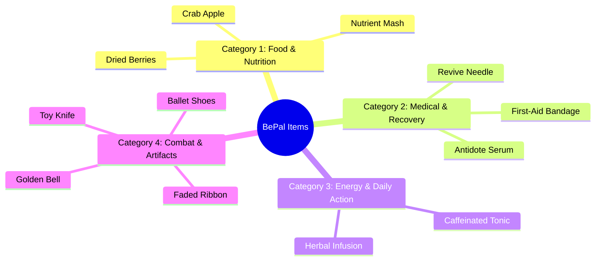

# BePal — Economy, Shop & Inventory Systems (v2)

## 1. Currency Economy & Financial Model (ระบบเศรษฐกิจและกระแสเงินสด)

ระบบการเงินใน BePal ใช้สกุลเงิน **Gold (G)** เป็นสื่อกลางในการแลกเปลี่ยน โดยออกแบบมาเพื่อสร้างแรงกดดันในการตัดสินใจ (Resource Tension) ระหว่างการซื้ออาหารประทังชีวิต การลงทุนในอุปกรณ์บัฟ หรือการสำรองเงินไว้สำหรับค่ารักษาฉุกเฉิน

```mermaid
flowchart LR
    subgraph GoldInflow [แหล่งรายรับ (Inflows)]
        A1[Starting Wallet: 150G]
        A2[Daily Subsidy: 100G/วัน]
        A3[Care Grade Bonus: 10-50G/รอบ]
        A4[Boss Loot: 500G]
        A5[Sell Toothless: 5,000G]
    end
    
    subgraph PlayerWallet [กระเป๋าเงินผู้เล่น (Gold Reserve)]
        W[(Gold Account)]
    end
    
    subgraph GoldOutflow [แหล่งรายจ่าย (Outflows / Sinks)]
        B1[Shop Purchases: 18-55G]
        B2[Emergency Revive: 500G]
        B3[Emergency Loan Interest: 20%/วัน]
    end
    
    GoldInflow --> PlayerWallet
    PlayerWallet --> GoldOutflow
```

### รายละเอียดกระแสเงินสด (Cash Flow Specifications)

1. **เงินทุนเริ่มต้น (Starting Capital):** $150 \text{ Gold}$ เมื่อเปิดสถานพักพิงใน Day 1
2. **เงินสนับสนุนรายวัน (Daily Subsidy):** ได้รับ $+100 \text{ Gold}$ ทุกเช้าจากกองทุนอนุรักษ์สิ่งมีชีวิต
3. **รางวัลผลงานการดูแล (Care Performance):**
   - เกรด S: $+50 \text{ Gold}$
   - เกรด A: $+35 \text{ Gold}$
   - เกรด B: $+20 \text{ Gold}$
   - เกรด C: $+10 \text{ Gold}$
4. **โบนัสพิเศษจากการต่อสู้:**
   - หลบกระสุนเหรียญทองในบอสไฟต์: $+2 \text{ Gold}$ ต่อเหรียญที่หลบพ้น
   - ชนะบอสพ่อค้าเร่: $+500 \text{ Gold}$
5. **ค่าใช้จ่ายฉุกเฉิน (Emergency Drain):**
   - ค่ากู้ชีพสัตว์เลี้ยงเมื่อหมดสภาพ (Incapacitated Revive): $-500 \text{ Gold}$
   - ดอกเบี้ยเงินกู้ฉุกเฉิน: $20\%$ ทบต้นต่อวัน

---

## 2. Merchant Shop Catalog (รายการสินค้าในร้านค้าพ่อค้าเร่)

ในเช้าของวันที่ 3 ร้านค้าของพ่อค้าเร่จะเปิดให้บริการ โดยมีสินค้าอุปโภคบริโภคและไอเทมบัฟพิเศษวางจำหน่าย:

```
┌────────────────────────────────────────────────────────────────────────┐
│                   THE TRAVELING COLLECTOR'S EMPORIUM                   │
├───────────────────┬─────────┬──────────────────────────────────────────┤
│ ITEM NAME         │ PRICE   │ PRIMARY EFFECT & DESCRIPTION             │
├───────────────────┼─────────┼──────────────────────────────────────────┤
│ 1. Crab Apple     │ 25 G    │ Heals +18 HP, Restores +20 Stomach       │
│ 2. Sea Tea        │ 18 G    │ Extends Dodge Zone duration (+20% width) │
│ 3. Cloudy Glasses │ 30 G    │ Grants 2 Invulnerability Shields in Dodge│
│ 4. Torn Notebook  │ 55 G    │ Permanently increases Train EXP by +50%  │
│ 5. Caffeine Tonic │ 40 G    │ Immediately restores +2 Energy Points    │
└───────────────────┴─────────┴──────────────────────────────────────────┘
```

### เจาะลึกคุณสมบัติสินค้าแต่ละชิ้น

1. **Crab Apple (25 Gold):**
   - *คำอธิบาย:* แอปเปิลทะเลเปลือกแข็งรสหวานอมเปรี้ยว อุดมไปด้วยแร่ธาตุชีวภาพเข้มข้น
   - *ผลลัพธ์:* ฟื้นฟู $\text{Health} +18 \text{ HP}$ และเพิ่ม $\text{Stomach} +20$ ทันทีเมื่อกดใช้
   - *คำแนะนำ:* เหมาะสำหรับสำรองไว้ฟื้นฟูสัตว์เลี้ยงก่อนเข้าสู่การปะทะบอส

2. **Sea Tea (18 Gold):**
   - *คำอธิบาย:* ชาสาหร่ายน้ำลึกสกัดเย็น ช่วยปรับคลื่นสมองให้สัตว์เลี้ยงสงบนิ่งและมีสมาธิ
   - *ผลลัพธ์:* ขยายแถบ Dodge Zone สีทองให้กว้างขึ้น $+20\%$ เป็นเวลา 1 การเผชิญหน้า
   - *คำแนะนำ:* ไอเทมแก้ทางสำหรับผู้เล่นที่กะจังหวะหลบหลีกไม่แม่นยำ

3. **Cloudy Glasses (30 Gold):**
   - *คำอธิบาย:* แว่นตาเลนส์มัวที่บดบังภาพความน่าสะพรึงกลัวของศัตรู
   - *ผลลัพธ์:* มอบบาเรียป้องกันความเสียหายจากการหลบพลาด **2 ครั้งแรก (2 Shield Charges)** ในฉากต่อสู้
   - *คำแนะนำ:* ประกันชีวิตชั้นยอดสำหรับรับมือท่ากระสุนเหรียญทองหรือกรดพิษ

4. **Torn Notebook (55 Gold):**
   - *คำอธิบาย:* เศษสมุดบันทึกเคล็ดลับการฝึกสัตว์จากผู้เชี่ยวชาญในอดีต
   - *ผลลัพธ์:* เพิ่มค่า $\text{EXP}$ ที่ได้รับจากมินิเกม Train ขึ้น $+50\%$ อย่างถาวรสำหรับสัตว์ที่สวมใส่
   - *คำแนะนำ:* การลงทุนระยะยาวเพื่อเร่งเลเวลและปลดล็อกพลังโจมตีสวนกลับ

5. **Caffeinated Tonic (40 Gold):**
   - *คำอธิบาย:* เครื่องดื่มสมุนไพรคาเฟอีนเข้มข้นสำหรับผู้ดูแลสถานพักพิง
   - *ผลลัพธ์:* เติมแต้มพลังงาน $\text{Energy Points} +2 \text{ AP}$ ทันทีในวันที่กดใช้
   - *คำแนะนำ:* ใช้เมื่อจำเป็นต้องทำกิจกรรมฉุกเฉินแต่พลังงาน 6 แต้มตามปกติหมดลงแล้ว

---

## 3. Equipment & Artifact Matrix (ตารางอุปกรณ์สวมใส่และของวิเศษ)

สัตว์เลี้ยงแต่ละตัวมีช่องสวมใส่อุปกรณ์เริ่มต้น 1 ช่อง (และปลดล็อกช่องที่สองเมื่อถึง Lv. 3) โดยอุปกรณ์จะมอบบัฟติดตัวถาวรตราบใดที่ยังสวมใส่:

| ชื่ออุปกรณ์ | ช่องที่สวม | ผลลัพธ์เชิงตัวเลข (Stat Deltas) | คำอธิบายและที่มา (Lore) |
| --- | --- | --- | --- |
| **Ballet Shoes** | รองเท้า / เท้า | เพิ่มดาเมจสวนกลับ $\text{Counter Damage} +12$ | รองเท้าบัลเลต์สีชมพูซีด ช่วยให้สัตว์เลี้ยงหมุนตัวสวนกลับได้อย่างพริ้วไหว |
| **Toy Knife** | อาวุธ / กรงเล็บ | เพิ่มพลังโจมตี $+8 \text{ Dmg}$ แต่ลดโซนหลบลง $5\%$ | มีดพลาสติกปลายทู่ เพิ่มความดุร้ายให้สัตว์เลี้ยงแต่ลดความระมัดระวัง |
| **Faded Ribbon** | เครื่องประดับ | ขยาย Dodge Zone $+15\%$ และลดดาเมจกรดลง $50\%$ | ริบบิ้นผ้าซาตินเก่า มอบความรู้สึกปลอดภัยและป้องกันละอองกรดกัดกร่อน |
| **Stick (กิ่งไม้)** | อุปกรณ์ดูแล | เพิ่มประสิทธิภาพการทำความสะอาด $\text{Clean} +15$ | กิ่งไม้ขัดฟันและเกาหลัง ช่วยขจัดคราบฝังแน่นได้ง่ายดาย |
| **Golden Bell** | กระดิ่งคอ (Boss Drop) | ขยาย Perfect Zone $+15\%$ และได้เงินเพิ่ม $+20\%$ | กระดิ่งทองคำโบราณที่ดรอปจากพ่อค้าเร่ นำพาโชคลาภและความแม่นยำ |

---

## 4. The 4 Item Effect Categories (4 หมวดหมู่ไอเทม)



1. **Food & Nutrition (อาหารและโภชนาการ):** เน้นฟื้นฟู Stomach ป้องกันอาการ Starving และเพิ่ม EXP เล็กน้อย
2. **Medical & Recovery (การแพทย์และฟื้นฟู):** เน้นเพิ่ม Health ลบล้างสถานะ Acid Burn, Grimy หรือ Sickness
3. **Energy & Action (พลังงานและเวลา):** มอบ AP ชั่วคราว หรือชะลอการเดินหน้าของหลอด Day Progress
4. **Combat & Equipment (อุปกรณ์สวมใส่):** ปรับแต่งค่าสเตตัสในฉากต่อสู้ เช่น ขนาดของ Dodge Zone และดาเมจ Counter

---

## 5. 8-Slot Inventory Architecture & UI Modal (โครงสร้างกระเป๋าและอินสเปกเตอร์)

กระเป๋าเก็บของของผู้เล่นถูกจำกัดขนาดไว้ที่ **8 ช่องเก็บของ (8-Slot Inventory Grid)**:

```
┌─────────────────────────────────────────────────────────────┐
│                      SANCTUARY INVENTORY (8 SLOTS)          │
├──────────────┬──────────────┬──────────────┬────────────────┤
│ [1]          │ [2]          │ [3]          │ [4]            │
│ Crab Apple   │ Sea Tea      │ Cloudy Glass │ Torn Notebook  │
│ Qty: x2      │ Qty: x1      │ Qty: x1      │ Qty: x1        │
├──────────────┼──────────────┼──────────────┼────────────────┤
│ [5]          │ [6]          │ [7]          │ [8]            │
│ Ballet Shoes │ Stick        │ Faded Ribbon │ < EMPTY >      │
│ [EQUIPPED]   │ Qty: x1      │ Qty: x1      │                │
└──────────────┴──────────────┴──────────────┴────────────────┘
```

### ระบบการตรวจสอบและใช้งาน (Inspection & Use Flow)

เมื่อผู้เล่นคลิกที่ไอเทมชิ้นใดก็ตามในกระเป๋า จะปรากฏหน้าต่างโมดอลป๊อปอัปย่อยขึ้นมา:

```
┌─────────────────────────────────────────────────────┐
│  ITEM INSPECTION: Crab Apple                        │
│  Type: Consumable (Food / Medical)                 │
│                                                     │
│  "A sweet and sour oceanic apple rich in nutrients. │
│   Heals +18 HP and restores +20 Stomach."           │
│                                                     │
│      [ USE ITEM ]                   [ CLOSE ]       │
└─────────────────────────────────────────────────────┘
```

1. **คลิก [ USE ITEM ]:**
   - ตรวจสอบเงื่อนไข (เช่น สัตว์เลี้ยงบาดเจ็บหรือหิวหรือไม่)
   - ปรับใช้ผลลัพธ์ (Apply Stat Deltas) ทันที พร้อมแสดงตัวเลขสีเขียวลอยขึ้นเหนือสัตว์เลี้ยง
   - ลดจำนวนไอเทมในช่องนั้นลง 1 หน่วย หากเหลือ 0 ให้เคลียร์ช่องให้ว่าง
2. **การสวมใส่อุปกรณ์ (Equip Item):**
   - หากไอเทมเป็นหมวดอุปกรณ์ หน้าต่างจะมีปุ่ม `[ EQUIP ]`
   - ไอเทมจะย้ายไปติดตั้งในช่องของสัตว์เลี้ยง และแสดงแท็ก `[EQUIPPED]`
3. **การซื้อของในร้านค้า (Purchase Flow):**
   - คลิกไอเทมในร้าน -> แสดงราคาและยอดเงินคงเหลือ
   - หากยอดเงินเพียงพอ และมีช่องว่างในกระเป๋า -> หักเงินและเพิ่มไอเทมลงในช่องว่างแรก
   - หากกระเป๋าเต็ม -> แสดงข้อความเตือน *"Inventory is full! Free up a slot first."*
