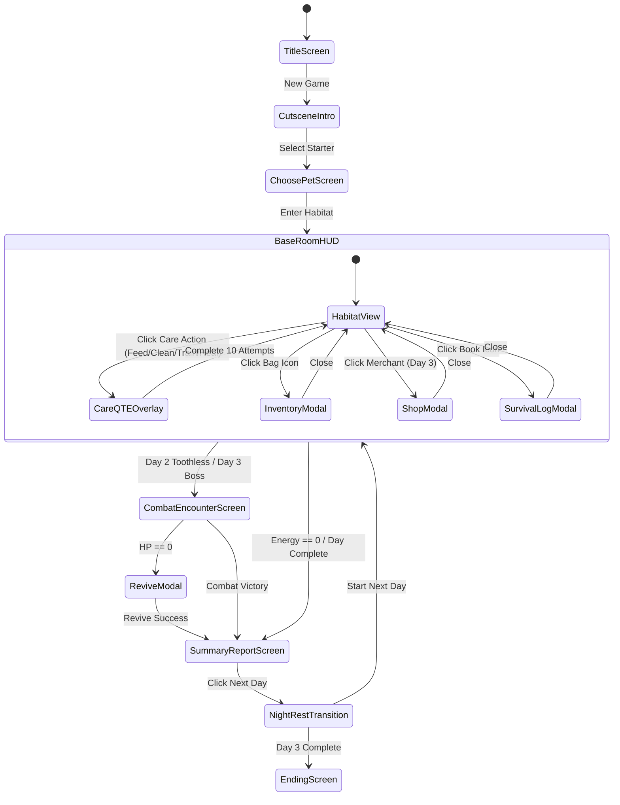

# BePal — UI/UX Wireframes & Screen Flow (v2)

## 1. Screen Flow & Navigation State Machine

โครงสร้างการเปลี่ยนผ่านของหน้าจอทั้งหมดใน BePal ยึดตามระบบ `ScreenManager` ที่แยกชั้นระหว่างหน้าจอหลัก (Full Screens) และหน้าต่างซ้อนทับ (Modal / Overlay Screens):



---

## 2. Title Screen & Main Menu Wireframe

ความละเอียดมาตรฐานของเกมคือ **1280x720 พิกเซล (16:9 Aspect Ratio)**

```
┌────────────────────────────────────────────────────────────────────────┐
│ [1280x720]                    TITLE SCREEN                             │
│                                                                        │
│                               B E P A L                                │
│                     ~ Abnormal Pet Sanctuary ~                         │
│                                                                        │
│                            [ (o . o) ]                                 │
│                     (Animated Pet Idle Sprite)                         │
│                                                                        │
│                       [ ▶  NEW GAME     ]                              │
│                       [ 💾 CONTINUE     ]                              │
│                       [ ⚙️ OPTIONS      ]                              │
│                       [ 🚪 QUIT GAME    ]                              │
│                                                                        │
│ v2.0-vertical-slice                               (c) 2026 BePal Team  │
└────────────────────────────────────────────────────────────────────────┘
```

- **Hotkeys / Controls:** คลิกเมาส์ซ้าย หรือใช้ลูกศรขึ้น/ลง + Enter ในการเลือกเมนู
- **Audio:** เล่นเพลงบรรเลงอบอุ่นปนลึกลับ (Title Acoustic Theme)

---

## 3. Narrative Dialogue & Choice Prompt Screen Wireframe

ใช้สำหรับฉากเล่าเรื่อง บทสนทนากับพ่อค้า และเหตุการณ์หน้าประตู

```
┌────────────────────────────────────────────────────────────────────────┐
│ [BACKGROUND ART: Front Door / Exterior Rain / Thunderstorm Flash]     │
│                                                                        │
│                                                                        │
│                      [ ANTAGONIST / NPC SPRITE ]                       │
│                        The Traveling Collector                         │
│                                                                        │
│   ┌────────────────────────────────────────────────────────────────┐   │
│   │ [ CHOICE A ]: [ YES - ยอมขาย Toothless รับ 5,000G ]            │   │
│   │ [ CHOICE B ]: [ NO  - ปฏิเสธข้อเสนอและปกป้องสัตว์เลี้ยง ]        │   │
│   └────────────────────────────────────────────────────────────────┘   │
│ ┌────────────────────────────────────────────────────────────────────┐ │
│ │ SPEAKER: The Traveling Collector                                   │ │
│ │ "ฉันกำลังสนใจเจ้า Toothless ของเธอเป็นพิเศษ... จะรังเกียจไหมถ้า      │ │
│ │  ฉันจะขอซื้อมันต่อจากเธอ? ฉันยินดีจ่ายให้เธอถึง 5,000 Gold เชียวนะ!"│ │
│ │                                                      [ CLICK / ⏎ ] │ │
│ └────────────────────────────────────────────────────────────────────┘ │
└────────────────────────────────────────────────────────────────────────┘
```

- **Dialogue Box Specs:** สูง 160px ยึดขอบล่างของหน้าจอ มีกรอบขอบทองสไตล์เรโทร
- **Typewriter Effect:** แสดงตัวอักษรทีละตัวความเร็ว $35 \text{ ตัวอักษร/วินาที}$ คลิกกล่องเพื่อแสดงข้อความเต็มทันที
- **Prompt Overlay:** เมื่อมีทางเลือก กล่องตัวเลือกจะลอยเด่นขึ้นเหนือบาร์ข้อความ

---

## 4. Choose Starter Pet Screen Wireframe

```
┌────────────────────────────────────────────────────────────────────────┐
│                     CHOOSE YOUR FIRST ABNORMAL PET                     │
│               เลือกสัตว์เลี้ยงเริ่มต้นเพื่อเข้ารับการอุปการะ              │
│                                                                        │
│   ┌──────────────────┐  ┌──────────────────┐  ┌──────────────────┐   │
│   │   COCO (Moss)    │  │    SPROUTLET     │  │    GLOOMTAIL     │   │
│   │                  │  │                  │  │                  │   │
│   │     (✿◕‿◕)       │  │     (⚡`･ω･´)    │  │     (👁️_👁️)      │   │
│   │                  │  │                  │  │                  │   │
│   │ HP: 100          │  │ HP: 90           │  │ HP: 110          │   │
│   │ Stomach: 80      │  │ Stomach: 70      │  │ Stomach: 60      │   │
│   │ Clean: 70        │  │ Clean: 80        │  │ Clean: 60        │   │
│   │ Pref: Feed/Clean │  │ Pref: Train/Play │  │ Pref: Heal/Feed  │   │
│   │ Passive: Regen+5 │  │ Passive: Agility │  │ Passive: Shield  │   │
│   │   [ SELECT ]     │  │   [ SELECT ]     │  │   [ SELECT ]     │   │
│   └──────────────────┘  └──────────────────┘  └──────────────────┘   │
│                                                                        │
│                     [ CONFIRM ADOPTION (Space) ]                       │
└────────────────────────────────────────────────────────────────────────┘
```

---

## 5. Base Room Screen & HUD Wireframe (หน้าจอหลักสถานพักพิง)

ศูนย์กลางการเล่นที่รวมการแสดงสถานะและการออกคำสั่งดูแล:

```
┌────────────────────────────────────────────────────────────────────────┐
│ 📅 DAY: 01/03   ⚡ ENERGY: [■■■■■■] 6/6 AP       💰 150 G   ⭐ Lv.1 (0/100)│
├────────────────────────────────────────────────────────────────────────┤
│                                                        [🎒 BAG (I)]    │
│  STATUS BARS:                                          [📖 LOG (L)]    │
│  HP:      [████████████████████] 100/100               [🛒 SHOP (S)]   │
│  STOMACH: [████████████░░░░░░░░]  60/100               [⚙️ SETTINGS]   │
│  CLEAN:   [████████████████░░░░]  80/100                               │
│                                                                        │
│                                                                        │
│                           [ PET SPRITE ]                               │
│                              (✿◕‿◕)                                    │
│                           Coco (Mossling)                              │
│                                                                        │
│                                                                        │
│ ┌────────────────────────────────────────────────────────────────────┐ │
│ │  [ 🍖 1. FEED ]    [ 🧼 2. CLEAN ]    [ ⚔️ 3. TRAIN ]    [ 💊 4. HEAL ]│ │
│ │    (1 Energy)        (1 Energy)         (1 Energy)        (1-2 AP) │ │
│ └────────────────────────────────────────────────────────────────────┘ │
└────────────────────────────────────────────────────────────────────────┘
```

### องค์ประกอบบน HUD Console
1. **Top Bar (แถบบน):**
   - แสดงวันที่ปัจจุบัน (`DAY: 01/03`)
   - แสดงโควตาพลังงาน (`ENERGY: [■■■■■■] 6/6 AP`)
   - แสดงจำนวนเงินคงเหลือ (`💰 150 G`)
   - แสดงระดับเลเวลและหลอด EXP (`⭐ Lv.1`)
2. **Left Status Stack (แถบสถานะด้านซ้าย):**
   - **HP Bar:** แถบสีเขียว (หรือสีแดงหากต่ำกว่า 30)
   - **Stomach Bar:** แถบสีส้มสดใส
   - **Clean Bar:** แถบสีฟ้าเทอร์ควอยซ์
3. **Action Bar (แถบคำสั่งด้านล่าง):**
   - ปุ่มลัดแป้นพิมพ์ `[1] FEED`, `[2] CLEAN`, `[3] TRAIN`, `[4] HEAL`
4. **Utility Panel (แถบเครื่องมือขวา):**
   - ปุ่มเปิดกระเป๋า (`Bag`), เปิดสมุดวิจัย (`Log`), ร้านค้าพ่อค้า (`Shop`)

---

## 6. Care Mini-Game QTE Screen Wireframe

```
┌────────────────────────────────────────────────────────────────────────┐
│ DAY PROGRESS: [████████████████████░░░░░░░░░░] 65%      ATTEMPT: 04/10 │
├────────────────────────────────────────────────────────────────────────┤
│                                                                        │
│                                [FEED]                                  │
│                                  |                                     │
│                            .-----^-----.                               │
│                          /   PERFECT     \                             │
│                        /   (+-0.20 rad)    \                           │
│                      /       |       |       \                         │
│                    /    GOOD |   |   | GOOD    \                       │
│                   |  (+-0.45)|   |   |(+-0.45)  |                      │
│                   |          |  /    |          |                      │
│                   |---------X--/----------------|                      │
│                   |           / Needle Marker   |                      │
│                    \         o                 /                       │
│                      \                       /                         │
│                        \                   /                           │
│                          '---------------'                             │
│                                                                        │
│                         STREAK: x3 🔥                                  │
│                 LAST HIT: PERFECT! (+150 PTS)                          │
│                                                                        │
│               [ PRESS SPACEBAR TO CONFIRM TIMING ]                     │
└────────────────────────────────────────────────────────────────────────┘
```

- **Target Zone:** แถบสีทองและสีเขียวเรืองแสงที่ตำแหน่งเป้าหมาย
- **Needle Marker:** เข็มสีขาวหมุนวนรอบจุดศูนย์กลาง
- **Feedback Tags:** แสดงข้อความลอยตัว `PERFECT!`, `GOOD!`, หรือ `MISS!` พร้อมคะแนนที่ได้รับ

---

## 7. Combat & Taming Arena Wireframe (ฉากต่อสู้และสยบสัตว์)

```
┌────────────────────────────────────────────────────────────────────────┐
│ BOSS: TOOTHLESS (Lv.2)                           BOSS HP: [████░░] 40/60│
│ ACID POUCH METER: [████████████████████] READY! (WARNING)              │
├────────────────────────────────────────────────────────────────────────┤
│                                                                        │
│                        [ TOOTHLESS SPRITE ]                            │
│                       (Throat Glowing Green)                           │
│                                                                        │
│                                                                        │
│                      ⚠️ ATTACK: ACID SPIT! ⚠️                          │
│                         [ DODGE ZONE: TOP ]                            │
│                                                                        │
│                           .-----^-----.                                │
│                         /  GOLDEN ZONE  \                              │
│                        |   (+-30 deg)    |                             │
│                        |        |        |                             │
│                        |--------o--------|                             │
│                         \      /        /                              │
│                           '---/-------'                                │
│                              Needle                                    │
│                                                                        │
│ PLAYER HP: [██████████] 80/100                  TAME GAUGE: [████░░] 67%│
│ [ SPACE: DODGE ]                                  [ COUNTER: READY ]   │
└────────────────────────────────────────────────────────────────────────┘
```

- **Boss Health & Charge Bar:** อยู่ด้านบนสุด แสดงสถานะการชาร์จท่าโจมตี
- **Telegraph Warning Banner:** แถบสีแดงเตือนชื่อท่าและทิศทางของโซนหลบ
- **Tame Gauge (หลอดความเชื่อง):** อยู่มุมขวาล่าง เมื่อสะสมเต็ม 100% จะจบการต่อสู้ด้วยชัยชนะ

---

## 8. Emergency Revive & Defeat Modal Wireframe

```
┌────────────────────────────────────────────────────────────────────────┐
│                                                                        │
│        ╔══════════════════════════════════════════════════════╗        │
│        ║           CRITICAL EMERGENCY: PET COLLAPSED!         ║        │
│        ╠══════════════════════════════════════════════════════╣        │
│        ║                                                      ║        │
│        ║   สัตว์เลี้ยงของคุณหมดสภาพจากอาการบาดเจ็บ/ความหิวโหย!    ║        │
│        ║   ต้องได้รับการฉีดเซรุ่มกู้ชีพฉุกเฉินทันที                ║        │
│        ║                                                      ║        │
│        ║   [ 💰 PAY 500 GOLD REVIVAL FEE ]                    ║        │
│        ║   (ชำระเงินสดทันทีเพื่อฟื้นฟู Health 50%)              ║        │
│        ║                                                      ║        │
│        ║   [ 📜 SIGN MERCHANT LOAN AGREEMENT ]                ║        │
│        ║   (กู้เงินฉุกเฉิน 500G / ดอกเบี้ยทบต้น 20% ต่อวัน)      ║        │
│        ║                                                      ║        │
│        ╚══════════════════════════════════════════════════════╝        │
│                                                                        │
└────────────────────────────────────────────────────────────────────────┘
```

---

## 9. Daily Summary Report Card Wireframe

```
┌────────────────────────────────────────────────────────────────────────┐
│                                                                        │
│        ╔══════════════════════════════════════════════════════╗        │
│        ║               DAILY SANCTUARY REPORT                 ║        │
│        ║                    DAY 01 OF 03                      ║        │
│        ╠══════════════════════════════════════════════════════╣        │
│        ║  CARE SESSIONS COMPLETED:   4 Sessions               ║        │
│        ║  ACCURACY RATING:           85% Hit Rate             ║        │
│        ║  DISASTER CASUALTIES:       0 Incidents              ║        │
│        ║                                                      ║        │
│        ║  PERFORMANCE GRADE:         [ RANK A ]               ║        │
│        ║  GOLD SUBSIDY & REWARD:     +135 Gold                ║        │
│        ║  SURVIVAL LOG ENTRY:        "Coco prefers Clean"     ║        │
│        ║                                                      ║        │
│        ║  CURRENT WALLET:            285 Gold                 ║        │
│        ║                                                      ║        │
│        ║             [ PROCEED TO NEXT DAY (⏎) ]              ║        │
│        ╚══════════════════════════════════════════════════════╝        │
│                                                                        │
└────────────────────────────────────────────────────────────────────────┘
```
