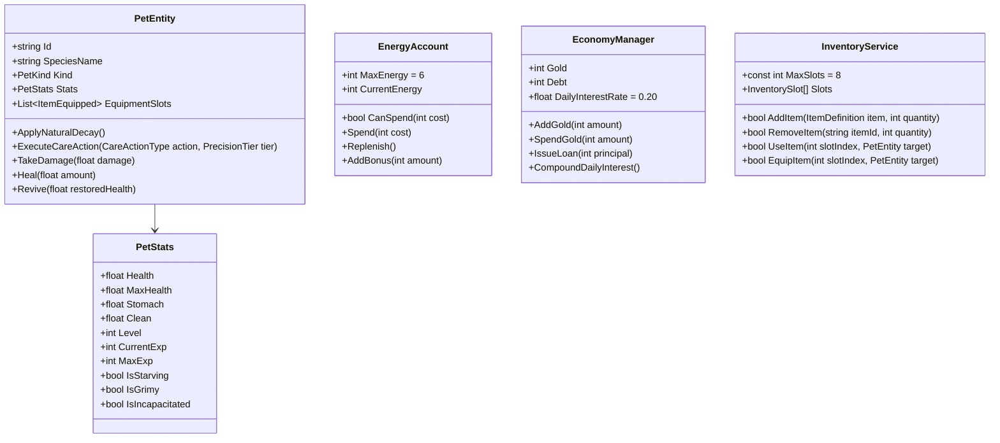
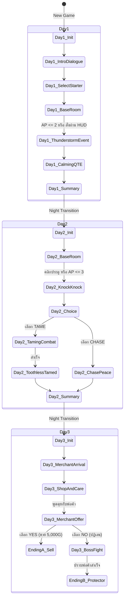

# BePal — Technical Architecture & Implementation Blueprint (v2)

## 1. High-Level Engine & Architecture Overview

BePal ได้รับการพัฒนาบนเฟรมเวิร์ก **MonoGame DesktopGL (.NET 8 C# 12)** โดยยึดหลักการออกแบบสถาปัตยกรรมที่แยกชั้นความรับผิดชอบอย่างเด็ดขาด (Clean Architecture / Domain-Driven Separation) ระหว่างชั้นการแสดงผลกราฟิก (MonoGame Presentation Layer) และตรรกะเชิงธุรกิจของเกม (Pure C# Domain Model)

```
┌────────────────────────────────────────────────────────────────────────┐
│                        MONOGAME ENGINE HOST                            │
│           (Program.cs, Game1.cs, ContentManager, SpriteBatch)          │
└───────────────────────────────────┬────────────────────────────────────┘
                                    │
           ┌────────────────────────┴────────────────────────┐
           ▼                                                 ▼
┌──────────────────────────────────────┐  ┌──────────────────────────────┐
│       PRESENTATION & VIEW LAYER      │  │      UI COMPONENT LAYER      │
│            (BePal.Screens)           │  │          (BePal.UI)          │
├──────────────────────────────────────┤  ├──────────────────────────────┤
│ - MainMenuScreen                     │  │ - DialogueBox                │
│ - ChoosePetScreen                    │  │ - StatusBarRenderer          │
│ - BaseHabitatScreen                  │  │ - RadialWheelRenderer        │
│ - CareQteScreen (10 Attempts)        │  │ - InventoryGridModal         │
│ - CombatArenaScreen (Boss / Tame)    │  │ - ShopModalRenderer          │
│ - EmergencyReviveModal               │  │ - ReportCardRenderer         │
│ - DailySummaryScreen                 │  │                              │
└──────────────────┬───────────────────┘  └──────────────┬───────────────┘
                   │                                     │
                   └──────────────────┬──────────────────┘
                                      ▼
┌────────────────────────────────────────────────────────────────────────┐
│                      PURE C# GAMEPLAY DOMAIN LAYER                     │
│                            (BePal.Gameplay)                            │
├────────────────────────────────────────────────────────────────────────┤
│ - PetEntity & PetStats (HP, Stomach, Clean, EXP, StatusEffects)        │
│ - EnergyAccount (6 AP Daily Budget, Spend, Reset)                      │
│ - EconomyManager (Gold, Daily Subsidy, Merchant Loan, Interest)        │
│ - InventoryService & ItemRegistry (8-Slot Grid, Equip, Consumables)    │
│ - CombatEngine (Telegraphs, Needle Math, Dodge Zones, Counter Window)  │
│ - RunSaveState (JSON Serialization Schema for Days 1-3)                │
└────────────────────────────────────────────────────────────────────────┘
```

### กฎเหล็กด้านสถาปัตยกรรม (Architectural Invariants)
1. **Zero MonoGame Dependency in Domain:** คลาสทุกตัวใน `BePal.Gameplay` จะต้องไม่มีการอ้างอิงชนิดข้อมูลของ MonoGame (`Microsoft.Xna.Framework.*`, `SpriteBatch`, `GraphicsDevice`, `GameTime`) เพื่อให้สามารถรัน Unit Test ในโปรเจกต์ `BePal.Tests` ได้อย่างรวดเร็วแบบ Headless 100%
2. **Deterministic State Mutation:** สถานะทั้งหมดถูกปรับเปลี่ยนผ่านเมธอดอย่างเป็นทางการ (เช่น `pet.Feed()`, `energy.Spend()`) หลีกเลี่ยงการเปิด `public set` โดยตรง
3. **Synchronous Single-Threaded Game Loop:** ทำงานที่ 60 FPS บน Main Thread การป้อนข้อมูล การคำนวณฟิสิกส์เข็มหมุน และการเรนเดอร์ดำเนินไปตามลำดับเฟรมต่อเฟรม

---

## 2. Core Domain Models & Class Specifications



---

## 3. Screen Lifecycle & Navigation (IScreen & ScreenManager)

ระบบหน้าจอได้รับการจัดการผ่าน `ScreenManager` ซึ่งสนับสนุนทั้งการสลับหน้าจอหลัก (Full Screen Transition) และการเปิดหน้าต่างซ้อนทับ (Modal / Overlay Stack):

```csharp
namespace BePal.Screens;

public interface IScreen
{
    bool IsOverlay { get; }
    void Initialize();
    void LoadContent(ContentManager content, GraphicsDevice graphicsDevice);
    void Update(GameTime gameTime, InputState input);
    void Draw(SpriteBatch spriteBatch, GameTime gameTime);
    void OnEntering();
    void OnExiting();
}
```

### Screen Registration Matrix

| หน้าจอ (Screen) | ชนิดหน้าจอ | บทบาทและหน้าที่หลัก |
| --- | --- | --- |
| `MainMenuScreen` | Full Screen | หน้าจอเริ่มต้น แสดงโลโก้ เมนู New Game / Continue / Settings |
| `CutsceneDialogueScreen` | Full Screen | หน้าจอเล่าเรื่อง บทนำ พายุเข้า บทสนทนาพ่อค้า พร้อมตัวเลือก Choice |
| `ChoosePetScreen` | Full Screen | หน้าต่างเลือกรับอุปการะ Starter Pet (Coco / Sproutlet / Gloomtail) |
| `BaseHabitatScreen` | Full Screen | หน้าจอหลักสถานพักพิง แสดง HUD, สเตตัสสัตว์เลี้ยง, ปุ่มคำสั่ง 4 แอ็กชัน |
| `CareQteScreen` | Overlay / Modal | หน้าจอมินิเกมวงล้อ QTE 10 ครั้ง จับจังหวะ Perfect / Good / Miss |
| `CombatArenaScreen` | Full Screen | สนามประลองการต่อสู้ (Toothless Taming ใน Day 2 / Boss Fight ใน Day 3) |
| `InventoryOverlayScreen`| Modal Overlay | หน้าต่างกระเป๋าเก็บของ 8 ช่อง แสดงคำอธิบายไอเทม และปุ่ม USE / EQUIP |
| `ShopModalScreen` | Modal Overlay | ร้านค้าพ่อค้าเร่ เลือกซื้อไอเทม 5 ชนิด ตรวจสอบราคาก่อนซื้อ |
| `EmergencyReviveModal` | Modal Overlay | หน้าต่างกู้ชีพฉุกเฉินเมื่อ HP สัตว์เลี้ยง = 0 จ่าย 500G หรือกู้ยืมเงิน |
| `DailySummaryScreen` | Full Screen | ใบสรุปผลงานประจำวัน คำนวณเกรด มอบเงินรางวัล และบันทึกเซฟ |

---

## 4. State Machine Implementation for Days 1–3

ลำดับเหตุการณ์ตั้งแต่ต้นจนจบถูกควบคุมผ่าน `RunStateMachine`:



---

## 5. Persistence & Save Schema (JSON Specification)

ความคืบหน้าของเกมจะถูกบันทึกลงในไฟล์ `savegame.json` ทุกครั้งที่ผ่านเข้าสู่ `DailySummaryScreen`:

```json
{
  "Version": "2.0",
  "SaveTimestamp": "2026-09-20T18:00:00Z",
  "RunState": {
    "CurrentDay": 2,
    "Gold": 285,
    "DebtAmount": 0,
    "EnergyRemaining": 6,
    "ActiveStarterPet": {
      "SpeciesId": "coco",
      "Level": 2,
      "CurrentExp": 120,
      "Health": 100.0,
      "MaxHealth": 110.0,
      "Stomach": 75.0,
      "Clean": 85.0,
      "EquippedSlot": "faded_ribbon"
    },
    "HasTamedToothless": true,
    "ToothlessEntity": {
      "SpeciesId": "toothless",
      "Level": 1,
      "CurrentExp": 40,
      "Health": 60.0,
      "MaxHealth": 60.0,
      "Stomach": 50.0,
      "Clean": 60.0,
      "EquippedSlot": null
    },
    "Inventory": [
      { "ItemId": "crab_apple", "Quantity": 2 },
      { "ItemId": "sea_tea", "Quantity": 1 },
      { "ItemId": "ballet_shoes", "Quantity": 1 }
    ],
    "SurvivalLogDiscoveredSpecies": [
      "coco",
      "toothless"
    ]
  }
}
```

---

## 6. Migration Roadmap from Legacy Codebase (แผนการปรับปรุงโค้ดจาก v1 สู่ v2)

เพื่อให้โปรแกรมเมอร์สามารถนำ GDD v2 ไปต่อยอดกับโค้ดปัจจุบันในโฟลเดอร์ `CoPoject/BePal/` ได้อย่างราบรื่น:

### เฟสที่ 1: Domain Refactoring (การแยกโมเดลโดเมน)
- แตกโครงสร้างข้อมูลออกจาก `PrototypeRun.cs`:
  - สร้าง `PetEntity.cs` และ `PetStats.cs` เพื่อรองรับค่า HP (0–100), Stomach, Clean และ EXP/Level
  - สร้าง `EnergyAccount.cs` รองรับโควตา 6 AP ประจำวัน
  - สร้าง `EconomyManager.cs` สำหรับจัดการเงิน Gold และระบบเงินกู้

### เฟสที่ 2: Care QTE Engine Upgrade (การยกระดับวงล้อ QTE)
- ปรับปรุง `CareQteScreen.cs` จากการหมุนเลือก 4 ช่องเดิม ให้รองรับ **10-Attempt Session**:
  - เพิ่มตัวแปรนับ `_attemptCounter` (1 ถึง 10)
  - กำหนดมุมความคลาดเคลื่อน $\pm 0.20 \text{ rad}$ (Perfect) และ $\pm 0.45 \text{ rad}$ (Good)
  - ปรับสูตรความคืบหน้าของวัน: กด Hit ได้ $+10\%$, กด Miss ได้ $+15\%$

### เฟสที่ 3: Narrative & Event Subsystem (ระบบเนื้อเรื่องและทางเลือก)
- ต่อยอด `DialogueBox.cs` ให้รองรับกล่องตัวเลือกสองทาง (`PromptOptions`)
- สร้าง Event State สำหรับวันที่ 1 (Thunderstorm), วันที่ 2 (Toothless Door Knock), และวันที่ 3 (Merchant Arrival)

### เฟสที่ 4: Combat Arena Subsystem (ระบบการต่อสู้และสยบสัตว์)
- พัฒนา `CombatArenaScreen.cs`:
  - บรรจุระบบหลบการโจมตี (Telegraphed Attacks & Dodge Zones)
  - บรรจุระบบสวนกลับแบบวงแหวนหด (Shrinking Ring Counter-Attack Window)
  - นำเข้าตรรกะ Boss Fight 3 เฟสของพ่อค้าเร่

### เฟสที่ 5: Economy, Shop & Inventory UI (ระบบไอเทมและร้านค้า)
- พัฒนา `InventoryOverlayScreen.cs` (8 ช่อง พร้อมป๊อปอัป USE / EQUIP)
- พัฒนา `ShopModalScreen.cs` (แสดงรายการไอเทม 5 ชิ้น พร้อมคำนวณเงิน)
- พัฒนา `EmergencyReviveModal.cs` (ระบบชำระ 500G หรือเซ็นสัญญาเงินกู้)
