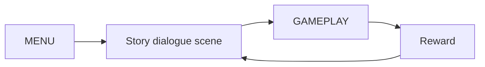

## type: gdd-core-loop

version: 0.1
date: 7/7/2026

---

# Project BePal  — Core Loop & Gameplay

## Core Loop

## Core Mechanics

1. [Guess and experiment]
2. [Perform actions via QTEs]
3. [Get results]
4. [Survival Log]

## Controls

| Key        | Action                   |
| ---------- | ------------------------ |
| Left Click | to interact              |
| ESC        | Pause                    |
| Mouse      | to see around & play QTE |

## Win / Lose Condition

- **ชนะเมื่อ:** [**เอาชีวิตรอดให้ถึงวันสุดท้ายที่กำหนด** (เช่น 5 วัน) โดยที่ HP ยังเหลือรอด]
- **แพ้เมื่อ:** [**HP ลดเหลือ 0** จากการถูกสัตว์เลี้ยงโจมตี (เนื่องจากเลือกวิธีดูแลผิดหรือกด QTE พลาดสะสมจนเลือดหมด]

---
