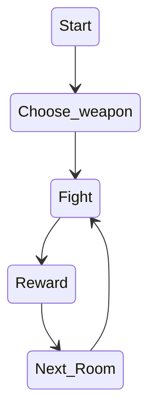
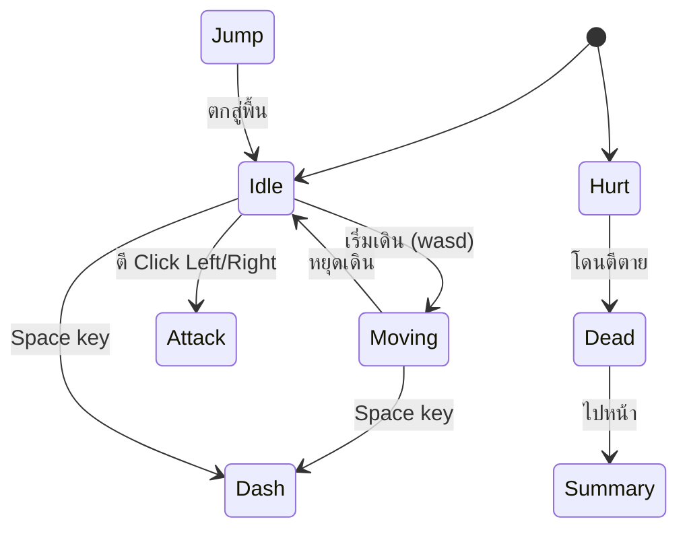

## State Diagram - ระบบ Text-Based & เลือกตอบ (Choice-driven Narrative)

## State Diagram - Player Movement & Combat State Diagram

## Rules

| State   | เข้าเงื่อนไข                                                                  | ออกเงื่อนไข                 | Note                                          |
| ------- | ----------------------------------------------------------------------------------------- | -------------------------------------- | --------------------------------------------- |
| Idle    | เริ่มเกม / หยุดเคลื่อนที่                                           | กด input ใดๆ                      | Animation loop                                |
| Move    | กดปุ่มทิศทาง                                                                  | ปล่อยปุ่ม / กระโดด      | Speed = [ค่า]                              |
| Dash    | กด Space ขณะอยู่นื่งหรือเดินเพื่อพุ่งหลบการโจมตี | ถึงจุดสูงสุด               | Dash speed= [ค่า] Iframe = True/false |
| Attack  | กดปุ่มตี                                                                          | โดนตี / หยุดตี              | Damage = [ค่า]                             |
| Hurt    | เมื่อโดนตี                                                                      | เดินหนีออกมา / ตาย      | Hurt_Damge = [ค่า]                         |
| Summary | เมื่อเลือดหมด                                                                | เมื่ออ่าน Summary เสร็จ | Story Summary                                |
