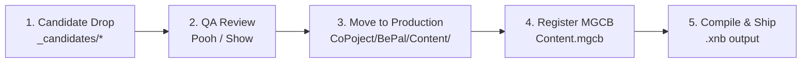

# Asset Candidates Staging Area

This directory serves as the raw staging landing zone for external, free, or newly created asset candidates (2D art, sound effects, background music, and typography) before they are approved by QA and compiled via the MonoGame Content Pipeline (MGCB).

Non-programmer team members (**Dear** for 2D Art, **Pooh** for Audio/SFX) should place raw candidates here before pipeline integration.

---

## Directory Structure

```
docs/02_Assets/_candidates/
├── sprites/       # Raw PNG sprites, badges, UI elements, and concept art
├── sfx/           # Raw sound effect audio files (WAV)
├── music/         # Raw ambient and background music tracks (MP3/WAV)
└── fonts/         # TrueType / OpenType font sources (.ttf, .otf)
```

---

## Technical Specifications

### 1. 2D Sprites & UI Graphics (`sprites/`)
- **Format**: PNG with 32-bit transparent RGBA channel.
- **Pet Emotion Sprites**:
  - **Resolution**: 280 × 360 px.
  - **Naming Convention**:
    - `spr_<pet>_idle.png` (e.g., `spr_mossling_idle.png`)
    - `spr_<pet>_happy.png` (e.g., `spr_mossling_happy.png`)
    - `spr_<pet>_angry.png` (e.g., `spr_mossling_angry.png`)
- **Backgrounds**:
  - **Resolution**: 1280 × 720 px (16:9 native backbuffer ratio).
  - **Naming Convention**: `bg_<scene>.png` (e.g., `bg_daycare_shelter.png`).
- **Scrap Badges & UI Assets**:
  - Transparent PNG, pixel-aligned, sized according to layout requirements (e.g. 160 × 48 px or 220 × 48 px).

### 2. Audio & Sound Effects (`sfx/` & `music/`)
- **Sound Effects (`sfx/`)**:
  - **Format**: 44.1 kHz, 16-bit PCM Uncompressed WAV.
  - **Channels**: Mono or Stereo (Mono preferred for localized positional effects).
  - **Naming Convention**: `sfx_<action>_<descriptor>.wav` (e.g., `sfx_qte_tick.wav`, `sfx_qte_hit.wav`, `sfx_qte_miss.wav`, `sfx_pet_react.wav`, `sfx_warning_siren.wav`).
- **Background Music (`music/`)**:
  - **Format**: 44.1 kHz, 16-bit or 320 kbps MP3 / WAV.
  - **Loops**: Seamless loop point alignment.
  - **Naming Convention**: `bgm_<theme>.mp3` (e.g., `bgm_shelter_day.mp3`, `bgm_death_spiral.mp3`).

### 3. Fonts (`fonts/`)
- **Format**: TTF or OTF (compatible with BMFont / MonoGame FontDescriptionProcessor).
- **License**: SIL Open Font License or CC0/Free for commercial use.

---

## Asset Staging Lifecycle



1. **Candidate Drop**: Teammate places new raw candidate file into appropriate folder (`sprites/`, `sfx/`, `music/`, `fonts/`).
2. **QA & Design Review**: Team reviews visual style, dimensions, volume levels, and audio clipping.
3. **Move to Production**: Approved assets are moved into `CoPoject/BePal/Content/` with canonical names.
4. **Register in MGCB**: Add asset reference into `Content.mgcb` with appropriate importer and processor settings.
5. **Compile & Commit**: Build pipeline compiles `.xnb` artifacts, verified via `dotnet build`.
